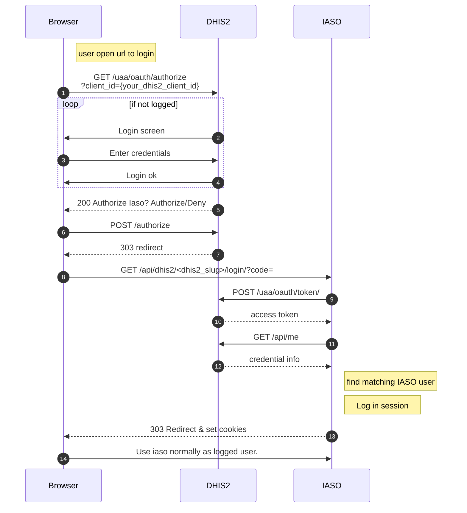

# [Iaso : a geospatial data management platform](https://www.bluesquarehub.com/iaso/)


Introduction
============


Iaso is a georegistry and data collection web platform structured around
trees of organization units (also known a master lists)

The main tasks it allows accomplishing are:

-   Data collection using [XLSForm](https://xlsform.org/) forms linked
    to org units through a mobile application.
-   Import, comparison and merging of multiple Org Units' trees, both
    through a web application and an API allowing manipulation through
    data science tools like [Jupyter notebooks](https://jupyter.org/).
-   Validation of received data for Org Units' trees and forms.
-   Exports of the Org Units' trees and form data, either in csv, xlsx,
    [GeoPackage](https://www.geopackage.org/) or through an api.

[Video presentation of IASO](https://fosdem.org/2021/schedule/event/iaso/) at FOSDEM 2021, with slides.

Long Intro
----------
Iaso is a platform created to support geo-rich data collection efforts, mainly in public health in
emerging countries. The key feature that it supports is that any survey is linked to an organizational
unit that is part of a canonical hierarchy. Each one of these org. units can have a location and a
territory. The mobile data collection tool can be used to enrich this hierarchy with additional GPS
coordinates, names corrections, etc ... which can then be validated by officials of the organizations
in question through the web dashboard. This leads to continuous improvements of the geographic references
available through the routine activities already planned. e.g. locating and registering health facilities while
investigating malaria cases.

The tool has been used in multiple data collection efforts, notably in the domain of Performance Based Financing
of health services in D.R. Congo, Niger, Cameroon and Nigeria and is more and more used to compare multiple
versions of official organisational hierarchies when a canonical one needs to be rebuilt (for example
 to rebuild a school map for DRC). To help for this type of project,
we provide location selection interfaces, multiple levels of audits and an API open to data scientists for analysis
and mass edits.

Iaso has been created by the company [Bluesquare](https://bluesquarehub.com/), specialised in software and services
for public health, and has become open source under the MIT License in November 2020.

Iaso is made of a white labeled Android application using Java/Kotlin, reusing large parts of the ODK projects,
and a web platform programmed using Python/GeoDjango on top of PostGIS. Frontend is mainly React/Leaflet.
One of the aims is the ease of integration with other platforms. We already have csv and geopackage imports and
exports and target easy integration with OSM.

Structure
---------

This repository contains Iaso frontend and backend, respectively in Python Django and JS React. They interact
via an API implemented via Django rest framework, all data is stored in Postgresql or the media/ directory.

A companion mobile app for Android allow submitting Form and creating org unit.

Form can also be filled in a web interface via the Enketo companion service. Both Iaso and Enketo need to be
configured to work together. It is possible to run an Enketo service locally, see Enketo section below.

More documentation on the Front End part is present in
[hat/assets/README.rst](hat/assets/README.rst)


Data Model / Glossary
---------------------

Some terminology in Iaso come from DHIS2, some from ODK which mean that it can be a bit confusing.
We will highlight some equivalences that might help you.

This is not (yet) the complete Data Model, but here are the main concepts/model in Iaso:

* Iaso is multi tenant. Tenant are called and represented by the model `Account`. It represents roughly one client org or country. It also represents the natural limit of right for a user.
* Each Django's User has a linked Iaso `Profile` that link it to an `Account` and store extra parameters for the user.
* Each tenant can have multiple `Project`. Projects are linked to one android version App via the `app_id`. We use the link to control what a user can see from that app.
* `DHIS2` is a standard server application and web UI in the industry to handle Health Data. Iaso can import and export data (forms and org unit) to it.
* `OrgUnit` (Organizational Unit) is a Node of the GeoRegistry tree. e.g a particular Country, City or Hospital. each belonging to each other via a `parent` relationship.
   * They can have a type `OrgUnitType` e.g. Country, City, Hospital
   * they can belong to multiple `Group`, e.g. Urban Region or Campaign 2017
   * DHIS2 has the concept of `Group` but not `Type` so when importing from a DHIS2 Instance all the type will be Unknown and OrgUnit will belong to group like `Clinic`
   * `GroupSet` are Group of group. Used when we export Group to DHIS2
  * OrgUnit may have a position in space, it can be an area, the  `geom` field is then used, or just a Point, the `location` field is then used.
    * It's technically possible to have both
    * a OrgUnit may have no geographical info
    * a OrgUnit may geographically be outside its parent.
* `DataSource` links OrgUnit and Group imported from the same source, e.g a DHIS2 instance, a CSV or a GeoPackage.
   * A `source_ref` on the imported instance is used to keep the reference from the original source, so we can match it again in the future (when updating the import or exporting it back)
   * `SourceVersion` is used to keep each version separated. e.g. each time we import from DHIS2 we create a new version.
   * OrgUnit (for their parent) and Group should only reference other OrgUnit and Group in the same version. (This is not enforced everywhere yet)
* `Task` are asynchronous function that will be run by a background worker in production. eg: Importing Data from DHIS2. see Worker section below for more info.
* `Form` is the definition of a Form (list of question and their presentation).
    * The model contain the metadata, the actual definition is done in a `XSLForm` as an attached file.
    * Form are linked to one or more Project. This is used to know which Form are presented in the Mobile App.
    * Form can have multiple versions
* `Instance` or Form instance is the `Submission` of a form. A form that has actually been filed by a user.
    * Instance can be GeoTagged and/or linked to a OrgUnit
    * Note: We are moving to use Submission everywhere in the UI, but it is still in progress. please submit PR.
    * Submission cannot be done via the Iaso UI itself but through Enketo or the Mobile App.
* `EntityType` represents a type of person or object to which we want to attach multiple submissions to track said submissions in time and across OrgUnits.
* `Entity` represents an actual person or object, defined by its `EntityType`. A concrete example is given in the docstrings of [iaos.models.entity](iaso/models/entity.py)
* `APIImport` are used to log some request from the mobile app, so we can replay them in case of error. See [vector_control Readme](hat/vector_control/README.md)
* `audit.Modification` are used to keep a history of modification on some models (mainly orgunit). See [audit readme](hat/audit/README.md)
* `Link` are used to match two OrgUnit (in different sources or not) that should be the same in the real world. Links have a confidence score indicating how much we trust that the two OrgUnit are actually the same.

They are usually generated via `AlgorithmRun`, or the matching is done in a Notebook and uploaded via the API.
  

Development environment
=======================

Setup
-----


A running local instance for development can be spin up via docker-compose which will install and
configure all dep in separate container. As such your computer should only need:

-   [git](https://git-scm.com/)
-   [docker](https://docs.docker.com/engine/installation/)
-   [docker-compose](https://docs.docker.com/compose/)

If docker-compose give you trouble, make sure it can connect to the
__docker daemon__.

A `pgdata-iaso` folder, containing the database data, will be created in the parent directory of the git repository

### 1. Environment variables

The docker-compose.yml file contains sensible defaults for the Django
application.

Other environment variables can be provided by a [.env
file](https://docs.docker.com/v17.12/compose/environment-variables/#the-env-file).

As a starting point, you can copy the sample .env.dist file and edit it
to your needs.

``` bash
cp .env.dist .env
```

> **note**
>
> all the commands here need to be run in the project directory, where you cloned the repository


### 2. Build the containers

This will build and download the containers.

``` bash
docker-compose build
```

### 3. Start the database

``` bash
docker-compose up db
```

### 4. Run migrations

In a separate bash (without closing yet the started db), launch the migrations

``` bash
docker-compose run --rm iaso manage migrate
```
(If you get a message saying that the database iaso does not exist, you can connect to your postgres instance using 
``` bash
psql -h localhost -p 5433 -U postgres
```
then type 
``` sql
create database iaso; 
```
to create the missing database.)

### 5. Start the server

To start all the containers (backend, frontend, db)

``` bash
docker-compose up
```

The web server should be reachable at `http://localhost:8081` (you
should see a login form).

The `docker-compose.yml` file describes the setup of the containers. See section below for a lit

### 6. Create a superuser

To log in to the app or the Django admin, a superuser needs to be created
with:

``` bash
docker-compose exec iaso ./manage.py createsuperuser
```

You can now log in at the admin section: `http://localhost:8081/admin`.

Then additional users with custom groups and permissions can be added
through the Django admin or loaded via fixtures.

### 7. Create and import data

To create the initial account, project and profile, do the following:

``` bash
docker-compose exec iaso ./manage.py create_and_import_data
```

And run the following command to populate your database with a tree of
org units (these are childcare schools in the West of DRC):

``` bash
docker-compose exec iaso ./manage.py tree_importer \
    --org_unit_csv_file testdata/schools.csv \
    --data_dict testdata/data_dict.json \
    --source_name wb_schools_2019 \
    --version_number=1 \
    --project_id=1\
     --main_org_unit_name maternelle
```

You can now log in on `http://localhost:8081`

Alternatively to this step and following steps you can import data from DHIS2 see section below.

### 8. Create a form

Run the following command to create a form:

``` bash
docker-compose exec iaso ./manage.py create_form
```

At this point, if you want to edit forms directly on your machine using
Enketo, go to the Enketo setup section of this README (down below).

Once you are done, you can click on the eye for your newly added form,
click on "+ Create", tap a letter, then enter, select the org unit, then
click "Create submission".

If Enketo is running and well setup, you can fill the form now.

### 9. Create other cool stuff

You can now start to develop additional features on Iaso!


### 10. Import OrgUnit, Forms and Submission from DHIS2

Alternatively or in addition to steps 7-8, you can import data from the DHIS2 demo server (play.dhis2.org).

First find a running version from play.dhis2.org.
Go to https://play.dhis2.org/2.37
Then watch the redirection : ex : https://play.dhis2.org/2.37.7.1/dhis-web-commons/security/login.action 
To find the current active version : 2.37.7.1
That you will pass to the next docker-compose run

In a new bash, run the command


``` bash
docker-compose run --rm iaso manage seed_test_data --mode=seed --dhis2version=2.37.7.1
```

The hierarchy of OrgUnit, group of OrgUnit, Forms, and their Submissions will be imported. Type of OrgUnit are not
handled at the moment

you can then log in through <http://127.0.0.1:8081/dashboard> with :

 -   user : testemail2.37.7.1
 -   password: testemail2.37.7.1

### 11. Activating the Polio plugin (optional)

Set the PLUGINS environment variable  to `polio`.
You can do so by adding the following line in your root .env:
``` python
PLUGINS=polio
```

 
Run commands inside the docker
-------------------------------

Each docker container uses the entrypoint.


The `entrypoint.sh` script offers a range of commands to start services or
run commands. The full list of commands can be seen in the script. The
pattern to run a command is
`docker-compose run <container-name> <entrypoint-command> <...args>`

The following are some examples:

* Run tests                    `docker-compose exec iaso ./manage.py test`
* Check type hints             `docker-compose exec iaso mypy .`
* Create a shell inside the container    `docker-compose run iaso bash`
* Run a shell command          `docker-compose run iaso eval curl http://google.com`
* Run Django manage.py         `docker-compose exec iaso ./manage.py help`
* Launch a python shell        `docker-compose exec iaso ./manage.py shell
* Launch a postgresql shell    `docker-compose exec iaso ./manage.py dbshell`
* Create pending ORM migration files `docker-compose exec iaso ./manage.py makemigrations`
* Apply pending ORM migrations `docker-compose exec iaso ./manage.py migrate`
* Show ORM migrations          `docker-compose exec iaso ./manage.py showmigrations`
* To run a background worker   `docker-compose run iaso manage tasks_worker`  (see  section Background tasks & Worker)

Containers and services
-----------------------

The list of the main containers:

*  iaso       The python backend in [Django](https://www.djangoproject.com/)
*  webpack    The JS frontend in react
*  db         [PostgreSQL](https://www.postgresql.org/) database

All the container definitions for development can be found in the
`docker-compose.yml`.

> **note**
>
> Postgresql uses Django ORM models for table configuration and
> migrations.

You can also have a dhis2 and db_dhis2 docker, refer to section below.

### note : docker-compose run VS docker-compose exec

Run launch a new docker container, Exec launch a command it the existing container.

So `run` will ensure the dependencies like the database are up before executing. `exec` main advantage is that it is faster
but the containers must already be running (launched manually) 

`run` will launch the entrypoint.sh script but exec will take a bash command to run which is why if you want
to run the django manage.py you will need to use `run iaso manage` but `exec iaso ./manage.py`

Also take care that `run` unless evoked with the `--rm` will leave you with a lot of left over containers that take up
disk space and need to be cleaned occasionally with `docker-compose rm` to reclaim disk space.

Enketo
------

To submit and edit existing form submission from the browser, an Enketo service is needed. 

To enable the Enketo editor in your local environment, include the additional docker compose configuration file for Enketo. Do so by invoking docker-compose with both files.
```
docker-compose -f docker-compose.yml -f docker/docker-compose-enketo.yml up
```

No additional configuration is needed. The first time the docker image is launched, it will download dependencies and do a build witch may take a few minutes. Subsequents launches are faster.

You can check that the server is correctly launched. By going to http://localhost:8005

To seed your DB with typical example forms editable by Enketo, see the  Import data from DHIS2 section


Database restore and dump
-------------------------

To create a copy of your iaso database in a file (dump) you can use:
``` bash
docker-compose exec db pg_dump -U postgres iaso  -Fc > iaso.dump
```

The dumpfile will be created on your host. The `-Fc` meant it will use an optimised Postgres format (which take less place). If you want the plain sql command use `-Fp`

### To restore a dump file that you made or that somebody sent you
0. Ensure the database server is running but not the rest. Close your docker-compose, ensure it is down with `docker-compose down`
1. Launch the database server with `docker-compose up db` 
2. Choose a name for you database. In this example  it will be `iaso5`
   You can list existing databases using `docker-compose exec db psql -U postgres -l`
3. Create the database `docker-compose exec db psql -U postgres -c "create database iaso5"`
4. Restore the dump file to put the data in your database
``` bash
cat iaso.dump | docker-compose exec -T db pg_restore -U postgres -d iaso5 -Fc --no-owner /dev/stdin
```
5. Edit your `.env` file to use to this database in the `RDS_DB_NAME` settings.
6. Start Iaso. Cut your docker-compose (see 0) and relaunch it fully. Warning: Modification in your .env file are not taken into account unless you entirely stop your docker-compose

Health
------
On the /health/ url you can find listed the Iaso version number, environment, deployment time, etc... that might help you understand how this server instance is deployed for debugging. e.g.  https://iaso.bluesquare.org/health/

Local DHIS2
-----------
Experimental. For development if you need a local dhis2 server, you can spin up one in your docker-compose by using the `docker/docker-compose-dhis2.yml ` configuration file.

Replace your invocations of `docker-compose` by `docker-compose -f docker-compose.yml -f docker/docker-compose-dhis2.yml` you need to specify both config files. e.g. to launch the cluster:
``` bash
docker-compose -f docker-compose.yml -f docker/docker-compose-dhis2.yml up
```

The DHIS2 will be available on your computer on http://localhost:8080 and is reachable from Iaso as http://dhis2:8080. The login and password are admin / district. If you use it as an import source do not set a trailing /

Database file are stored in `../pgdata-dhis2` and dhis2 log and uploaded files in `docker/DHIS2_home`.

### Sample dhis2 database
You will probably require some sample data in your instance. It is possible to
populate your DHIS2 server with sample data from a database dump like it's done
for the official play servers. The DHIS2 database take around 3 GB.

The steps as are follow:
Download the file, stop all the docker, remove the postgres database directory, start only the database docker, load the database dump and then restart everything.

``` bash
wget https://databases.dhis2.org/sierra-leone/2.36.4/dhis2-db-sierra-leone.sql.gz
docker-compose down
sudo rm ../pgdata-dhis2 -r
docker-compose up db_dhis2
zcat dhis2-db-sierra-leone.sql.gz| docker-compose exec -T db_dhis2 psql -U dhis dhis2 -f /dev/stdin
docker-compose up
cd Projects/blsq/iaso
docker-compose up dhis2 db_dhis2
```

### Setting up Single Sign On (SSO) with you local DHIS2
If you want to test the feature with your local dhis2 you can use the following step. This assumes you are running everything in Dockers

0. Launch DHIS2 with iaso within docker compose
`docker-compose -f docker-compose.yml -f docker/docker-compose-dhis2.yml up`
 With the default docker compose setup, iaso is on port 8081 and dhis2 on port 8081 on your machine
1. These step assume you have loaded your DHIS2 with the play test data, but it's not mandatory. To see how to do it, look at previous section
2. Configure an Oauth client in DHIS2: open http://localhost:8080/dhis-web-settings/index.html#/oauth2
3. Add new client:
   - Name : what you want
   - ClientId: What you want (must be the same as your external credential in Iaso)
   - Client Secret : there is one generated, copy it and save it for a latter step
   - Grant Type: check Authorization code
   - Redirect URI : http://localhost:8081/api/dhis2/{same as client id}/login/

4. Setup external credential in iaso
   1. open admin http://localhost:8081/admin/
   2. go to External Credentials | http://localhost:8081/admin/iaso/externalcredentials/
   3. Add external credentials on the top right | http://localhost:8081/admin/iaso/externalcredentials/add/
   4. Account: The account for which you want to enable dhis2 auth
   - Name : Same as DHIS2 Client ID
   - Login : http://dhis2:8080/
   - Password: the client secret you saved in step 2
   - Url: http://localhost:8081/

5 Create a new user in Iaso, grant it some right

6. In DHIS2 retrieve the id for the user
     - Current way I have found it is to go to http://localhost:8080/api/me and copy the id field
     - But you can also find a user here, and it's in the url http://localhost:8080/dhis-web-user/index.html#/users

7. Add the dhis2 id to the Iaso user : Open the target user in the iaso Admin http://localhost:8081/admin/iaso/profile/ and add it to the dhis2 id field, save.

8. Log out from iaso or in a separate session/container
9. Try the feature by opening : http://localhost:8080/uaa/oauth/authorize?client_id={your_dhis2_client_id}&response_type=code


Test and serving forms from Iaso mobile application
-----------

To test your forms on the mobile app follow those steps:

### 1 - Setup Ngrok
Download and setup Ngrok on https://ngrok.com/. Once Ngrok installed and running you must add your ngrok server url
in ```settings.py``` by adding the following line :
``` python
FILE_SERVER_URL = os.environ.get("FILE_SERVER_URL", "YOUR_NGROK_SERVER_URL")
```

After this step you have to import  ```settings.py``` and add ```FILE_SERVER_URL``` to ```forms.py``` in iaso/models/forms as
shown on the following lines :

``` python
"file": settings.FILE_SERVER_URL + self.file.url,
"xls_file": settings.FILE_SERVER_URL + self.xls_file.url if self.xls_file else None
```

### 2 - Set up the mobile app
Once Ngrok installed and running you have to run the app in developer mode (tap 10 times on the Iaso icon at start ) and connect the mobile app to your server
by selecting the 3 dots in the top right corner and select "change server url". When connected to your server, refresh
all data and your app will be ready and connected to your development server.


Testing and service forms from Iaso App In Android Studio Emulator
----------

In this case you don't need Ngrok, the emulator considers that `10.0.2.2` points to `127.0.0.1` on the computer running the emulator, so if you have for example your django server running on `http://127.0.0.1:8001` (In android emulator this becomes `http://10.0.2.2:8001`

You can just add at the end of `hat/settings.py` the following :

``` python
FILE_SERVER_URL = "http://10.0.2.2:8001"
```

And then in `iaso/models/forms.py` in the import section, add :
```
from django.conf import settings
```

And then in the `as_dict` method of `FormVersion` model, add the `settigs.FILE_SERVER_URL +` part

So that it becomes like :

``` python
"file": settings.FILE_SERVER_URL + self.file.url,
"xls_file": settings.FILE_SERVER_URL + self.xls_file.url if self.xls_file else None,
```

SSO with DHIS2
--------------------------
You can use DHIS2 as identity provider to login on Iaso. It requires a little configuration on DHIS2 and Iaso in order
to achieve that. 

### 1 - Setup OAuth2 clients in DHIS2
In DHIS2 settings you must set up your Iaso instance as Oauth2 Clients. Client ID and Grant types must be :
* Client ID : What you want (Must be the same as your external credential name in Iaso)
* Grant Types : Authorization code

Redirect URIs is your iaso server followed by : ```/api/dhis2/{your_dhis2_client_id}/login/```

For example : https://myiaso.com/api/dhis2/dhis2_client_id/login/

### 2 - Configure the OAuth2 connection in Iaso
In iaso you must set up your dhis2 server credentials. 
To do so, go to ```/admin``` and setup as follows :  

* Name: {your_dhis2_client_id} ( It must be exactly as it is in your DHIS2 client_id and DHIS2 Redirect URIs)
* Login: Your DHIS2 url (Ex : https://sandbox.dhis2.org/ )
* Password: The secret provided by DHIS2 when you created your OAuth2 client.
* Url: Your Iaso Url (Ex: https://myiaso.com/)

Don't forget the ```/``` at the end of the urls.

### Workflow for Single Sign On as a sequence diagram



Live Bluesquare components
--------------------------

It is possible to configure the project to load a version of Bluesquare components from a local git repository instead of the one installed from a package. This enabled to develop feature necessitating modification in the components code.

To do so:
 * place the repository in the parent repository of Iaso `../bluesquare-components/`
 * install the dependency for bluesquare-component by running npm install in its directory
 * set the environment variable `LIVE_COMPONENTS=true`
 * start your docker-compose

``` bash
cd ..
git clone git@github.com:BLSQ/bluesquare-components.git
cd  bluesquare-components
npm install
cd ../iaso
LIVE_COMPONENTS=true docker-compose up
```

This way the page will reload automatically if you make a change to the bluesquare-components code.

This functionality also works if you launch webpack outside of docker.

If you encounter any problem, first check that your repo is on the correct branch and the deps are up-to-date


Customization
-------------

You can override default application title, logo and colors using the `.env` file and specify those variables:

``` bash
THEME_PRIMARY_COLOR="<hexa_color>"
THEME_PRIMARY_BACKGROUND_COLOR="<hexa_color>"
THEME_SECONDARY_COLOR="<hexa_color>"
APP_TITLE="<app_title>"
FAVICON_PATH="<path_in_static_folder>"
LOGO_PATH="<path_in_static_folder>"
SHOW_NAME_WITH_LOGO="<'yes' or 'no'>"
```

> **note**
>
> Those settings are optional and are using a default value if nothing is provided


Contributing
============

If you are not using the Docker container for development, please ensure that
you are using the supported Python version on your local machine. At the time of
writing, the supported version is 3.8, but it's always a good idea to check the
system requirements section for the most up-to-date information.

Code formatting
---------------

We have adopted Black [](https://github.com/psf/black) as our code
formatting tool. Line length is 120.

The easiest way to use it is to install the pre-commit hook:
1. Install pre-commit: pip install pre-commit
2. Execute pre-commit install to install git hooks in your .git/ directory.

Another good way to have it working is to set it up in your code editor.
Pycharm, for example, has good support for this.

The pre-commit is not mandatory but Continuous Integration will check
if the formatting is respected!

Tests and linting
-----------------

For the Python backend, we use the Django builtin test framework. Tests can be executed with

``` bash
docker-compose exec iaso ./manage.py test
```

Translations
------------

There are a some user facing text in the Django side, and they require translations. For examples the login and reset password email and their page.
These are handled separately and differently from the JS frontend translations, and are storer in the folder `hat/locale/`

We only require translations for the html and e-mail template.
not the python code (e.g. strings on model or the admin), stuff that the end users are going to see directly.

When modifying or adding new strings that require translation, use the following command to
regenerate the translations file:

```manage.py makemessages --locale=fr --extension txt --extension html```

This will update `hat/locale/fr/LC_MESSAGES/django.po` with the new strings to
translate.

If you get an error about `/opt/app` or cannot accessing docker:
Change in settings.py LOCALE_PATHS to
``` python
LOCALE_PATHS = [ "hat/locale/"]
```

And specify --ignore
```bash
makemessages --locale=fr --extension txt --extension html --ignore /opt/app --ignore docker --ignore node_modules
```


After updating it with the translation you need to following command to have
them reflected in the interface:

```manage.py compilemessages```

This is done automatically when you launch the docker image so if new translations
you just pulled in git don't appear, relaunch the iaso docker.


You do not need to add translation for English as it is the default language, so for now only the French correspondance is needed.


Code reloading
--------------

In development the servers will reload when they detect a file
change, either in Python or Javascript. If you need reloading for the bluesquare-components code, see the "Live Bluesquare Components" section. 

Troubleshooting
---------------

If you need to restart everything
``` bash
docker-compose stop && docker-compose start
```

If you encounter problems, you can try to rebuild everything from
scratch.

``` bash
# kill containers
docker-compose kill
# remove `iaso` container
docker-compose rm -f iaso
# build containers
docker-compose build
# start-up containers
docker-compose up
```

Jupyter Notebook
----------------

To run a Jupyter Notebook, just copy the env variable from runaisasdev.sh, activate the virtualenv and run

``` {.sourceCode .bash}
python manage.py shell_plus --notebook
```

Deployment in Production
========================

System requirements
-------------------

Recommended:
  * Linux System X86_64 system
  * Latest Ubuntu LTS Server (> 20.04)
  * 16 GB ram
  * 4 Threads @ 3 Ghz
  * Docker

External service dependencies:
* PostgreSQL Server > 10.
* Enketo > 4.0
* Access to an SMTP server to send e-mail.

Currently supported version of Python is 3.8.

The PostgreSQL database server and Enketo server can both be deployed in Docker on the same physical machine, it is advised to double the recommended values in that case.

Each of these services have their own requirements, that are available on their own documentation.

Area of notice for configuration
--------------------------------

### E-mails

The reset e-mail functionality use django builtin site framework to generate
the url. When setting a new server, got to the admin and modify the example.com
site to point to your server url.
You can do so at `/admin/sites/site/1/change/`

Some part of the code use DNS_DOMAIN environment variable, please fill it 
with the same value.

Please also check the `# Email configuration` section in settings.py and check
everything is set correctly. Notably the sending address. See the
[sending email](https://docs.djangoproject.com/en/4.1/topics/email/) section
in the Django documentation for the possible backends and tweak. 
`

Deployment on AWS Elastic Beanstalk
====================================

see [AWS-Deployment.md](docs%2FAWS-Deployment.md)


Testing S3 uploads in development
---------------------------------

If you need to test s3 storage in development, you have to:

1.  Set the AWS\_STORAGE\_BUCKET\_NAME env variable to a bucket created
    for such tests
2.  Set the AWS\_ACCESS\_KEY\_ID and AWS\_SECRET\_ACCESS\_KEY env
    variables appropriately
3.  Set the USE\_S3 env variable to 'true'

These are actually exactly the same steps we use on AWS.

### Testing prod js assets in development

During local development, by default, the Javascript and CSS will be loaded from
a webpack server with live reloading of the code. To locally test the compiled
version as it is in production ( minified and with the same compilation option).
You can launch docker-compose with the `TEST_PROD=true` environment variable
set.

e.g `TEST_PROD=true docker-compose up`

This can be useful to reproduce production only bugs. Please also test with this
configuration whenever you modify webpack.prod.js to validate your changes.

Alternatively this can be done outside of docker by running:

1. `npm run webpack-prod` to do the build
2. Launching the django server with `TEST_PROD`
   e.g. `TEST_PROD=true python manage.py runserver`.

# Background tasks & worker

Iaso queue certain functions (task) for later execution, so they can run
outside an HTTP request. This is used for functions that take a long time to execute,
so they don't canceled in the middle by a timeout of a connection closed.
e.g: bulk import, modifications or export of OrgUnits.  Theses are the functions
marked by the decorator @task_decorator, when called they get added to a Queue
and get executed by a worker.

In local development, you can run a worker by using the command:
```
docker-compose run iaso manage tasks_worker
```

Alternatively, you can call the url `tasks/run_all` which will run all the pending tasks in queue.

If you want to develop a new background task, the endpoint `/api/copy_version/`
is a good example of how to create a task and to plug it to the api.

To call a  function with the @task decorator, you need to pass it a User objects, in addition to
the other function's arguments, this arg represent which user is launching
the task. At execution time the task will receive a iaso.models.Task
instance in argument that should be used to report progress. It's
mandatory for the function, at the end of a successful execution to call
task.report_success() to mark its proper completion.

We have two background workers mechanisms: a postgres backed one, and a SQS backed one. You can choose which one to use with the `BACKGROUND_TASK_SERVICE` environment variable, use either `SQS` or `POSTGRES` (it defaults to `SQS` in production).

## AWS SQS

The logic is based on a fork of the library [django-beanstalk-worker](https://pypi.org/project/django-beanstalk-worker/) from tolomea, please consult its doc for reference.

In production on AWS, we use Elastic Beanstalk workers which use a SQS queue. They use the SQS queue for enqueuing and persisting the tasks, but rely on the Elastic Beanstalk Worker environment to poll from that queue and push it to the webapp, at `tasks/task`. [AWS Elastic Beanstalk Worker docs](https://docs.aws.amazon.com/elasticbeanstalk/latest/dg/using-features-managing-env-tiers.html#worker-daemon)

## Postgres

This is also the one that you get when running locally with `docker-compose run iaso manage tasks_worker`, instead of enqueuing the tasks to SQS, we now enqueue them to our postgres server.

Our tasks_worker process (which runs indefinitely) will listen for new tasks and run them when it gets notified (using PostgreSQL NOTIFY/LISTEN features)
