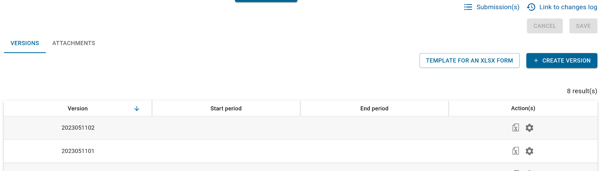
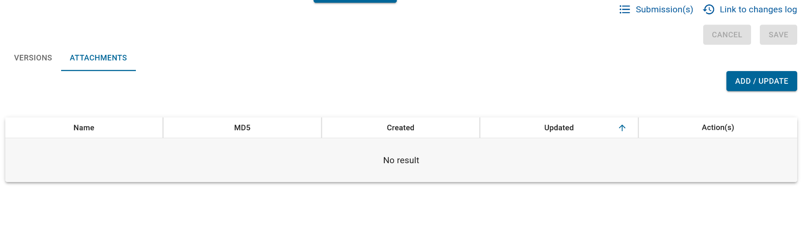
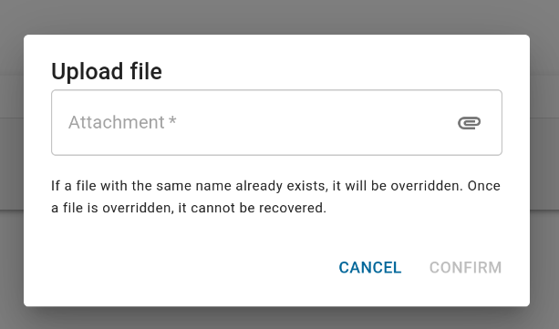

# Attach a file to a form

In [ODK forms](../../../users/reference/iaso_concepts/iaso_concepts.en.md#questionnaires-or-xls-data-collection-forms), 
you can use external files ([images, videos, audios](https://docs.getodk.org/form-question-types/#select-from-image-widget), 
[CSVs](https://docs.getodk.org/aggregate-data-access/), etc.) to enrich your forms.

This is also possible in IASO, but you need to upload your files and attach them to the related form.

After you have successfully [created your form in the web interface](../../../users/reference/iaso_web/user_guide.en.md#createupload-a-data-collection-form),
go to the details of your form, where you can see all the versions.

Select the tab "**ATTACHMENTS**" and click on "**ADD/UPDATE**".

You will be able to upload your file.

| ⚠️ **Note** If a file with the same name already exists, it will be overridden. Once a file has been overridden, it cannot be recovered. |
|------------------------------------------------------------------------------------------------------------------------------------------|