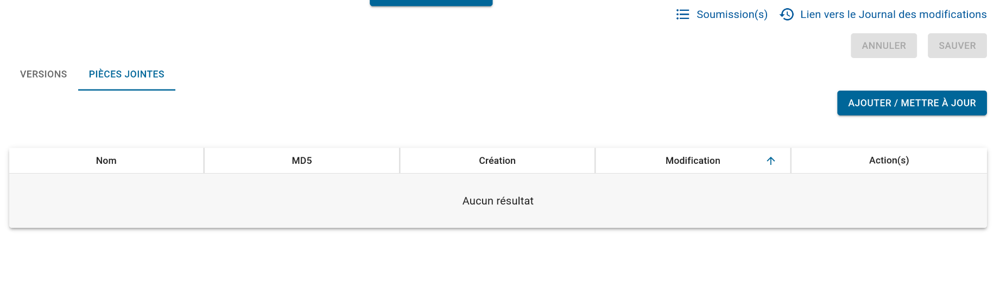

# Attach a file to a form

Dans les [formulaires ODK](../../../users/reference/iaso_concepts/iaso_concepts.fr.md#formulaires-de-collecte-de-données-xls), 
il est possible d'utiliser des fichiers externes ([images, videos, audios](https://docs.getodk.org/form-question-types/#select-from-image-widget), 
[CSVs](https://docs.getodk.org/aggregate-data-access/), etc.) pour enrichir vos formulaire.

Cela est aussi possible dans IASO, mais il est d'abord nécessaire de téléverser et attacher vos fichiers au formulaire correspondant.

Après avoir [créer votre formulaire dans l'interface web](../../../users/reference/iaso_web/user_guide.fr.md#créertéléverser-un-formulaire-de-collecte-de-données),
allez dans les détails de votre formulaire, où vous pouvez voir toutes les versions.

Sélectionnez l'onglet "**PIÈCES JOINTES**" et cliquez sur "**AJOUTER/METTRE À JOUR**".

Vous serez alors en mesure de sélectionner votre fichier à téléverser

| ⚠️ **Note** Si un fichier portant le même nom existe déjà, il sera écrasé. Une fois qu'un fichier est remplacé, il ne peut pas être récupéré. |
|-----------------------------------------------------------------------------------------------------------------------------------------------|