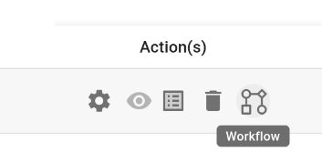
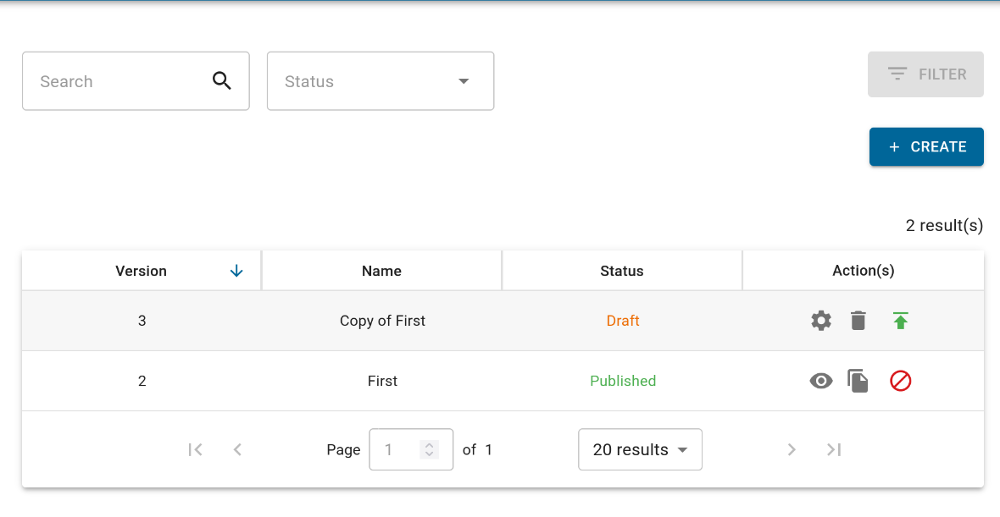
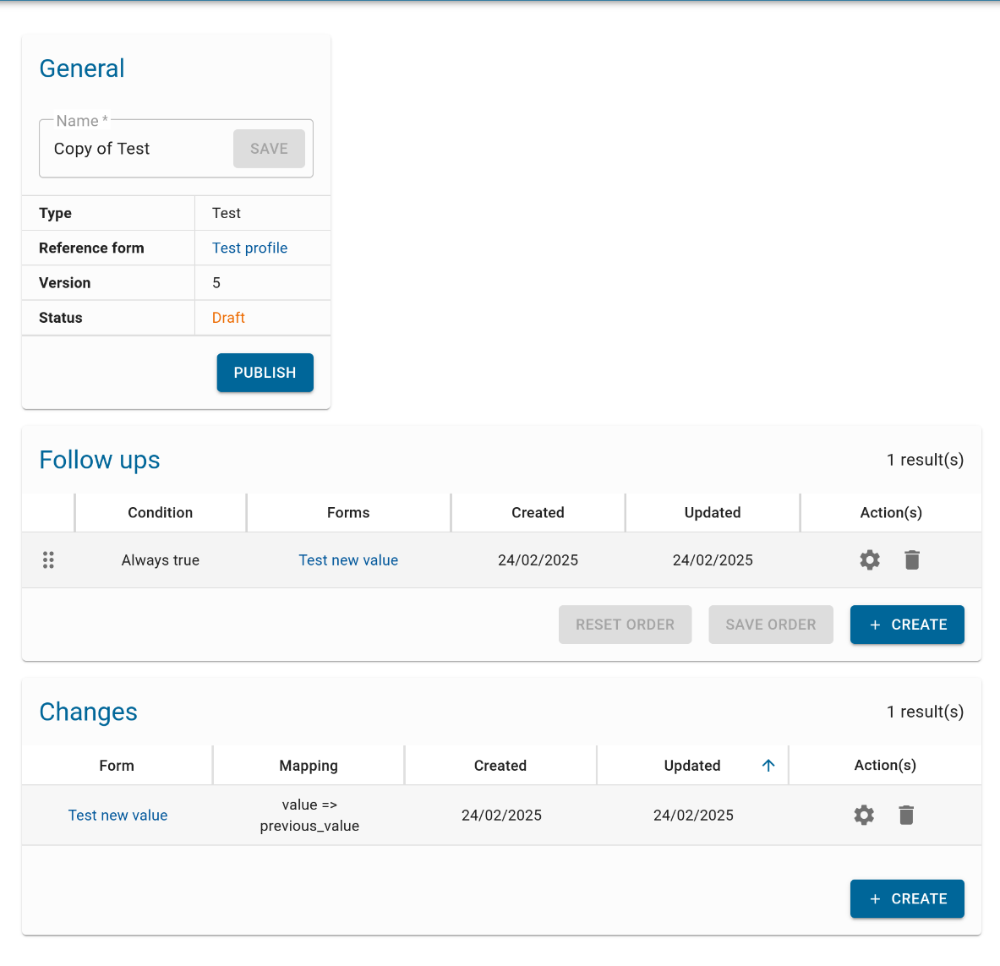
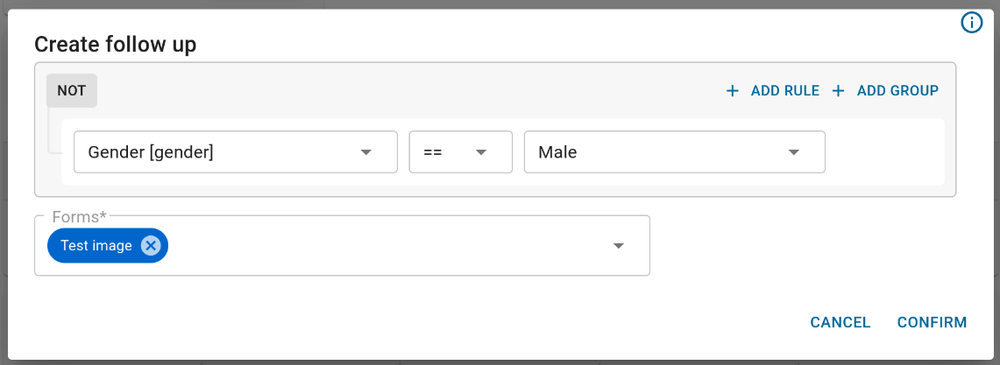
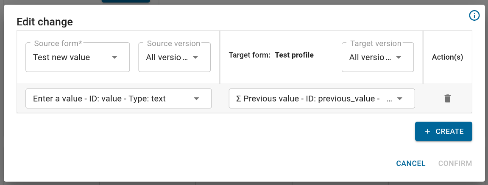

# Create an entity workflow

As explained in [Create forms for entities](../create_forms_for_entities/create_forms_for_entities.en.md), 
[entities](../../../users/reference/iaso_concepts/iaso_concepts.en.md#entities) are represented by their profile's 
submission, and are changed through follow-up forms. Yet, to make this work, we need to create a 
[workflow](../../../users/reference/iaso_concepts/iaso_concepts.en.md#workflows) that defines which follow-up forms are
possible, based on the entity's current state, and how each follow-up form changes the profile.

## Access workflows

On the entity type page, click on the "**Workflow**" icon in the "Action(s)" column:

There, you can create a new workflow from scratch, open an existing one, or duplicate an existing one:

## Workflow statuses

Workflows can be in three different states:

- Draft: This is the default state in which you can still edit or delete a workflow
- Published: There can only be **one** published workflow per entity type. In this state, the workflow cannot be edited anymore.
- Unpublished: Workflows in this state cannot be edited nor deleted anymore, but can be promoted to published again.

## Editing a workflow

### The name

The name is only useful to you and your team, it doesn't matter for the mobile application. It can be anything that 
makes sense for your team, like a reference number of an approved UML diagram or an approved date.

### Follow-ups

The follow-up forms are a list of forms which are going to be offered to the user as next forms to fill based on
conditions which applies to the entity's profile.

In the example above, if the gender of the entity is "Male", we will offer the "Test image" form.
There can also be more than one form offered if the conditions are met.

If there are multiple follow-ups which conditions are met, all their forms will be offered as next in the order of the 
follow-ups list.

Finally, if you want a form to always be offered as next, you can leave the condition empty.

### Changes

Changes define which values from the follow-ups submission will override values in the entity's profile submission.

On the left, you can define which follow-up form will impact the profile. You can also select a form version to filter
the questions only present in that version. On the right, you can filter on a specific version of the profile form if 
you wish.

Underneath, you can select the question that will impact the profile and select the question in the profile that will be 
overridden. You can enter as many changes as you want per form.

In the example above, the question `value`'s content, from the form `Test new value`, will be written into the question
`previous_value` in the profile.