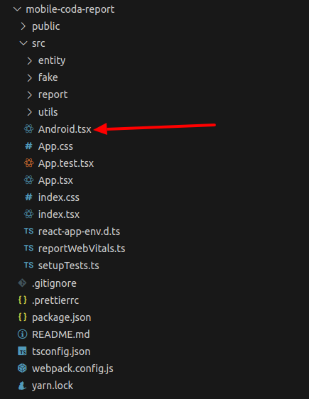

# Requirements

Make sure to have an entity workflow and forms avalaible in Iaso.

You can find the documentation for that in the sections [Create forms for entities](../../../dev/how_to/create_forms_for_entities/create_forms_for_entities.en.md) and [Create an entity workflow](../../../dev/how_to/create_entity_workflow/create_entity_workflow.en.md#workflows).


# How to run coda mobile report locally

The current report is based on nutrition programs with beneficiaries split into 2 entity types:
- Childen Under 5
- Pregnant and breastfeeding woman 

## 1. Get the code and install the dependencies


```
git clone git@github.com:BLSQ/mobile-coda-report.git
cd mobile-coda-report
yarn install
```

## 2. Start the local node server

```
yarn start
```

## 3. Getting json sample data for development

It requires to have the CODA mobile app debug version installed on your device.
The debugging version allows to get sample data.

### Connect the device to your computer and run `scrcpy` command from the terminal

You can download `scrcpy` from their GitHub page: [https://github.com/Genymobile/scrcpy].

Then run it:

Either run  `scrcpy` or `scrcpy -s <device id>` (E.g.: `scrcpy -s R58MA48E00H`, the device id changes from one device to another)

Open the CODA mobile app on the device, then click the `See reports` link at the bottom left of your screen to access the mobile report.


In your Chrome browser, enter the following URL: `chrome://inspect/`, then inspect link:


You should see the same report page as you get on your mobile device

In the browser console, tape:
- `Android.loadForms()`, copy the content and paste it in the  `/src/fake/FakeData.ts` as `FAKE_DATA` const content. 

- `Android.currentOrgUnit()` copy and paste it in `/src/fake/FakeLocalHealthFacility.ts` as `FAKE_LOCAL_HF` const content. This allow to get data only collected within the org unit level.

Note that getting the data from browser console is possible only for debug version!


## 4. Exploring the code

Open the cloned folder with an editor like vscode. You will get the following structure:




## 5. How to debug

From the code editor, open the file `/src/Android.tsx` and check if the sample data are imported in the header like:

```
import FAKE_DATA from './fake/FakeData';
import FAKE_LOCAL_HF from './fake/FakeLocalHealthFacility';
```

Within `LoadForms()` function, comment the existing const:

`const formsToLoad` and `const localHealthFacility` 

Then add:

```
const formsToLoad = JSON.parse(FAKE_DATA);
const localHealthFacility = JSON.parse(FAKE_LOCAL_HF);
```

This is for reading sample(fake) data from your local env.

Then from your browser go to http://127.0.0.1:3000/ or http://localhost:3000

The app reports 2 types of beneficiaries :
- Childen Under 5
- Pregnant and breastfeeding woman

To allow you to navigate back inside the report from within your browser, you need to make the back button visible.
In your code editor of choice, open `/src/App.tsx`, under line 82, replace "hidden" with "visible".


Each sub report is splitted into:
- Main
- Medical
- Followup category
- eRegister


## 6. How to deploy a new report

The report is deployed on Iaso via the web interface.

### 1. Prepare the report zip file to deploy

**/!\ Make sure you have removed the FAKE DATA and made back the back button hidden in `/src/App.tsx` before you create a zip /!\**


```
yarn run build
cd build/static/css
```
Cut all content of `css` folder

```
cd ../
```
Paste in the build folder

```
cd ../js
```
Cut all content of `js` folder
```
cd ../
```
Paste in the build folder as well

Open the `index.html` file with your code editor, make sure to have HTML plugin formatter activated then format the content file

In header tag, on: 
- line 8, with `<script></script>` tag, on the `src` attribute, remove the path `/static/js/`. Just keep the main css file name.
- line 9, with `<link>` tag  attribute, remove the path `/static/css/`.

In order to reference the right path, then remove css and js folder as they are empty.

Inside the `build/static` folder, create the zip file with the whole content by selecting all files then zip.
Provide a name for the zip and let the process finish completely.


### 2. Upload the zip file

Login with a super user account (with admin access) to Django admin interface: `/admin``:

- Go to `/admin`
- Open the `Report versions` menu
- Click on `ADD REPORT VERSION`
- Fill the Name, Status(make sure to select Published) and upload the zip file
- Save

Then:

- Open the `Report` menu
- Click on `ADD REPORT`
- Fill the Name, select the right version(created previously) and Project
- Save

### 3. View report from mobile app

Open the CODA mobile and **Refresh data** then **Refresh Beneficiaries** to download the latest report version.

After refreshing data, your new mobile report is accessible from the bottom left link `See reports`.


