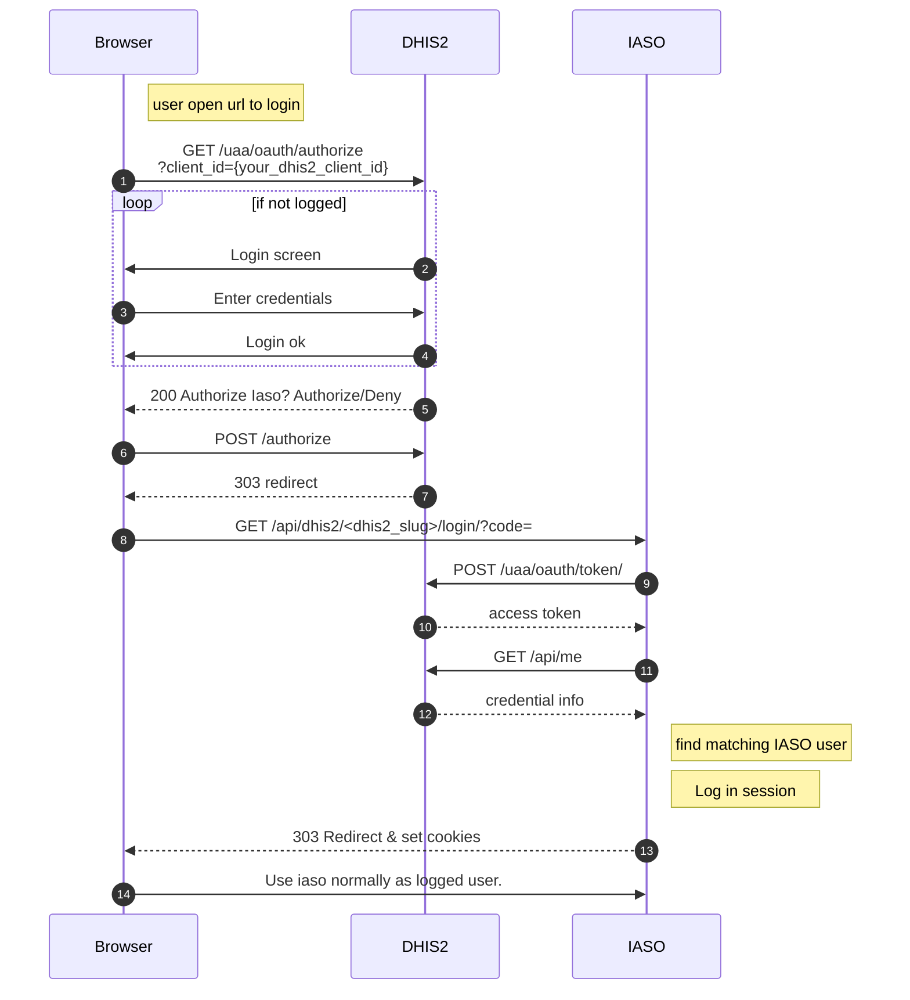

Setup
-----


A running local instance for development can be spin up via docker-compose which will install and
configure all dep in separate container. As such your computer should only need:

-   [git](https://git-scm.com/)
-   [docker](https://docs.docker.com/engine/installation/)
-   [docker-compose](https://docs.docker.com/compose/)

If docker-compose give you trouble, make sure it can connect to the
__docker daemon__.

If you use an Apple Silicon Mac, ensure `export DOCKER_DEFAULT_PLATFORM=linux/amd64` is set.

A `pgdata-iaso` folder, containing the database data, will be created in the parent directory of the git repository.

### 1. Environment variables

The docker-compose.yml file contains sensible defaults for the Django
application.

Other environment variables can be provided by a [.env
file](https://docs.docker.com/v17.12/compose/environment-variables/#the-env-file).

As a starting point, you can copy the sample .env.dist file and edit it
to your needs.

``` {.sourceCode .bash}
cp .env.dist .env
```

> **note**
>
> all the commands here need to be run in the project directory, where you cloned the repository


### 2. Build the containers

This will build and download the containers.

``` {.sourceCode .bash}
docker-compose build
```

### 3. Start the database

``` {.sourceCode .bash}
docker-compose up db
```

### 4. Run migrations

``` {.sourceCode .bash}
docker-compose run --rm iaso manage migrate
```
(If you get a message saying that the database iaso does not exist, you can connect to your postgres instance using 
```
psql -h localhost -p 5433 -U postgres
```
then type 
```
create database iaso; 
```
to create the missing database.)
### 5. Start the server

To start all the containers (backend, frontend, db)

``` {.sourceCode .bash}
docker-compose up
```

The web server should be reachable at `http://localhost:8081` (you
should see a login form).

The `docker-compose.yml` file describes the setup of the containers. See section below for a lit

### 6. Create a superuser

To login to the app or the Django admin, a superuser needs to be created
with:

``` {.sourceCode .bash}
docker-compose exec iaso ./manage.py createsuperuser
```

You can now login in the admin at `http://localhost:8081/admin`.

Then additional users with custom groups and permissions can be added
through the Django admin or loaded via fixtures.

### 7. Create and import data

To create the initial account, project and profile, do the following:

``` {.sourceCode .bash}
docker-compose exec iaso ./manage.py create_and_import_data
```

And run the following command to populate your database with a tree of
org units (these are childcare schools in the West of DRC):

``` {.sourceCode .bash}
docker-compose exec iaso ./manage.py tree_importer \
    --org_unit_csv_file testdata/schools.csv \
    --data_dict testdata/data_dict.json \
    --source_name wb_schools_2019 \
    --version_number=1 \
    --project_id=1\
     --main_org_unit_name maternelle
```

You can now login on `http://localhost:8081`

Alternatively to this step and following steps you can import data from DHIS2 see section below.

### 8. Create a form

Run the following command to create a form:

``` {.sourceCode .bash}
docker-compose exec iaso ./manage.py create_form
```

At this point, if you want to edit forms directly on your machine using
Enketo, go to the Enketo setup section of this README (down below).

Once you are done, you can click on the eye for your newly added form,
click on "+ Create", tap a letter, then enter, select the org unit, then
click "Create submission".

If Enketo is running and well setup, you can fill the form now.

### 9. Create other cool stuff

You can now start to develop additional features on Iaso!


### 10. Import OrgUnit, Forms and Submission from DHIS2

Alternatively or in addition to steps 7-8, you can import data from the DHIS2 demo server (play.dhis2.org).

By running the command


``` {.sourceCode .bash}
docker-compose run --rm iaso manage seed_test_data --mode=seed --dhis2version=2.35.3
```

The hierarchy of OrgUnit, group of OrgUnit, Forms, and their Submissions will be imported. Type of OrgUnit are not
handled at the moment

you can then log in through <http://127.0.0.1:8081/dashboard> with :

 -   user : testemail2.35.3
 -   password: testemail2.35.3

### 11. Activating the Polio plugin (optional)

Set the PLUGINS environment variable  to `polio`.
You can do so by adding the following line in your root .env:
```
PLUGINS=polio
```

 
Run commands inside the docker
-------------------------------

Each docker container uses the entrypoint.


The `entrypoint.sh` script offers a range of commands to start services or
run commands. The full list of commands can be seen in the script. The
pattern to run a command is
`docker-compose run <container-name> <entrypoint-command> <...args>`

The following are some examples:

* Run tests                    `docker-compose exec iaso ./manage.py test`
* Create a shell inside the container    `docker-compose run iaso bash`
* Run a shell command          `docker-compose run iaso eval curl http://google.com`
* Run Django manage.py         `docker-compose exec iaso ./manage.py help`
* Launch a python shell        `docker-compose exec iaso ./manage.py shell`
* Launch a postgresql shell    `docker-compose exec iaso ./manage.py dbshell`
* Create pending ORM migration files `docker-compose exec iaso ./manage.py makemigrations`
* Apply pending ORM migrations `docker-compose exec iaso ./manage.py migrate`
* Show ORM migrations          `docker-compose exec iaso ./manage.py showmigrations`
* To run a background worker   `docker-compose run iaso manage tasks_worker`  (see  section Background tasks & Worker)

Containers and services
-----------------------

The list of the main containers:

*  iaso       The python backend in [Django](https://www.djangoproject.com/)
*  webpack    The JS frontend in react
*  db         [PostgreSQL](https://www.postgresql.org/) database

All the container definitions for development can be found in the
`docker-compose.yml`.

> **note**
>
> Postgresql uses Django ORM models for table configuration and
> migrations.

You can also have a dhis2 and db_dhis2 docker, refer to section below.

### note : docker-compose run VS docker-compose exec

Run launch a new docker container, Exec launch a command in the existing container.

So `run` will ensure the dependencies like the database are up before executing. `exec` main advantage is that it is faster
but the containers must already be running (launched manually) 

`run` will launch the entrypoint.sh script but exec will take a bash command to run which is why if you want
to run the django manage.py you will need to use `run iaso manage` but `exec iaso ./manage.py`

Also take care that `run` unless evoked with the `--rm` will leave you with a lot of left over containers that take up
disk space and need to be cleaned occasionally with `docker-compose rm` to reclaim disk space.

Enketo
------

To submit and edit existing form submission from the browser, an Enketo service is needed. 

To enable the Enketo editor in your local environment, include the additional docker compose configuration file for Enketo. Do so by invoking docker-compose with both files.
```
docker-compose -f docker-compose.yml -f docker/docker-compose-enketo.yml up
```

No additional configuration is needed. The first time the docker image is launched, it will download dependencies and do a build witch may take a few minutes. Subsequents launches are faster.

You can check that the server is correctly launched. By going to http://localhost:8005

To seed your DB with typical example forms editable by Enketo, see the  Import data from DHIS2 section


Database restore and dump
-------------------------

To create a copy of your iaso database in a file (dump) you can use:
```
docker-compose exec db pg_dump -U postgres iaso  -Fc > iaso.dump
```

The dumpfile will be created on your host. The `-Fc` meant it will use an optimised Postgres format (which take less place). If you want the plain sql command use `-Fp`

### To restore a dump file that you made or that somebody sent you
0. Ensure the database server is running but not the rest. Close your docker-compose, ensure it is down with `docker-compose down`
1. Launch the database server with `docker-compose up db` 
2. Choose a name for you database. In this example  it will be `iaso5`
   You can list existing databases using `docker-compose exec db psql -U postgres -l`
3. Create the database `docker-compose exec db psql -U postgres -c "create database iaso5"`
4. Restore the dump file to put the data in your database
```
cat iaso.dump | docker-compose exec -T db pg_restore -U postgres -d iaso5 -Fc --no-owner /dev/stdin
```
5. Edit your `.env` file to use to this database in the `RDS_DB_NAME` settings.
6. Start Iaso. Cut your docker-compose (see 0) and relaunch it fully. Warning: Modification in your .env file are not taken into account unless you entirely stop your docker-compose


Health
------
On the /health/ url you can find listed the Iaso version number, environment, deployment time, etc... that might help you understand how this server instance is deployed for debugging. e.g.  https://iaso.bluesquare.org/health/

Local DHIS2
-----------
Experimental. For development if you need a local dhis2 server, you can spin up one in your docker-compose by using the `docker/docker-compose-dhis2.yml ` configuration file.

Replace your invocations of `docker-compose` by `docker-compose -f docker-compose.yml -f docker/docker-compose-dhis2.yml` you need to specify both config files. e.g to launch the cluster:
```
docker-compose -f docker-compose.yml -f docker/docker-compose-dhis2.yml up
```

The DHIS2 will be available on your computer on http://localhost:8080 and is reachable from Iaso as http://dhis2:8080. The login and password are admin / district. If you use it as an import source do not set a trailing /

Database file are stored in `../pgdata-dhis2` and dhis2 log and uploaded files in `docker/DHIS2_home`.

### Sample dhis2 database
You will probably require some sample data in your instance. It is possible to
populate your DHIS2 server with sample data from a database dump like it's done
for the official play servers. The DHIS2 database take around 3 GB.

The steps as are follow:
Download the file, stop all the docker, remove the postgres database directory, start only the database docker, load the database dump and then restart everything.

```
wget https://databases.dhis2.org/sierra-leone/2.36.4/dhis2-db-sierra-leone.sql.gz
docker-compose down
sudo rm ../pgdata-dhis2 -r
docker-compose up db_dhis2
zcat dhis2-db-sierra-leone.sql.gz| docker-compose exec -T db_dhis2 psql -U dhis dhis2 -f /dev/stdin
docker-compose up
cd Projects/blsq/iaso
docker-compose up dhis2 db_dhis2
```

### Setting up Single Sign On (SSO) with you local DHIS2
If you want to test the feature with your local dhis2 you can use the following step. This assume you are running everything in Dockers

0. Launch DHIS2 with iaso within docker compose
`docker-compose -f docker-compose.yml -f docker/docker-compose-dhis2.yml up`
 With the default docker compose setup, iaso is on port 8081 and dhis2 on port 8081 on your machine
1. These step assume you have loaded your DHIS2 with the play test data but it's not mandatory. To see how to do it, look at previous section
2. Configure an Oauth client in DHIS2: open http://localhost:8080/dhis-web-settings/index.html#/oauth2
3. Add new client:
   - Name : what you want
   - ClientId: What you want (must be the same as your external credential in Iaso)
   - Client Secret : there is one generated, copy it and save it for a latter step
   - Grant Type: check Authorization code
   - Redirect URI : http://localhost:8081/api/dhis2/{same as client id}/login/

4. Setup external credential in iaso
   1. open admin http://localhost:8081/admin/
   2. go to External Credentials | http://localhost:8081/admin/iaso/externalcredentials/
   3. Add external credentials on the top right | http://localhost:8081/admin/iaso/externalcredentials/add/
   4. Account: The account for which you want to enable dhis2 auth
   - Name : Same as DHIS2 Client ID
   - Login : http://dhis2:8080/
   - Password: the client secret you saved in step 2
   - Url: http://localhost:8081/

5 Create a new user in Iaso, grant it some right

6. In DHIS2 retrieve the id for the user
     - Current way I have found it is to go to http://localhost:8080/api/me and copy the id field
     - But you can also find a user here and it's in the url http://localhost:8080/dhis-web-user/index.html#/users

7. Add the dhis2 id to the Iaso user : Open the target user in the iaso Admin http://localhost:8081/admin/iaso/profile/ and add it to the dhis2 id field, save.

8. Unlog from iaso or in a separate session/container
9. Try the feature by opening : http://localhost:8080/uaa/oauth/authorize?client_id={your_dhis2_client_id}&response_type=code


Test and serving forms from Iaso mobile application
-----------

To test your forms on the mobile app follow those steps:

### 1 - Setup Ngrok
Download and setup Ngrok on https://ngrok.com/. Once Ngrok installed and running you must add your ngrok server url
in ```settings.py``` by adding the following line :
```
FILE_SERVER_URL = os.environ.get("FILE_SERVER_URL", "YOUR_NGROK_SERVER_URL")
```

After this step you have to import  ```settings.py``` and add ```FILE_SERVER_URL``` to ```forms.py``` in iaso/models/forms as
shown on the following lines :

```
"file": settings.FILE_SERVER_URL + self.file.url,
"xls_file": settings.FILE_SERVER_URL + self.xls_file.url if self.xls_file else None
```

### 2 - Setup the mobile app
Once Ngrok installed and running you have to run the app in developer mode (tap 10 times on the Iaso icon at start ) and connect the mobile app to your server
by selecting the 3 dots in the top right corner and select "change server url". When connected to your server, refresh
all data and your app will be ready and connected to your development server.


SSO with DHIS2
--------------------------
You can use DHIS2 as identity provider to login on Iaso. It requires a little configuration on DHIS2 and Iaso in order
to achieve that. 

### 1 - Setup OAuth2 clients in DHIS2
In DHIS2 settings you must setup your Iaso instance as Oauth2 Clients. Client ID and Grant types must be :
* Client ID : What you want (Must be the same as your external credential name in Iaso)
* Grant Types : Authorization code

Redirect URIs is your iaso server followed by : ```/api/dhis2/{your_dhis2_client_id}/login/```

For example : https://myiaso.com/api/dhis2/dhis2_client_id/login/

### 2 - Configure the OAuth2 connection in Iaso
In iaso you must setup your dhis2 server credentials. 
To do so, go to ```/admin``` and setup as follow :  

* Name: {your_dhis2_client_id} ( It must be exactly as it is in your DHIS2 client_id and DHIS2 Redirect URIs)
* Login: Your DHIS2 url (Ex : https://sandbox.dhis2.org/ )
* Password: The secret provided by DHIS2 when you created your OAuth2 client.
* Url: Your Iaso Url (Ex: https://myiaso.com/)

Don't forget the ```/``` at the end of the urls.

### Workflow for Single Sign On as a sequence diagram



Live Bluesquare components
--------------------------

It is possible to configure the project to load a version of Bluesquare components from a local git repository instead of the one installed from a package. This enabled to develop feature necessitating modification in the components code.

To do so:
 * place the repository in the parent repository of Iaso `../bluesquare-components/`
 * install the dependency for bluesquare-component by running npm install in its directory
 * set the environment variable `LIVE_COMPONENTS=true`
 * start your docker-compose

```
cd ..
git clone git@github.com:BLSQ/bluesquare-components.git
cd  bluesquare-components
npm install
cd ../iaso
LIVE_COMPONENTS=true docker-compose up
```

This way the page will reload automatically if you make a change to the bluesquare-components code.

This functionality also works if you launch webpack outside of docker.

If you encounter any problem, first check that your repo is on the correct branch and the deps are up-to-date


Customization
-------------

You can override default application title, logo and colors using the `.env` file and specify those variables:

```
THEME_PRIMARY_COLOR="<hexa_color>"
THEME_PRIMARY_BACKGROUND_COLOR="<hexa_color>"
THEME_SECONDARY_COLOR="<hexa_color>"
APP_TITLE="<app_title>"
FAVICON_PATH="<path_in_static_folder>"
LOGO_PATH="<path_in_static_folder>"
SHOW_NAME_WITH_LOGO="<'yes' or 'no'>"
```

> **note**
>
> Those settings are optional and are using a default value if nothing is provided

