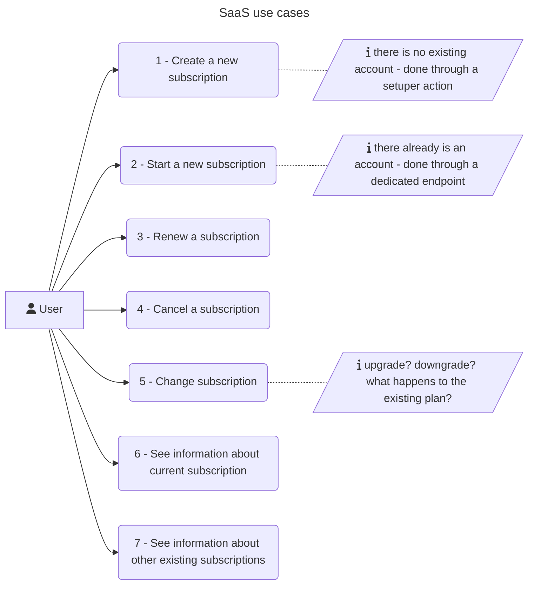
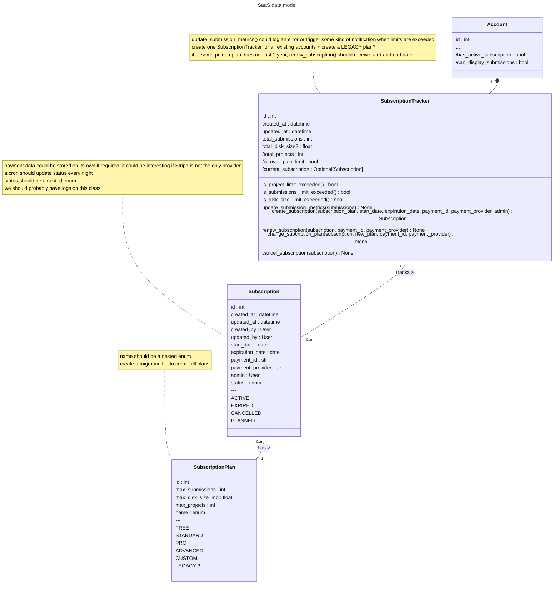

# SaaS modelization

This document will explain the necessary changes that will be made to prepare the SaaS version of the application.

General philosophy of IASO SaaS:
- clients will be able to choose a subscription plan, based on their needs
- each plan has a set of limits (number of submissions, disk size, number of projects, etc.)
- if some limit is exceeded, the client will always be able to continue submitting data (therefore exceeding even more the limit), but they won't be able to visualize any of their submissions
  - are they not able to visualize any other type of data?
  - should the concerned API endpoints return anything special when the limit is exceeded? `402` error?

## Table of contents
1. [Use cases](#use-cases)
2. [Data model](#data-model)
3. [API](#api) 

## Use cases

## Data model

## API

Based on the use cases and the data model, we will probably need to create a new API endpoint: `/api/subscriptions/`

It's not clear yet how we will interact with that endpoint since there is currently no information about the stripe & hubspot interactions (polling? webhook that receives notifications? something else?)

I suggest that we:
- don't create subscriptions "directly" through the API by passing its parameters like any other object
- create instead subscriptions through a payment ID, we check the payment provider API to get some confirmation/information and create the subscription based on that
- have a FREE payment plan as default
