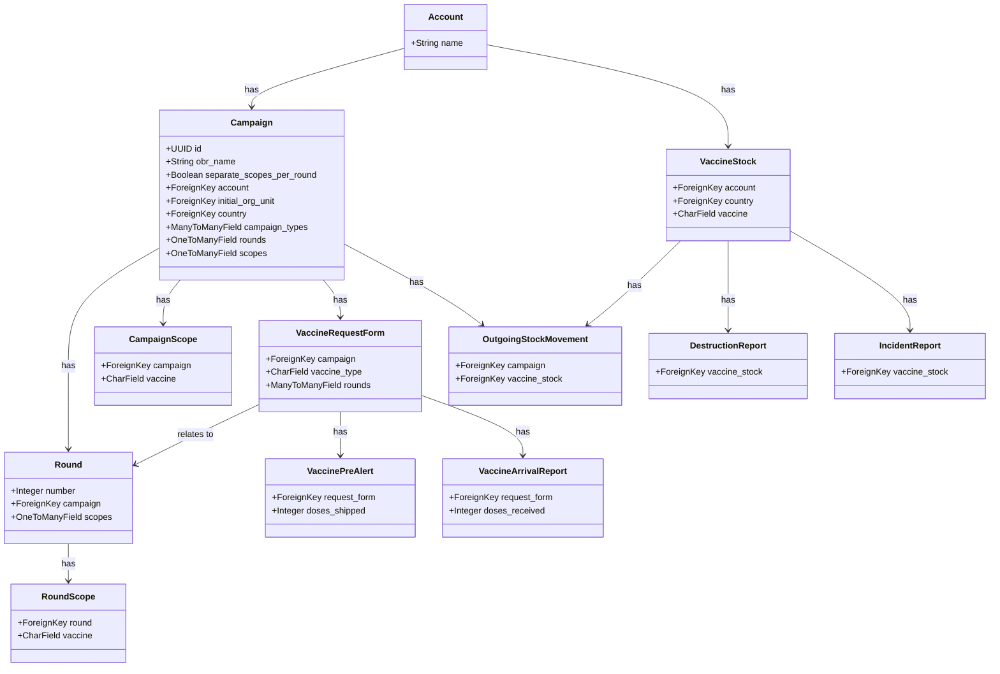

# Vaccine Management in IASO.

Overview of the related models

```mermaid
classDiagram
    class Account {
        +String name
    }
    class Campaign {
        +UUID id
        +String obr_name
        +Boolean separate_scopes_per_round
        +ForeignKey account
        +ForeignKey initial_org_unit
        +ForeignKey country
        +ManyToManyField campaign_types
        +OneToManyField rounds
        +OneToManyField scopes
    }

    class Round {
        +Integer number
        +ForeignKey campaign
        +OneToManyField scopes
    }

    class RoundScope {
        +ForeignKey round
        +CharField vaccine
    }

    class CampaignScope {
        +ForeignKey campaign
        +CharField vaccine
    }

    class VaccineRequestForm {
        +ForeignKey campaign
        +CharField vaccine_type
        +ManyToManyField rounds
    }

    class VaccinePreAlert {
        +ForeignKey request_form
        +Integer doses_shipped
    }

    class VaccineArrivalReport {
        +ForeignKey request_form
        +Integer doses_received
    }

    class VaccineStock {
        +ForeignKey account
        +ForeignKey country
        +CharField vaccine
    }

    class OutgoingStockMovement {
        +ForeignKey campaign
        +ForeignKey vaccine_stock
    }

    class DestructionReport {
        +ForeignKey vaccine_stock
    }

    class IncidentReport {
        +ForeignKey vaccine_stock
    }

    Campaign --> Round : has
    Account --> Campaign : has
    Account --> VaccineStock : has
    Round --> RoundScope : has
    Campaign --> CampaignScope : has
    Campaign --> VaccineRequestForm : has
    Campaign --> OutgoingStockMovement : has
    VaccineRequestForm --> Round : relates to
    VaccineRequestForm --> VaccinePreAlert : has
    VaccineRequestForm --> VaccineArrivalReport : has
    VaccineStock --> OutgoingStockMovement : has
    VaccineStock --> DestructionReport : has
    VaccineStock --> IncidentReport : has
```
