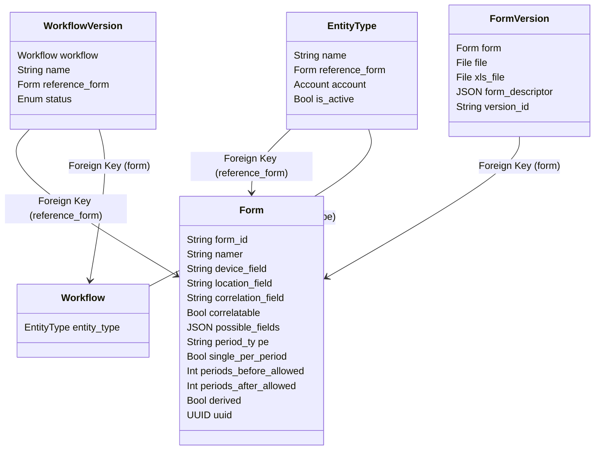

# Table of contents

**[Table of contents](#table-of-contents) 2**

**[What are entities?](#what-are-entities) 3**

**[How to create an entity?](#how-to-create-an-entity) 3**

> [Enable the feature](#enable-the-feature) 3
>
> [Create and upload the profile
> form](#create-and-upload-the-profile-form) 3
>
> [Create the entity type](#create-the-entity-type) 4
>
> [Create an entity](#create-an-entity) 4

**[How to configure how we display an
entity?](#how-to-configure-how-we-display-an-entity) 6**

> [In the web interface](#in-the-web-interface) 6
>
> [In the list](#in-the-list) 6
>
> [In the details screen](#in-the-details-screen) 7
>
> [In the mobile application](#in-the-mobile-application) 7
>
> [In the list](#in-the-list-1) 7
>
> [In the details screen](#in-the-details-screen-1) 8

**[Searching for an entity](#searching-for-an-entity) 8**

> [On the web](#on-the-web) 8
>
> [In the application](#in-the-application) 9

**[What are workflows?](#what-are-workflows) 9**

> [Create a workflow](#create-a-workflow) 9
>
> [Follow-ups and changes](#follow-ups-and-changes) 10
>
> [Follow-ups](#follow-ups) 10
>
> [Changes](#changes) 10
>
> [Using values from the profile in subsequent
> forms](#using-values-from-the-profile-in-subsequent-forms) 11
>
> [Publishing workflows](#publishing-workflows) 11

# What are entities?

We call an “**Entity**” anything that can move or be moved and that we
want to track through time and Org Units. For example, a beneficiary, a
car, a vaccination card, etc.

To differentiate between different kinds of entities, Iaso has a concept
of “**Entity Type**”.

Iaso heavily relies on [<u>XLSForms</u>](https://xlsform.org), and
entities are no exceptions. Therefore, an entity is represented by a
submission to a form. This submission is referred to as the **profile**.
The entity type defines which form has to be filled in.

# How to create an entity?

## Enable the feature

In order to create an entity, your project must first enable the entity
feature flag. You can set this flag either during its creation or by
updating it later.

## Create and upload the profile form

Using the sheet application of your choosing, create an XLSForm which
will contain all the questions related to your entity that are either
fixed (I.e., first name and last name) or can evolve through time (I.e.,
a program to which an entity can be affiliated to).

Upload it on the server using the web application.

| **Note:** The questions that can evolve through time should not be editable. |
|------------------------------------------------------------------------|

## Create the entity type

In the entity types screen, click on the “CREATE” button. Give the
entity type a name and select the newly uploaded form as a reference
form:

| **Note:** We’ll see later what “List fields” and “Detail info fields” are. |
|------------------------------------------------------------------------|

## Create an entity

In the mobile application, make sure that the data has been refreshed
and are up to date with the backend server. You will now be able to see
the entity screen.

At the moment, it is not possible to create an Entity from a web
interface.

Click the “Add” button in the application.

Select the entity type you want to create.

You will be prompted to confirm your selection.

You can then fill out the form to finalize your first entity.

# How to configure how we display an entity?

Within the entity type’s configuration, it is possible for
administrators to define which questions are displayed within lists and
within the details screen.

This impacts how the web and mobile applications display entities, as
shown below.

## In the web interface

### In the list

### In the details screen

## In the mobile application

### In the list

### In the details screen

# Searching for an entity

## On the web

In the beneficiary list, you can filter by type and/or enter a query to
filter based on the identifier or any of the list fields values.

## In the application

Clicking on the magnifying glass icon on the entity screen will lead you
to the list of all entities and allow you to filter them quickly based
on the identifier or any of the list fields values.

If you need a more fine-grained selection, you can click on the funnel
icon, select a type and fill out the search form (second picture)

# What are workflows?

As stated before, an entity is tracked through time and Org Units. In
order to achieve this, Iaso links the subsequent submissions for an
entity together and allows subsequent submissions to change the profile.
In order for you to choose which forms should be presented next and what
values override the properties of the profile, you can define a
workflow.

## High Level Schema of the workflow's models

## Create a workflow

In the entity types’ list, click on the workflow icon

In the list of the workflow versions, create the “CREATE” button and
give the version a name:

## Follow-ups and changes

### Follow-ups

They represent the next possible forms based on the state of the
profile. They are based on a condition.  
In the following example, the mobile application will offer “U5
Registration WFP” as the next possible form if the first name is “Bill”.

| **Reminder**: “First Name” is one of the questions in the Entity Type’s form. |
|------------------------------------------------------------------------|

### Changes

They represent the mapping of what value from a form will change the
values in the profile.

In the example below, the “Target form” is the Entity Type’s form, and
the “Source form” is the subsequent submission.

When a “U5 Registration WFP” form is filled out, the value entered in
“Child’s Age in months” will be copied into the profile’s “Age (Months)”
question. And the value entered in “Child’s Name” will be copied into
the profile’s “First Name” question.

## Using values from the profile in subsequent forms

Sometimes, you want a subsequent form to use values from the profile. In
order to do so, just add a question with the same identifier and type as
the value from the profile.

I.e., Let’s assume the profile has 2 questions of type “text”:
first_name and last_name. By adding a read-only similar question in your
subsequent forms, the value will be available to you.

## Publishing workflows

Once a workflow version has been published, it is marked as finalized,
and it cannot be edited anymore. Only workflows in “draft” can be
edited.

If you want to edit a finalized workflow, you first need to duplicate it
using the “Copy version” button. A new draft version is then created
with the same content.
