# FAQ

### Comment configurer Iaso pour que les utilisateurs mobiles ne puissent pas créer de nouvelles UO ? Et/ou est-il possible de limiter la création d'UO à certains types d'UO ? Ex : les utilisateurs mobiles peuvent créer les types situés en bas de la hiérarchie (FOSA, village), mais pas ceux du haut (Région -> Aire sanitaire) ?

Cela se configure dans le type d'unité d'organisation : vous spécifiez ce qui est autorisé sous un type d'unité d'organisation donné dans le sélecteur « sous-types d'unité d'organisation ».

### Comment configurer un ETL IASO ?

[Extract, Transform, Load (ETL)](https://en.wikipedia.org/wiki/Extract,_transform,_load) est un script permettant d'extraire et de transformer les données d'entités d'IASO vers le format attendu par les tableaux de bord Tableau.

Actuellement, il lit et écrit dans la même base de données que l'installation Iaso. Le script ETL peut être utilisé de deux manières :

1. Il peut être planifié comme tâche périodique, ce qui signifie qu'il est configuré pour s'exécuter régulièrement.
2. Il peut aussi être planifié comme une tâche ponctuelle, où la tâche n'est exécutée qu'une seule fois.

#### Comment consulter les tâches périodiques planifiées

Depuis la page d'administration Iaso, dans la section « Periodic Tasks », sélectionnez « Periodic tasks » :

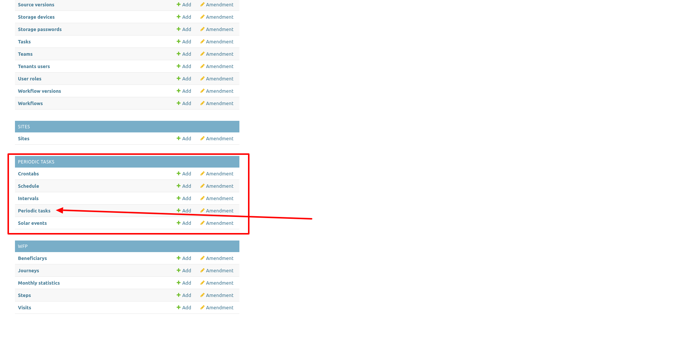

Vous obtiendrez une liste des tâches planifiées :

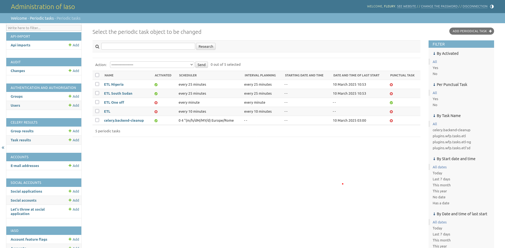

#### Comment créer une tâche ETL en tant que tâche périodique

Depuis la page d'administration Iaso, dans la liste « Periodic Tasks », en haut à droite, il y a un bouton **Add periodical task** :

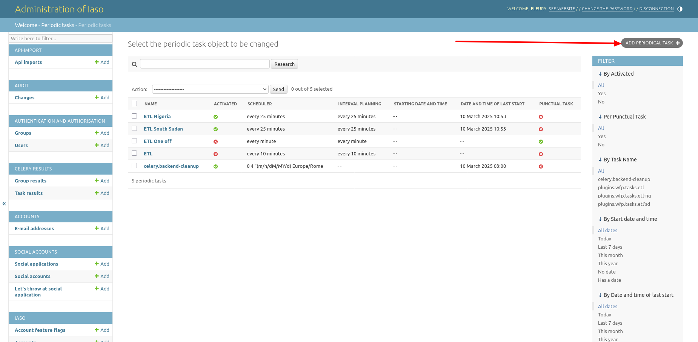

Vous obtiendrez un formulaire pour créer/modifier une tâche périodique comme la tâche ETL :

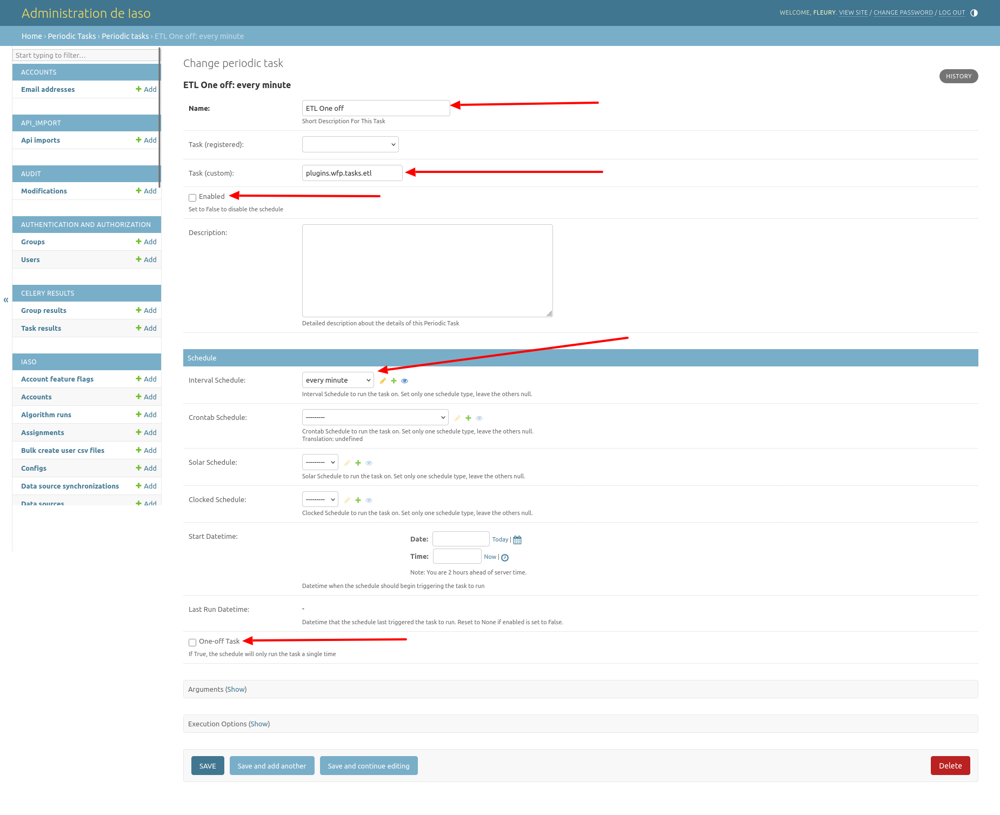

Il y a 5 champs principaux :

- Name : le nom de la tâche
- Task (custom) : un script personnalisé développé
- Enabled : si activé à true, la tâche s'exécutera automatiquement
- Interval Schedule : la fréquence d'exécution de la tâche (quand Enabled est à True)
- One-off Task : si cette case est cochée, la tâche planifiée ne s'exécutera qu'une seule fois

Cliquez ensuite sur **Save** pour enregistrer la tâche !

Dans la liste des tâches périodiques, quand **Enabled** et/ou **One-off Task** est à true, l'icône ronde devient verte, sinon elle est rouge !

#### Comment exécuter le script ETL manuellement

Depuis la page « Periodic tasks » de l'administration Iaso, sélectionnez la tâche ETL à exécuter, puis dans le champ « Action » au-dessus, sélectionnez l'action « Run Selected Tasks » :

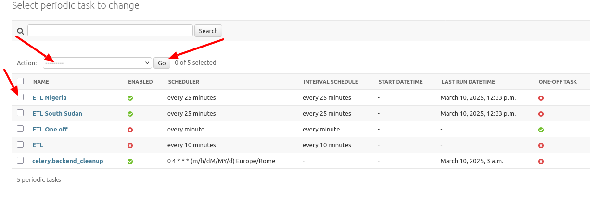

Cliquez ensuite sur le bouton **Go** :

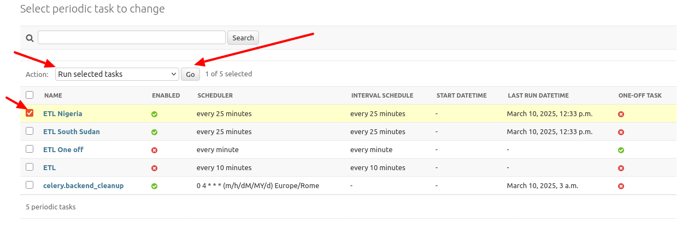

Notez que la file de tâches est gérée par Celery, une file de tâches distribuée (Distributed Task Queue).

Une fois la tâche terminée, vous pouvez aller dans la section « Celery Results » et ouvrir « Task results ». Vous y trouverez une liste des tâches terminées, classées par date et heure de fin, avec pour chaque ligne :

1. Period task name : le nom de la tâche
2. Task Name : le script personnalisé développé
3. Completed datetime : l'heure à laquelle le script a terminé de s'exécuter
4. Task state : **SUCCESS** si la tâche s'est exécutée avec succès, **FAILURE** en cas d'échec

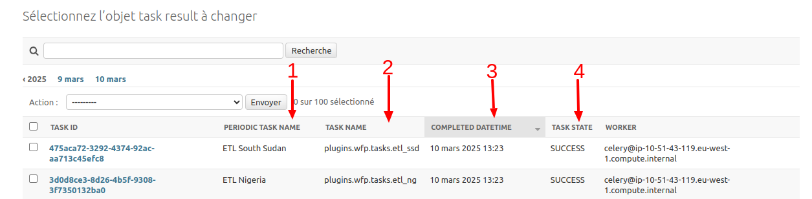

Lorsque la tâche s'est exécutée avec succès, elle alimente la table analytique avec les données des entités.
Sur la page d'administration Iaso, vous trouverez toutes les tables analytiques dans la section WFP :

1. Beneficiaries
2. Journeys
3. Visits
4. Steps
5. Monthly statistics

Notez que, dans notre cas, il existe 2 types de bénéficiaires : **Children under 5** et **Pregnant and Lactating Women** (PLW)

##### 1. Beneficiaries

Une table analytique pour stocker les informations de base du bénéficiaire :

- Birth date : la date de naissance du bénéficiaire enregistrée lors de la visite d'admission
- Gender : le sexe du bénéficiaire, utilisé uniquement pour les enfants de moins de 5 ans
- Entity id : référence à l'id de l'entité
- Account : référence au compte du pays

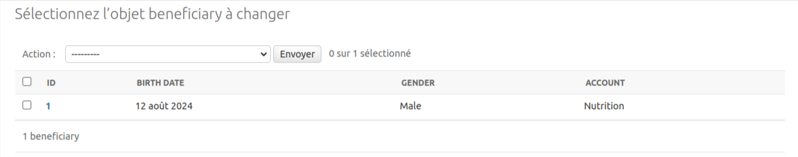

##### 2. Journeys

Table analytique pour stocker les informations du bénéficiaire depuis son admission dans le programme jusqu'à sa sortie. Lorsqu'un bénéficiaire est admis dans un programme, cela marque, dans le contexte actuel, le début d'un parcours (journey) qui se terminera lorsqu'il sera sorti du programme.

- Beneficiary : référence à l'id du bénéficiaire
- Admission Criteria : le critère sélectionné lors de la visite d'admission, ex : MUAC, WHZ
- Admission Type : le type d'admission sélectionné lors de la visite d'admission. ex : New Case, Relapse, etc.
- Nutrion Programme : le programme sélectionné lors de la visite d'admission. ex : OTP, TSFP
- Programme Type : indique si le bénéficiaire est un enfant de moins de 5 ans ou une femme enceinte/allaitante, ex : U5, PLW
- Initial Weight : le poids du bénéficiaire à son admission dans le programme
- Discharge Weight : le poids du bénéficiaire à sa sortie du programme
- Start Date : la date d'admission
- End Date : la date de sortie
- Duration : la durée du séjour (nombre de jours entre la date d'admission et la date de sortie), c'est-à-dire la durée du parcours
- Weight Gain : la différence entre le poids de sortie et le poids initial lorsqu'elle est positive
- Weight Loss : la différence entre le poids de sortie et le poids initial lorsqu'elle est négative
- Exit Type : le motif de sortie du programme. ex : Cured, Voluntary Withdrawal, Death, Defaulter, etc.
- Instance Id : référence à la soumission du formulaire d'enregistrement du bénéficiaire

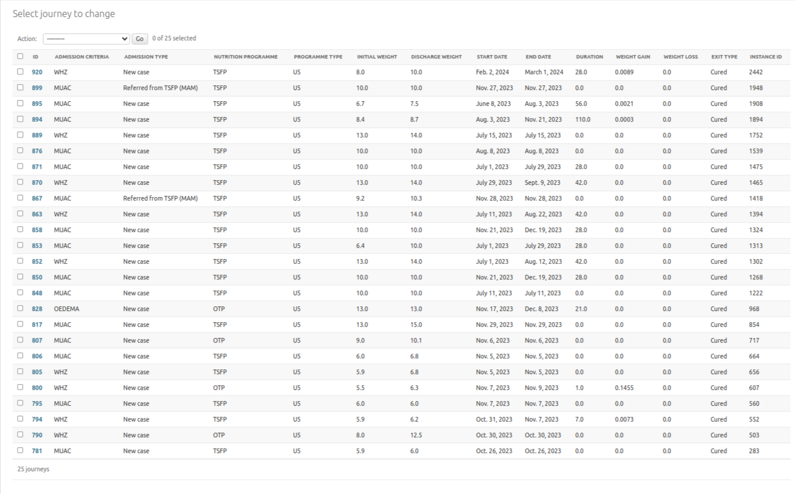

##### 3. Visits

Table analytique pour stocker les informations des visites du bénéficiaire. Par exemple, dans un programme de nutrition, il existe 2 types de visites :

1. admission : la première fois que le bénéficiaire est admis dans le programme
2. followup : les visites suivantes lorsque le bénéficiaire est déjà admis dans le programme

Voici les champs de la table :

- Date : date de la visite d'admission ou de suivi
- Number : le numéro de la visite en cours (la visite d'admission est 0)
- Org unit : l'unité d'organisation où la visite a eu lieu
- Journey : référence à l'id du parcours auquel appartient la visite

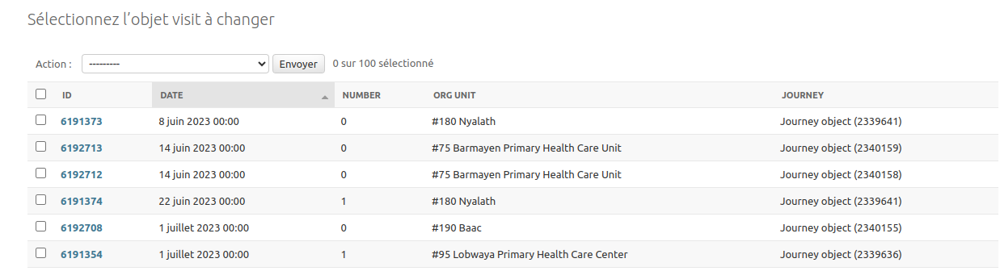

##### 4. Steps

Dans le contexte d'un programme de nutrition, une visite est découpée en 3 étapes : anthropométrique, médicale et assistance.

Voici les champs de la table :

- Assistance type : le type d'assistance donné pendant la visite médicale ou d'assistance. ex : Amoxillin, Soap, Net, CSB, etc.
- Quantity given : la quantité donnée pour ce type d'assistance.
- Visit : référence à la visite liée

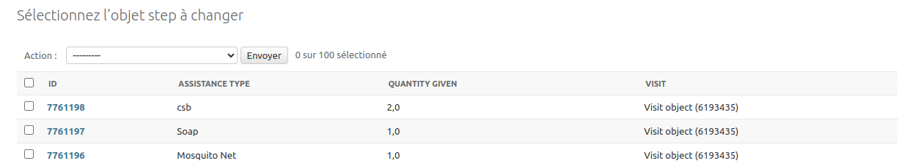

Pour chaque table analytique, vous trouverez à droite des filtres permettant de filtrer les données selon différentes valeurs de champs.

##### 5. Monthly statistics

Une table analytique qui agrège les données d'assistance des visites selon l'unité d'organisation où les visites ont eu lieu, la période (mois et année), et le type et la quantité d'assistance donnée.

Par exemple, lorsque 3 visites de 3 bénéficiaires appartenant au même type de programme, programme de nutrition, type d'admission et critère d'admission, ont eu lieu dans la même unité d'organisation, le même mois et la même année, et que différentes assistances ont été données au cours de ces visites, ces 3 visites seront agrégées en 1 dans cette table en additionnant les quantités d'assistance données pour le même type d'assistance.

Voici les champs de la table :

1. Org Unit : la référence de l'unité d'organisation où les visites ont eu lieu
2. Account : référence au compte du pays
3. Month : le mois où les visites ont eu lieu
4. Year : l'année où les visites ont eu lieu
5. Admission criteria : le critère d'admission de toutes les visites agrégées
6. Admission type : le type d'admission de toutes les visites agrégées
7. Nutrition program : le programme de nutrition de toutes les visites agrégées
8. Program type : le type de programme de toutes les visites agrégées
9. Number visits : le nombre de visites agrégées
10. Given sachet RUSF : la somme de toute la quantité donnée de RUSF (type d'assistance) pendant les visites d'assistance
11. Given sachet RUTF : la somme de toute la quantité donnée de RUTF (type d'assistance) pendant les visites d'assistance
12. Given quantity CSB : la somme de tout le CSB donné pendant le type d'assistance

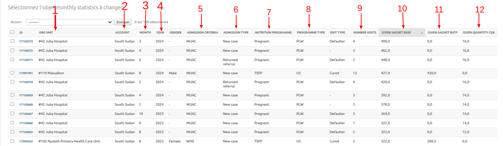

Notez qu'à droite se trouve un filtre permettant de filtrer les données selon différentes valeurs de champs.
