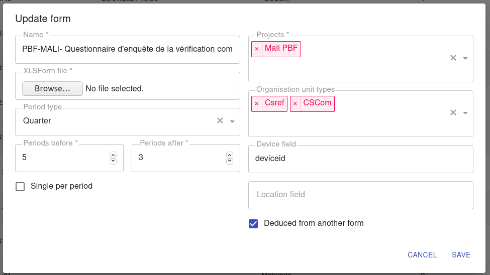
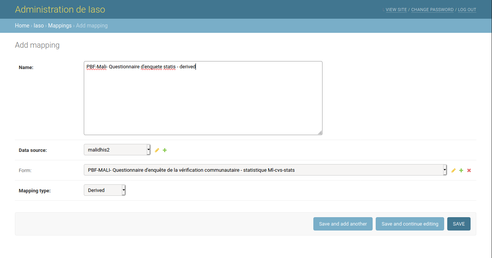
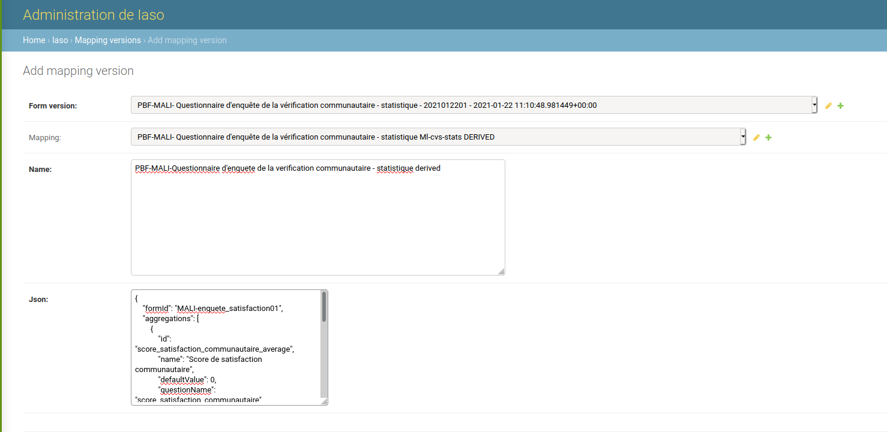
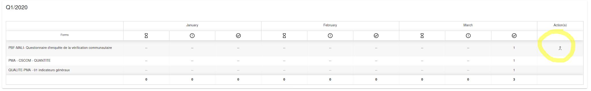
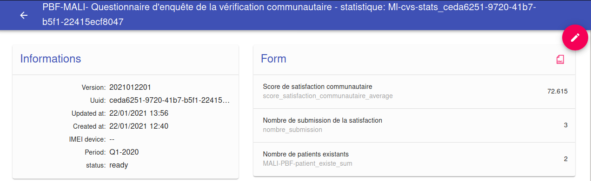

# Deducir un formulario a partir de otro formulario (estadísticas agregadas)

Cuando marca **"Deducido de otro formulario"** en un formulario, ese formulario deja de ser algo que los usuarios de campo completan ellos mismos. En su lugar, IASO genera automáticamente sus envíos agregando las respuestas de un formulario *diferente* - calculando una suma, un promedio, un conteo, un mínimo o un máximo por unidad organizacional y período.

## Para qué sirve

Esto se usa principalmente en programas de **Financiamiento Basado en el Desempeño (FBD)**. Un caso típico: una encuesta de satisfacción comunitaria se completa una vez por cada paciente encontrado (¿se encontró al paciente? ¿qué puntaje dio?). Para efectos de facturación, lo que realmente se necesita es el agregado por unidad organizacional y período - cuántos pacientes fueron encontrados, cuál fue el puntaje de satisfacción promedio, etc.

En lugar de volver a codificar esos totales manualmente, o de depender de los propios analytics/agregación de eventos de DHIS2 para calcularlos, IASO puede generar un envío de "estadísticas" directamente a partir de las respuestas de la encuesta subyacente. Ese agregado puede luego usarse para la facturación dentro de IASO (por ejemplo con Hesabu), o mapearse hacia un conjunto de datos de DHIS2 para uso posterior.

## Cómo configurarlo

### 1. Crear el formulario de encuesta y el formulario de estadísticas

Cargue ambos formularios en IASO como de costumbre:

- El **formulario de encuesta** es el que los usuarios de campo realmente completan (por ejemplo, un envío por paciente).
- El **formulario de estadísticas** contiene los resultados agregados. Márquelo como **"Deducido de otro formulario"** - esto evita que los usuarios de campo creen envíos de este formulario manualmente en la aplicación móvil, ya que está pensado para ser generado, no completado.



Consejo: dé a ambos formularios el mismo prefijo de nombre (por ejemplo "... - estadística") para que aparezcan uno junto al otro en las listas de formularios.

### 2. En la administración de Django, crear un Mapping

Vaya a `/admin/iaso/mapping/` y agregue un nuevo **Mapping**:

- **Form**: el formulario de estadísticas (no el formulario de encuesta)
- **Mapping type**: `Derived`



**Tenga cuidado aquí**: la administración de Django muestra todos los proyectos y formularios de la cuenta. Es fácil vincular por error formularios que pertenecen a proyectos no relacionados.

### 3. Crear una Mapping version con las reglas de agregación

Todavía en la administración de Django, agregue una **Mapping version** para ese mapping, apuntando a una versión específica del formulario de estadísticas, con un JSON que describa qué se debe agregar:

```json
{
  "formId": "MALI-enquete_satisfaction01",
  "aggregations": [
    {
      "id": "score_satisfaction_communautaire_average",
      "name": "Score de satisfaction communautaire",
      "defaultValue": 0,
      "questionName": "score_satisfaction_communautaire",
      "aggregationType": "avg"
    },
    {
      "id": "nombre_submission",
      "name": "Nombre de submission de la satisfaction",
      "defaultValue": 0,
      "questionName": "MALI-PBF-patient_existe",
      "aggregationType": "count"
    }
  ]
}
```



Cada entrada en `aggregations` significa:

| Campo | Significado |
|---|---|
| `formId` | El ID del formulario de **encuesta** del que se leen las respuestas |
| `id` | El nombre de la pregunta en el formulario de **estadísticas** donde se escribe el resultado |
| `name` | La etiqueta mostrada para esa pregunta en el formulario de estadísticas |
| `questionName` | El nombre de la pregunta en el formulario de **encuesta** que se va a agregar |
| `aggregationType` | Uno de `sum`, `avg`, `count`, `max`, `min` |
| `defaultValue` | El valor usado cuando no hay nada que agregar |

## Generar las instancias deducidas

Una vez que el formulario de encuesta tiene envíos, vaya a **Forms > Completeness (Formularios > Completitud)**, busque la fila del formulario de encuesta para el período correspondiente, y haga clic en el ícono de generación en la columna **Action(s)**.



Esto crea un nuevo envío del formulario de estadísticas por unidad organizacional y período, completado con los valores calculados.



## Puntos a tener en cuenta

- **La lógica de salto ("relevant") cambia lo que se promedia.** Si una pregunta (por ejemplo, el puntaje de satisfacción) solo se hace cuando se cumple una condición (por ejemplo, "paciente encontrado"), un `avg` solo promedia los envíos donde esa pregunta fue realmente respondida - las respuestas saltadas no cuentan como cero. `avg(15, 12, 12, 0, 0)` y `avg(15, 12, 12)` dan resultados muy diferentes; decida qué comportamiento realmente desea y ajuste la lógica `relevant` de la encuesta en consecuencia.
- **Pruebe con al menos 3 envíos**, incluyendo algunos donde se active la rama de "no encontrado", para asegurarse de que la agregación se comporte como se espera antes de confiar en ella.
- **Vuelva a generar después de cambios.** Si los envíos de la encuesta cambian después de que ya se generó una instancia de estadísticas, debe volver a hacer clic en el botón de generación para actualizarla.

## Ir más allá: enviar el agregado a DHIS2

La instancia de estadísticas puede ser en sí misma la fuente de un mapping adicional hacia DHIS2 (un mapping de tipo "Aggregate"), que envía los valores calculados a un conjunto de datos de DHIS2. Así es como los indicadores de FBD agregados terminan alimentando las herramientas de facturación basadas en DHIS2.
