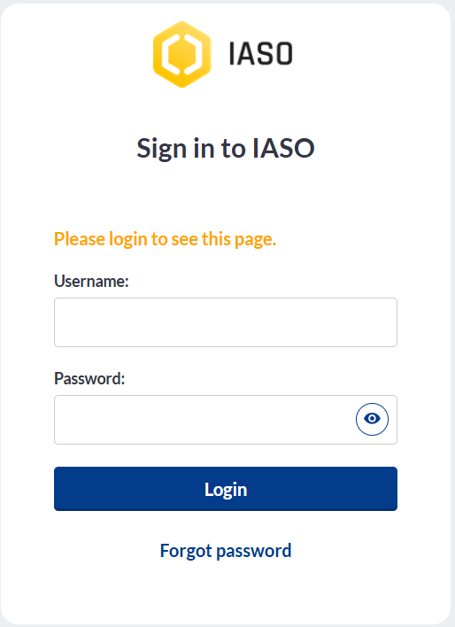
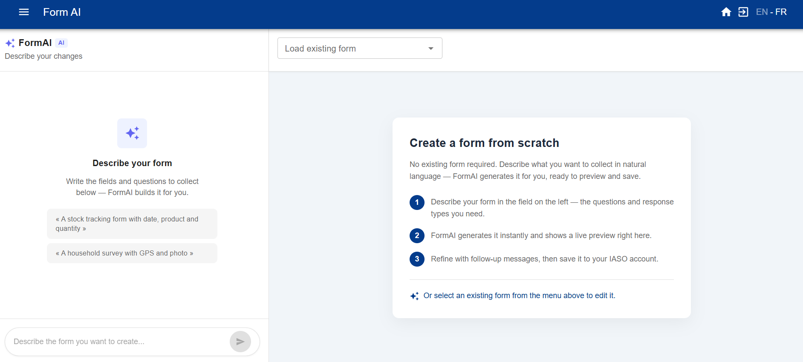

# Get started with IASO

*A first-timer's guide to basic configuration.*

This guide is for account administrators setting up a new IASO SaaS account for the first
time. It covers subscribing to a plan, logging in, setting up your geographical data,
creating your first data collection form, and connecting the mobile app.

## 1. Subscribe to IASO

If you haven't subscribed yet, go to [openiaso.com/pricing](https://www.openiaso.com/pricing/)
and choose a plan. If you're not sure yet, you can start with a free trial to try out the
product.

You'll then receive an email with instructions to create your account.

## 2. Connect to your account

Go to [app.openiaso.com](https://app.openiaso.com/).

Enter your credentials and click "Login".

{ .doc-shot }

## 3. Set up your geographical data

Your geographical data appears under the "Org Units" menu. It's empty by default on a new
account. You can set it up manually, or by importing a geopackage file (a standard file
format for geographic boundary data).

**Manual configuration**

- Go to "Org Units" > "Configuration" > "Organisation unit type"
- Create the organisation unit types that match the geographical levels in your data (e.g.
  country, region, district, facility)
- See the [organisation unit types guide](../reference/user_guide.md#organization-unit-types-management)
  for more detail

**Import a geopackage**

- Go to "Admin" > "Data sources list" > "Create"
- Name your data source and assign it to one or more projects
- Your geopackage file needs to follow this format: [github.com/BLSQ/iaso](https://github.com/BLSQ/iaso/tree/main/iaso/gpkg)

## 4. Create your data collection forms

Go to the "Forms" menu. You can create a form in two ways:

**Option A — Generate a form with Form AI**

- Go to "Forms" > "Form AI"

{ .doc-shot }

- Describe the form you want in a prompt: list the questions you need, specify whether each
  should be an open question or closed with pre-selected fields, and mention any skip logic.
- IASO generates a form you can preview and adjust on the right-hand side. Save it once
  you're happy with it.

**Option B — Import an existing XLS form**

- Go to "Forms" > "Form list" > "Add form"

{ .doc-shot }

Then fill in the fields:

- Form name (mandatory)
- Project (mandatory)
- Org unit type (recommended)
- Org unit group (only if relevant, otherwise leave blank)
- Period (only if relevant, otherwise leave blank)

{ .doc-shot }

## 5. Download the IASO mobile app

Get the IASO mobile app on the Google Play Store: [play.google.com](https://play.google.com/store/apps/details?id=com.bluesquarehub.iaso&hl=en)

## 6. Scan the QR code and get started

On the IASO web application, go to "Projects". Make sure the required feature flags are
activated for your project. Then, click the QR code for your project. Scan it from the
mobile app to finish setup.
