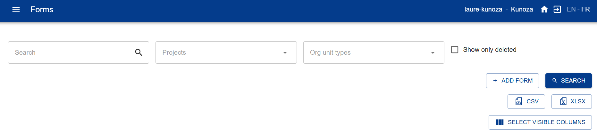
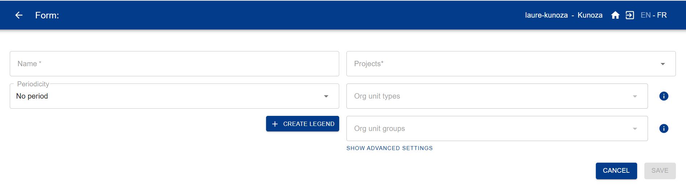

# Primeros pasos con IASO

*Una guía para la primera configuración básica.*

Esta guía está dirigida a los administradores de cuenta que configuran una nueva cuenta SaaS
de IASO por primera vez. Cubre la suscripción a un plan, el inicio de sesión, la configuración
de sus datos geográficos, la creación de su primer formulario de recolección de datos y la
conexión de la aplicación móvil.

## 1. Suscribirse a un plan SaaS

IASO ya está disponible como producto SaaS.

Si aún no se ha suscrito, vaya a [openiaso.com/pricing](https://www.openiaso.com/pricing/) y
elija un plan. Si todavía no está seguro, puede comenzar con una prueba gratuita para probar
el producto.

Luego recibirá un correo electrónico con las instrucciones para crear su cuenta.

## 2. Conectarse a su cuenta

Vaya a [app.openiaso.com](https://app.openiaso.com/).

Introduzca sus credenciales y haga clic en "Login".

## 3. Configurar sus datos geográficos

Sus datos geográficos aparecen en el menú "Org Units" (Unidades Organizacionales). Está vacío
por defecto en una cuenta nueva. Puede configurarlo manualmente, o importando un archivo
geopackage (un formato de archivo estándar para datos de límites geográficos).

**Configuración manual**

- Vaya a "Org Units" > "Configuration" > "Organisation unit type" (Tipo de Unidad
  Organizacional)
- Cree los tipos de Unidad Organizacional que correspondan a los niveles geográficos de sus
  datos (por ejemplo, país, región, distrito, centro de salud)
- Consulte la [guía de tipos de Unidad Organizacional](../reference/user_guide.md#gestion-de-tipos-de-unidades-organizacionales)
  para más detalles

**Importar un geopackage**

- Vaya a "Admin" > "Data sources list" (Lista de fuentes de datos) > "Create"
- Nombre su fuente de datos y asígnela a uno o varios proyectos
- Su archivo geopackage debe seguir este formato: [github.com/BLSQ/iaso](https://github.com/BLSQ/iaso/tree/main/iaso/gpkg)

## 4. Crear sus formularios de recolección de datos

Vaya al menú "Forms" (Formularios). Puede crear un formulario de dos maneras:

**Opción A — Generar un formulario con Form AI**

- Vaya a "Forms" > "Form AI"
- Describa el formulario que desea en una instrucción: enumere las preguntas que necesita,
  especifique si cada una debe ser una pregunta abierta o cerrada con opciones predefinidas, y
  mencione cualquier lógica de salto.
- IASO genera un formulario que puede previsualizar y ajustar en el panel derecho. Guárdelo
  una vez que esté satisfecho con el resultado.

**Opción B — Importar un formulario XLS existente**

- Vaya a "Forms" > "Form list" > "Add form"

{ .doc-shot }

Luego complete los campos:

- Nombre del formulario (obligatorio)
- Proyecto (obligatorio)
- Tipo de Unidad Organizacional (recomendado)
- Grupo de Unidad Organizacional (solo si es relevante, de lo contrario déjelo en blanco)
- Período (solo si es relevante, de lo contrario déjelo en blanco)

{ .doc-shot }

## 5. Descargar la aplicación móvil de IASO

Obtenga la aplicación móvil de IASO en Google Play Store: [play.google.com](https://play.google.com/store/apps/details?id=com.bluesquarehub.iaso&hl=es)

## 6. Escanear el código QR y comenzar

Antes de escanear, asegúrese de que los indicadores de funcionalidad necesarios estén
activados para su proyecto.

Luego, en la aplicación web de IASO, vaya a "Projects" (Proyectos) y haga clic en el código QR
de su proyecto. Escanéelo desde la aplicación móvil para finalizar la configuración.
