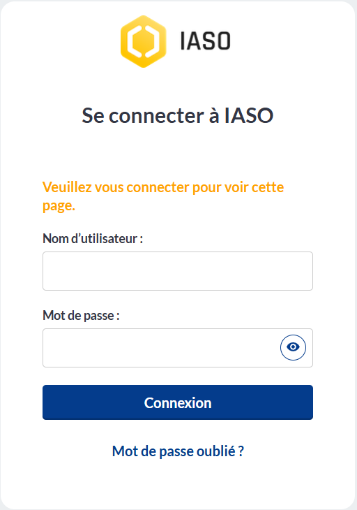
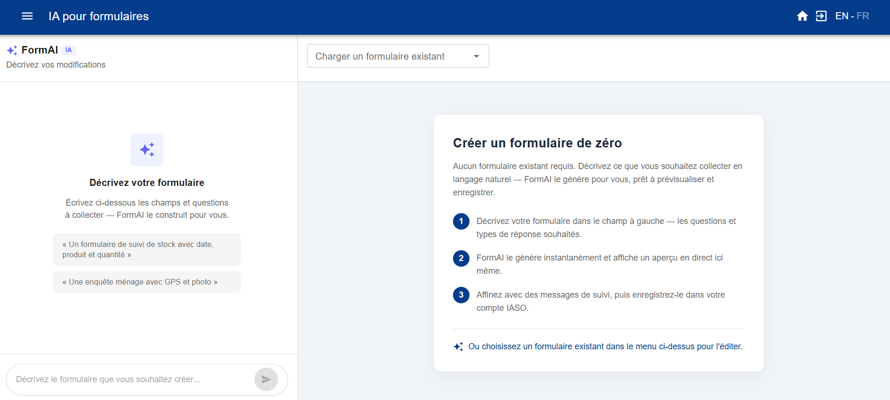

# Bien démarrer avec IASO

*Un guide pour une première configuration de base.*

Ce guide s'adresse aux administrateurs de compte qui configurent un nouveau compte IASO SaaS
pour la première fois. Il couvre l'abonnement à une offre, la connexion, la configuration de
vos données géographiques, la création de votre premier formulaire de collecte de données, et
la connexion de l'application mobile.

## 1. S'abonner à IASO

Si vous n'êtes pas encore abonné, rendez-vous sur [openiaso.com/pricing](https://www.openiaso.com/pricing/)
et choisissez une offre. Si vous n'êtes pas encore sûr, vous pouvez commencer par un essai
gratuit pour découvrir le produit.

Vous recevrez ensuite un email avec les instructions pour créer votre compte.

## 2. Se connecter à votre compte

Rendez-vous sur [app.openiaso.com](https://app.openiaso.com/).

Saisissez vos identifiants et cliquez sur "Login".

{ .doc-shot }

## 3. Configurer vos données géographiques

Vos données géographiques apparaissent dans le menu "Org Units" (Unités d'organisation).
Il est vide par défaut sur un nouveau compte. Vous pouvez le configurer manuellement, ou en
important un fichier geopackage (un format de fichier standard pour les données de limites
géographiques).

**Configuration manuelle**

- Allez dans "Org Units" > "Configuration" > "Organisation unit type" (Type d'unité
  d'organisation)
- Créez les types d'unité d'organisation correspondant aux niveaux géographiques de vos
  données (par exemple pays, région, district, structure sanitaire)
- Consultez le [guide des types d'unité d'organisation](../reference/user_guide.md#gestion-des-types-dunites-dorganisation)
  pour plus de détails

**Importer un geopackage**

- Allez dans "Admin" > "Data sources list" (Liste des sources de données) > "Create"
- Nommez votre source de données et associez-la à un ou plusieurs projets
- Votre fichier geopackage doit respecter ce format : [github.com/BLSQ/iaso](https://github.com/BLSQ/iaso/tree/main/iaso/gpkg)

## 4. Créer vos formulaires de collecte de données

Allez dans le menu "Forms" (Formulaires). Vous pouvez créer un formulaire de deux façons :

**Option A — Générer un formulaire avec Form AI**

- Allez dans "Forms" > "Form AI"

{ .doc-shot }

- Décrivez le formulaire souhaité dans une requête : listez les questions dont vous avez
  besoin, précisez si chacune doit être une question ouverte ou fermée avec des choix
  prédéfinis, et mentionnez toute logique de saut.
- IASO génère un formulaire que vous pouvez prévisualiser et ajuster sur la partie droite.
  Enregistrez-le une fois satisfait.

**Option B — Importer un formulaire XLS existant**

- Allez dans "Forms" > "Form list" > "Add form"

{ .doc-shot }

Renseignez ensuite les champs :

- Nom du formulaire (obligatoire)
- Projet (obligatoire)
- Type d'unité d'organisation (recommandé)
- Groupe d'unité d'organisation (uniquement si pertinent, sinon laissez vide)
- Période (uniquement si pertinent, sinon laissez vide)

{ .doc-shot }

## 5. Télécharger l'application mobile IASO

Téléchargez l'application mobile IASO sur le Google Play Store : [play.google.com](https://play.google.com/store/apps/details?id=com.bluesquarehub.iaso&hl=fr)

## 6. Scanner le code QR et démarrer

Sur l'application web IASO, allez dans "Projects" (Projets). Assurez-vous que les indicateurs
de fonctionnalité requis sont activés pour votre projet. Cliquez ensuite sur le code QR de
votre projet. Scannez-le depuis l'application mobile pour terminer la configuration.
