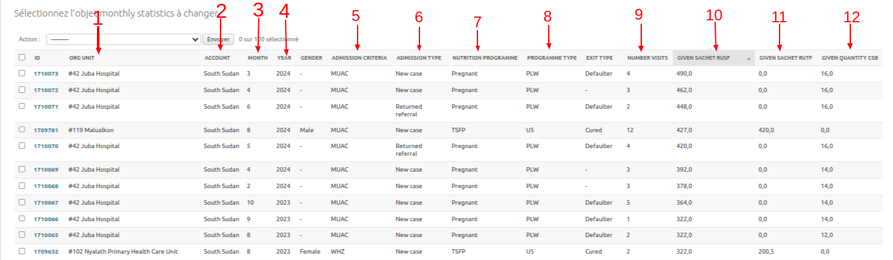

# IASO ETL

[Extract, Transform, Load (ETL)](https://en.wikipedia.org/wiki/Extract,_transform,_load) is a script to extract and transform entity data from IASO into the format expected by the Tableau dashboards.

Currently, it reads and writes to the same database as the Iaso installation. The ETL script can be used in two ways:

1. It can be scheduled as periodic task, which means it is set to run regulary.
2. Alternatively, it can be scheduled as a one-off task, where the task is executed only once.

## How to view scheduled periodic tasks

From the Iaso Admin page, in the "Periodic Tasks" section select "Periodic tasks":

You will get a list of scheduled tasks:

## How to create ETL task as periodic task

From the Iaso Admin page, in the "Periodic Tasks" list, on the top right side, there is a button **Add periodical task**:

You will get a form to create/edit a periodic task like the ETL task:

There are 5 main fields:

- Name: task name
- Task (custom): a developed custom script
- Enabled: if is set to true, the task will run automatically
- Interval Schedule: the frequency of execution of the task (when Enabled is set to True)
- One-off Task: if checked, the schedule will only run the task a single time

Then click on **Save** to save the task!

In the periodic tasks list, when **Enabled** and/or **One-off Task** is set to true the circle icon will become green, otherwise it's red!

## How to run the ETL script manually

From the Iaso Admin on the "Periodic tasks" page, select the ETL task to run, in the "Action" field above, select the action "Run Selected Tasks":

Then click on the **Go** button:

Note that the task queue is managed by Celery which is a Distributed Task Queue.

Once the task has finished running, you can go to the "Celery Results" section and open "Task results". There you will find a list of completed tasks ordered by completed datetime with for each row:

1. Period task name: the name of task
2. Task Name: the developed custom script
3. Completed datetime: the time when the script finished running
4. Task state: **SUCCESS** if the task ran successfully, **FAILURE** if it failed

When the task ran successfully, it will populate the analytics table with the entities data.
In the Iaso Admin page, you can find all analytics tables in the WFP section:

1. Beneficiaries
2. Journeys
3. Visits
4. Steps
5. Monthly statistics

Note that in our case, there are 2 beneficiary types: **Children under 5** and **Pregnant and Lactating Women** (PLW)

### 1. Beneficiaries

An analytics table to store the basic beneficiary information:

- Birth date: The beneficiary's birth date recorded in the admission visit
- Gender: The gender for the beneficiary, used only for children under 5
- Entity id: Reference to the entity id
- Account: reference to the country account

### 2. Journeys

Analytics table to store beneficiary information from the admission in the program to the exit. When a beneficiary is admitted in a program, it means in the current context the start of a journey that will end when he is discharged from the program.

- Beneficiary: Reference to beneficiary id
- Admission Criteria: the criteria selected in the admission visit, eg: MUAC, WHZ
- Admission Type: the admission type selected in the admission visit. eg: New Case, Relapse, etc...
- Nutrion Programme: the program selected in the admission visit. eg: OTP, TSFP
- Programme Type: It shows if the beneficiary is a child under 5 or a pregnant/lactating woman, e,g: U5, PLW
- Initial Weight: the weigth of beneficiary when admitted in the program
- Discharge Weight: the weigth of beneficiary when discharged from the program
- Start Date: the admission date
- End Date: the discharge date
- Duration: the length of the stay(number of days between the admission date and discharge date), i.e. the journey duration
- Weight Gain: the difference between discharge weight and initial weight when it's positive
- Weight Loss: the difference between discharge weight and initial weight when it's negative
- Exit Type: the reason of discharge from program. e.g: Cured, Voluntary Withdrawal, Death, Defaulter, etc...
- Instance Id: reference to the form submission of the beneficiary registration

### 3. Visits

Analytics table to store beneficiary visit information. For instance in nutrition program, there are 2 types of visits:

1. admission: the first time when the beneficiary is admitted in the program
2. followup: the successif visits when the beneficiary is already admitted into program

Here are the fields for the table:

- Date: admission or followup visit date
- Number: The number of current visit (admission visit is 0)
- Org unit: the org unit where the visit occured
- Journey: Reference to journey id where the visit belongs to

### 4. Steps

In the context of nutrition program, a visit is splitted into 3 steps: anthropometric, medical and assistance.

Here are the fields for the table:

- Assistance type: the assistance type given during the medical or assistance visit. e.g: Amoxillin, Soap, Net, CSB, etc...
- Quantity given: the quantity given for assistance type.
- Visit: Reference to the linked visit

For each analytics table, you will find filters on the right side that allow filtering data on various field values.

### 5. Monthly statisticss

An analytics table to aggregate assistance data within visits based on the org unit the visits happened, period (month and year) and assistance type and quantity given.

For example, when there are 3 visits for 3 beneficiaries that belong to the same program type, nutrition program, admission type and admission criteria, that happened in the same org unit, month and year, and within the visits various assistances have been given, in this table, those 3 visits will be aggregated in 1 by adding together the quantities of assistance given for the same assistance type.

Here are the fields for the table:

1. Org Unit: the reference of org unit where the visits happened
2. Account: reference to country account
3. Month: the month when the visits happened
4. Year: the month when the visits happened
5. Admission criteria: the admission criteria of all aggregated visits
6. Admission type: the admission type of all aggregated visits
7. Nutrition program:  the nutrition program of all aggregated visits
8. Program type: the program type of all aggregated visits
9. Number visits: the number of aggregated visits
10. Given sachet RUSF: the sum of all given quantity of RUSF (assistance type) during the assistance visits
11. Given sachet RUTF: the sum of all given quantity of RUTF (assistance type) during the assistance visits
12. Given quantity CSB: the sum of all CSB given during assistance type

Note that on the right there is a filter to allow filtering data on various field values.
