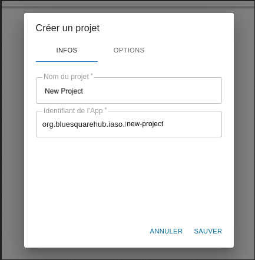

# 1. Configurar una cuenta IASO vacía

Encuentre a alguien con derechos de acceso apropiados (se requiere administrador django)

https://iaso.bluesquare.org/api/setupaccount/


Use y almacene el usuario/contraseña en un gestor de contraseñas

# 2. Crear un DHIS2 dedicado para IASO

Queremos mantener registro de qué app está cambiando qué datos/metadatos de dhis2 así que por favor no use el usuario principal/predeterminado "admin" sino uno dedicado.

- Vaya al módulo "Users / Utilisateurs" de dhis2

- "Duplicar el admin" 


- Genere una contraseña con gestor de contraseñas (necesita al menos un carácter especial)


# 3. Iniciar sesión en IASO con el usuario creado en el paso 1 

Verifique que la cuenta esté vacía o en el menú izquierdo

Evite hacer los siguientes pasos con el admin django, ya que puede llevar a accidentes industriales: el usuario puede estar vinculado a una cuenta/proyecto totalmente diferente y podría terminar con la pirámide de un proyecto llena de orgunits de otro país.


 


# 4. Agregar un nuevo proyecto

Use la nomenclatura usada por los clientes si aplica.




Promueva "buen comportamiento" habilitando la autenticación por defecto


 

# 5. Crear una nueva fuente de datos

Use el usuario creado en el paso 2

Haga que la fuente sea la predeterminada 

 


# 6. Crear una nueva (primera) Versión de la fuente de datos


Puede importar esta primera versión 


# 7. Actualizando la pirámide

IMPORTANTE note que si "agrega nuevas orgunits o agrega/cambia grupos" esa no es la pantalla del paso anterior que debe usar

sino el botón "actualizar" en la versión predeterminada !


Si crea una nueva versión "cámbiela a la versión predeterminada" esta detección se romperá ya que los envíos entrantes se adjuntarán a diferentes id de orgUnit de IASO.

# 8. ¿Qué sigue? 

- Use la [App móvil](https://play.google.com/store/apps/details?id=com.bluesquarehub.iaso&hl=nl) en la tienda y proporcione el appId/usuario/contraseña
   
- Comience a configurar los formularios de IASO

   - ¡trate de ser consistente y a prueba de futuro en la nomenclatura! 

esto es *bueno* : 
       
 ```
 PMA - Qualité 01 - Indicateurs généraux
 PMA - Qualité 02 - Plan financier
 PMA - Qualité 03 - Consultation Postnatale
 ...
 PMA - Qualité 10 - Vaccination
 PMA - Qualité 11 - Accouchements
 PMA - Quantité 
 PCA - Qualité ...
```

esto es **MALO** : 
      
```      
 PMA - Qualité 1 - Indicateurs généraux
 PMA - qualité 10 - Vaccination
 PMA - Qualité 11 - accouchements
 PMA - qualité 2 - plan financier
 PMA - Qualité 3 - consultation Postnatale...
 ...
 PMA - Quantité 
 Qualité - PCA - ...
```
- las computadoras son realmente malas para ordenar en orden natural así que prefiera 01 02 03
- sea consistente en el uso de mayúsculas/minúsculas
- sea consistente prefijando el tipo de entidad (no necesita poner el país en él, tenemos espacio limitado en la app móvil)