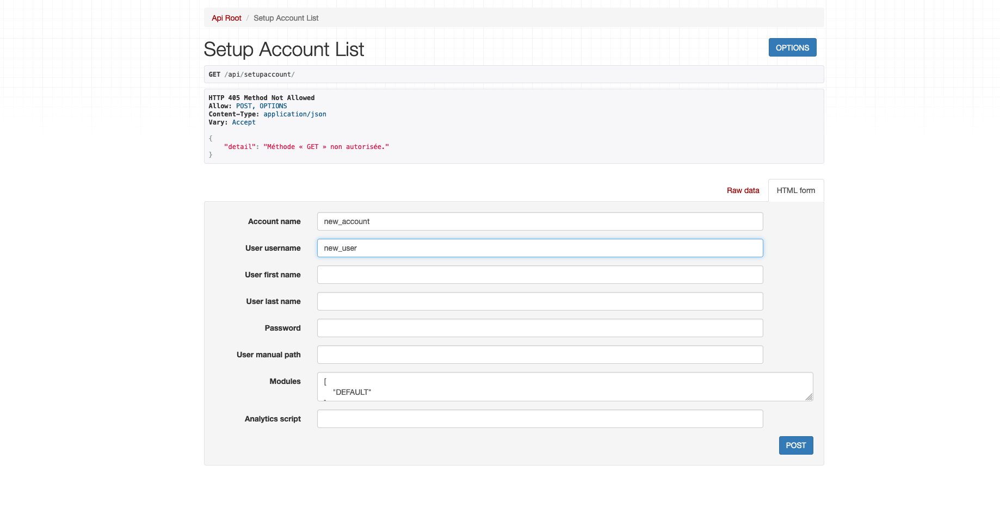
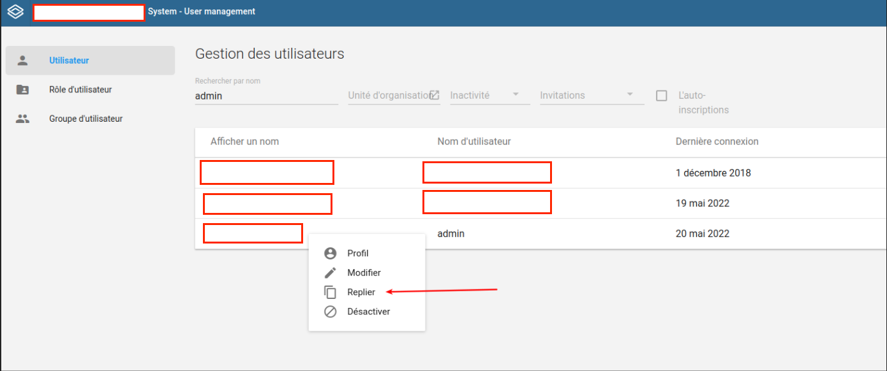
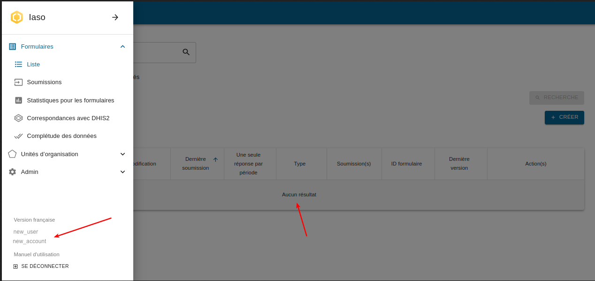
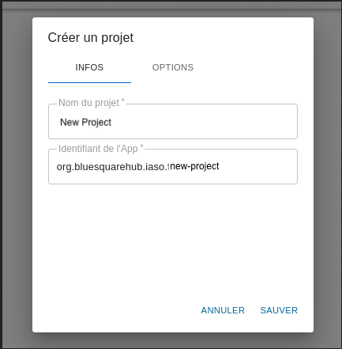
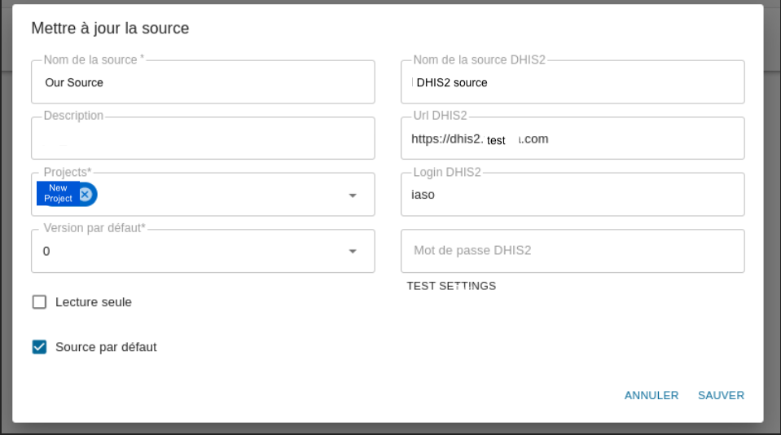
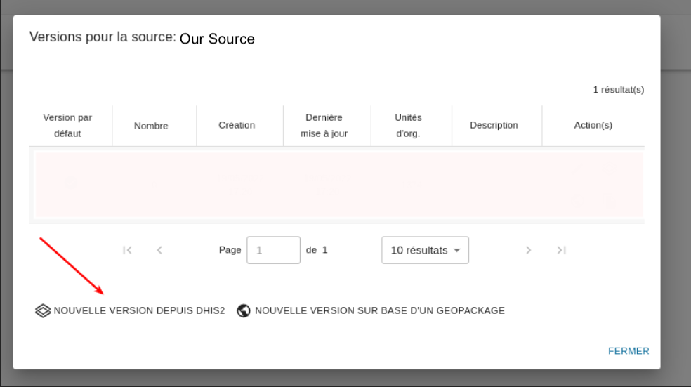
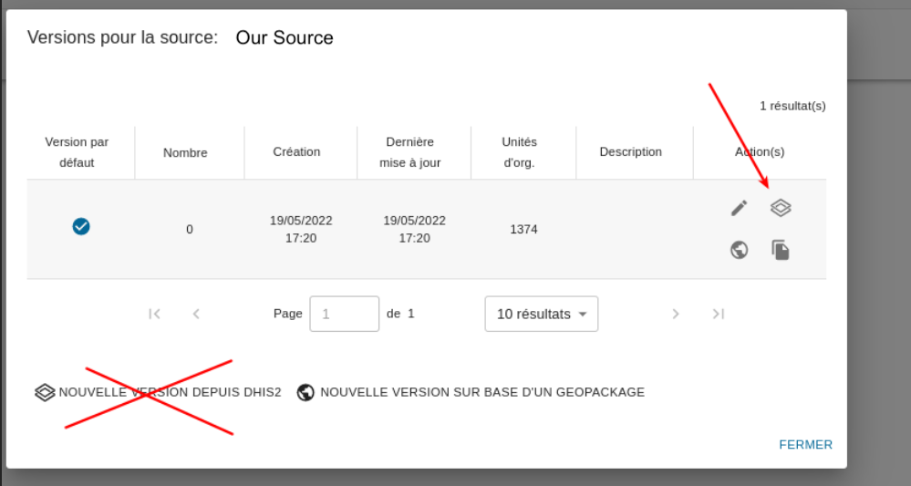

# 1. Setup an empty iaso account

Find someone with appropriate access right (django admin required)

https://iaso.bluesquare.org/api/setupaccount/




Use and store the user/password in a password manager

# 2. Create a dedicated DHIS2 for iaso

We want to keep track of which app is changing which data/metadata of dhis2 so please don’t use the main/default “admin” user but a dedicated one.

- Go in the dhis2 “Users / Utilisateurs” module

- “Duplicate the admin” 




- Generate a password with password manager (need at least one special char)


# 3. Login in iaso with the user created at step 1 

Verify the account is empty or in the left menu

Avoid doing the next steps with the django admin, as it can lead to industrial accident: the user may be linked to a totally different account/project you might end up with the pyramid of a project filled with orgunits of another country.


 


# 4. Add a new project

Use the naming used by clients if applicable.




Promote “good behavior” by enabling authentication by default


 

# 5. Create a new datasource

Use the user created at step 2

Make the source the default one 

 


# 6. Create a new (first) Version of the


You can import this first version 



# 7. Updating the pyramid

IMPORTANT note that if you “add new orgunits or add/change groups” that’s not previous step screen that you should use

but the “update” button on the default version !



If you create a new version “swap it to the default version” this detection will be broken since incoming submission will be attached to different orgUnit iaso id.

# 8. What's next ? 

- Use the [Mobile app](https://play.google.com/store/apps/details?id=com.bluesquarehub.iaso&hl=nl) in the store and provide the appId/user/password
   
- Start configuring the iaso forms

   - try to be consistent and future proof in the naming ! 

this is *good* : 
       
 ```
 PMA - Qualité 01 - Indicateurs généraux
 PMA - Qualité 02 - Plan financier
 PMA - Qualité 03 - Consultation Postnatale
 ...
 PMA - Qualité 10 - Vaccination
 PMA - Qualité 11 - Accouchements
 PMA - Quantité 
 PCA - Qualité ...
```

this is **BAD** : 
      
```      
 PMA - Qualité 1 - Indicateurs généraux
 PMA - qualité 10 - Vaccination
 PMA - Qualité 11 - accouchements
 PMA - qualité 2 - plan financier
 PMA - Qualité 3 - consultation Postnatale...
 ...
 PMA - Quantité 
 Qualité - PCA - ...
```
- computers are really bad at sorting in natural order so prefer 01 02 03
- be consistent in your upper/lower case usage
- be consistent by prefixing the entity type (no need to put the country in it, we have limited space in the mobile app)