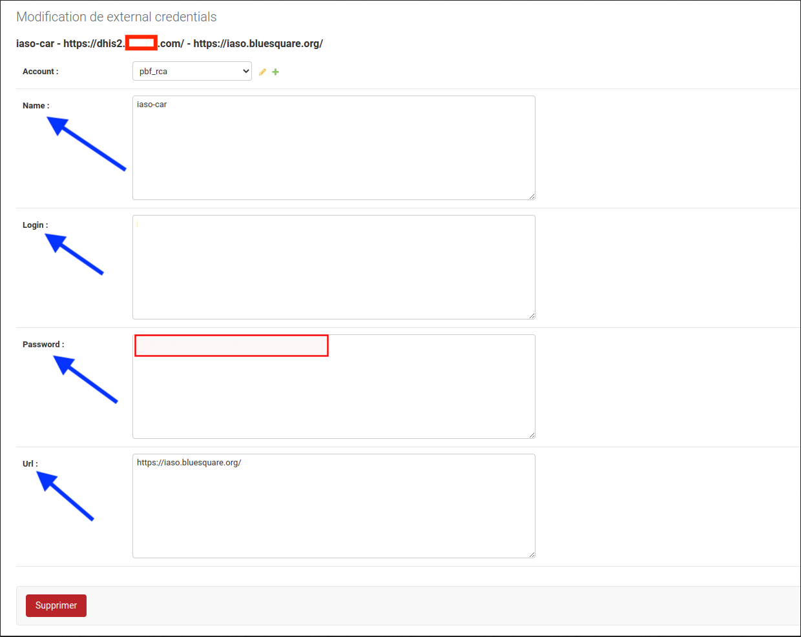
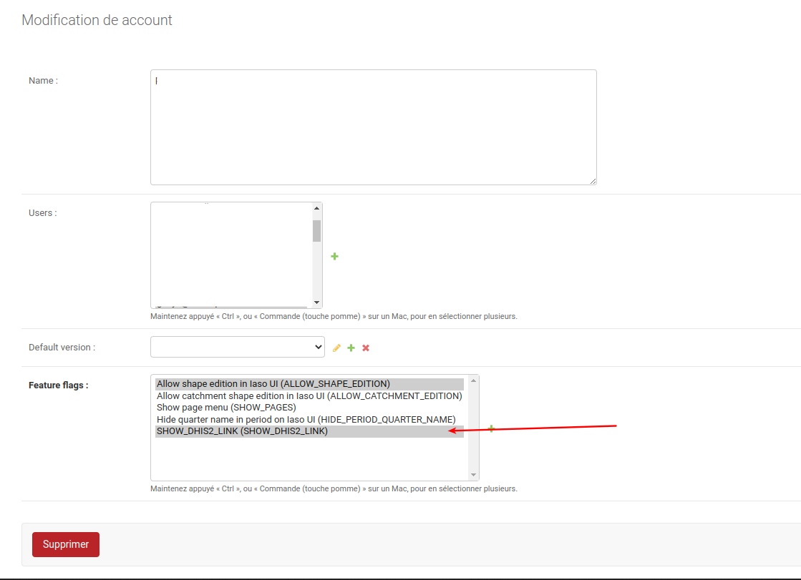
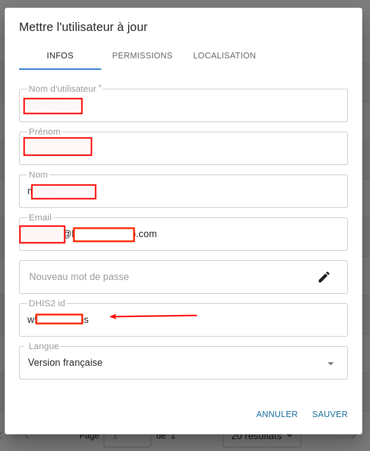

# Setup login with dhis2 for iaso

## In DHIS2 

### Go in the oauth settings

in the menu : 
```
System settings > Oauth 2 clients
Parametres Systeme > Oauth 2 clients
```


### Create oauth client

Name :  `iaso`
Select : authorization code
Url : you need to pick a unique code : `https://iaso.bluesquare.org/api/dhis2/<<unique-code>>/login/`


## In iaso django admin

### Create an external credentials record

In django admin : https://iaso.bluesquare.org/admin/iaso/externalcredentials/

* Name : oauth client id
* Login: the url of the dhis2
* Password: the oauth client secret
* Url : iaso




### Enable the dhis2 link in the iaso menu

to be able to easily go back to dhis2
add the feature flag "SHOW_DHIS2_LINK" on the Project 



then the entry should appear


## In iaso 

### Link the iaso user with a dhis2 user

in iaso general ui



### Test


login in dhis2 with the linked in previous step 

`<<dhis2>>/uaa/oauth/authorize?client_id=<<unique-code>>&response_type=code`
  

then "Authorize": you should end up in iaso


**It's not working ?**

  - Did you put the same code in iaso/dhis2/url to login ?
  - The login in iaso external contains the url of the dhis2 ? 
  - Are you logged in dhis2 with the user you linked the iaso user ? 