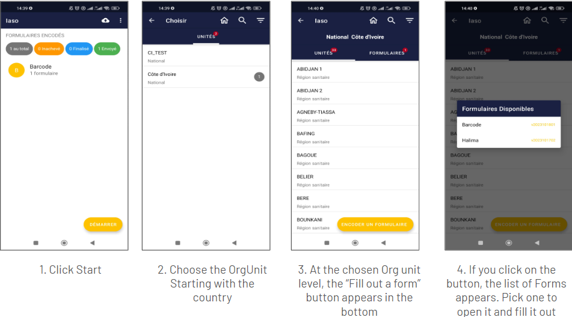
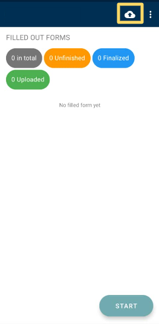

# Aplicación Móvil

## Aplicación Móvil IASO

La aplicación móvil IASO está disponible en Google Play Store (solo teléfonos Android).

Puede funcionar completamente sin conexión - una vez que el usuario final ha codificado los datos necesarios, él/ella puede subir los datos recolectados sin conexión todos de una vez cuando la red esté disponible.

Las actualizaciones hechas desde la web (versiones de formularios, pirámide de salud) se reflejarán en la App solo **después de que los datos de la App hayan sido actualizados** y esto requiere conectividad de red.

Consejo clave antes de probar / usar la App - **Asegúrese de haber actualizado los datos previamente**

## Ejecutar la aplicación móvil por primera vez

La aplicación móvil IASO tiene que ser configurada en la parte web antes de usar (vea la parte "Proyecto").

Luego puede:

- Descargar [IASO App](https://play.google.com/store/apps/details?id=com.bluesquarehub.iaso&pcampaignid=web_share) en Google Play
- Insertar la URL del servidor: https://iaso.bluesquare.org
- Luego, ingrese el App ID

## Vista general de botones

Vea a continuación una vista general de los botones principales que puede encontrar en la pantalla principal en modo de recolección de datos.

En la parte de Más Opciones, puede tomar las siguientes acciones:
- Actualizar datos: necesita tener conectividad a internet para hacerlo. Sincronizará la aplicación móvil con los datos web de IASO. Para evitar que tome demasiado tiempo en configuraciones de baja conectividad, puede elegir actualizar solo sub-partes como Formularios, Unidades Organizacionales, u otros.
- Cambiar el App ID: puede cambiar de Proyecto ingresando otro App ID. Para asegurarse de que no queden datos del App ID anterior en la aplicación móvil IASO, por favor acceda a sus parámetros y borre los datos de almacenamiento y caché de IASO previamente.
- Cambiar la URL del servidor: esto puede ser útil si necesita cambiar del servidor de Producción al de Staging
- Cerrar sesión: su usuario puede cerrar sesión. Esto no previene la consulta de datos de datos locales (datos disponibles en IASO en el dispositivo del usuario)
- Acerca de: da la versión de la aplicación móvil IASO. Puede ser bueno tenerlo para depurar.

## Recolectar datos

Una vez que esté conectado a la aplicación móvil IASO, puede proceder con su recolección de datos. Aquí abajo están las diferentes pantallas que vería para una recolección de datos simple.

Luego tendrá el formulario de recolección de datos elegido abriéndose. Puede proceder con responder las diferentes preguntas y presionar "Siguiente" hasta el final del Formulario.

Si desea interrumpir la recolección de datos durante la entrada, puede presionar el botón atrás en la tableta o smartphone.

Una vez que haga clic en el botón, tiene 2 opciones:
- Guardar Cambios: para guardar todos los datos ya completados y el formulario con estado no finalizado. Con esta opción puede, regresar y continuar ingresando datos
- Ignorar Cambios: para eliminar los datos completados y el formulario

**Subir datos recolectados**

Si recolecta datos con su dispositivo móvil, están almacenados en su dispositivo. Necesita subir los datos al servidor para hacerlos visibles a nivel central. *Tenga en cuenta que necesita conexión a internet para poder subir datos*.

Haga clic en el icono "Enviar Formularios Finalizados" en la página de inicio de la aplicación móvil en la esquina superior derecha.

Luego, se abrirá una página específica para hacerle saber si los datos han sido subidos correctamente. Finalice la operación haciendo clic en "Enviar al servidor".

## Dispositivos Recomendados para Recolección de Datos IASO (última edición Feb 2025)

La **app Android de IASO** requiere **menos de 30MB de almacenamiento** y poder de procesamiento mínimo, haciéndola compatible con **smartphones de nivel básico**.

### Recomendaciones de Smartphone
Para uso estándar, recomendamos **dispositivos Android One** (ej., Nokia 2.3, aunque el programa ahora está menos activo). A partir de 2025, el **Samsung Galaxy A14** es una buena alternativa ([especificaciones](https://www.gsmarena.com/samsung_galaxy_a14-12151.php)).

- Si recolecta **muchas fotos/videos**, opte por teléfonos con **mayor capacidad de almacenamiento**.
- Evite dispositivos que ejecuten **versiones de Android menores a 6**.

### Tabletas para Uso Intensivo
Para entrada de datos frecuente, una **tableta** puede mejorar la comodidad gracias a un **teclado más grande**. Recomendamos **modelos Samsung**, como la **Galaxy Tab A 8.0 (~€200)**. Asegúrese de que soporte **conectividad 4G**.

Antes de **compras al por mayor**, pruebe una sola unidad para confirmar compatibilidad con todas las apps requeridas y características de hardware (**NFC, brújula, escaneo QR**).

#### Especificaciones Técnicas para Tabletas
- **Pantalla:** 7-10" pantalla táctil Full HD
- **Memoria:** 2GB RAM, 16GB almacenamiento (+MicroSD hasta 128GB)
- **Procesador:** Quad-core 1.6GHz
- **Batería:** 7-8 horas de uso
- **Conectividad:** 4G LTE, Wi-Fi, Bluetooth 5.0
- **SO:** Android 6+ (preferiblemente versiones **Android One**)

### Accesorios
- **Funda protectora** para tableta
- **Cargador solar de 25,000mAh** (puertos Type-C y USB)