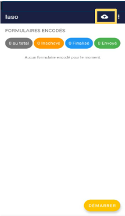

# Application mobile

L'application mobile IASO est disponible sur le Google Play Store (uniquement pour les téléphones Android).

Elle peut fonctionner entièrement hors ligne - une fois que l'utilisateur final a saisi les données nécessaires, il/elle peut télécharger toutes les données collectées hors ligne d'un seul coup lorsque le réseau est disponible.

Les mises à jour effectuées depuis le web (versions des formulaires, pyramide sanitaire) seront reflétées dans l'application uniquement après actualisation des données de l'application, ce qui nécessite une connexion Internet.

Astuce importante avant de tester/utiliser l'application : **Assurez-vous d'avoir actualisé les données au préalable**.

## Lancer l'application mobile pour la première fois

L'application mobile IASO doit être configurée sur la partie web avant utilisation (voir la section “Projet”).

Ensuite, vous pouvez :

- Télécharger [IASO App](https://play.google.com/store/apps/details?id=com.bluesquarehub.iaso&pcampaignid=web_share) sur Google Play Store
- Insérer l'URL du serveur : https://iaso.bluesquare.org (Attention, cet url peut varier en fonction du contexte des projets)
- Puis, entrer l'App ID.

Vous pouvez également configurer l'application mobile en scannant le QR code du projet correspondant sur le web. 

## Aperçu des boutons

Voir ci-dessous un aperçu des principaux boutons que vous pouvez trouver sur l'écran principal en mode collecte de données. 

Dans la section "Plus d'options", vous pouvez effectuer les actions suivantes :

- Actualiser les données : vous devez avoir une connexion Internet pour le faire. Cela synchronisera l'application mobile avec les données IASO web. Pour éviter que cela ne prenne trop de temps dans les environnements à faible connectivité, vous pouvez choisir d'actualiser uniquement certaines parties comme les formulaires, les unités d'organisation, ou autres.
- Changer l'App ID : vous pouvez changer de projet en entrant un autre App ID. Pour éviter que des données de l'ancien App ID ne restent dans l'application mobile IASO, accédez à vos paramètres et effacez les données de stockage et de cache de l'application IASO au préalable.
- Changer l'URL du serveur : ceci peut être utile si vous devez passer du serveur de production au serveur de test.
- Se déconnecter : votre utilisateur peut se déconnecter. Cela n'empêche pas la consultation des données locales (données disponibles sur l'appareil de l'utilisateur IASO).
- À propos : affiche la version de l'application mobile IASO. 

## Collecter des données

Une fois connecté à l'application mobile IASO, vous pouvez procéder à la collecte de données. Voici les différents écrans que vous verrez lors d'une simple collecte de données.

Le formulaire de collecte de données sélectionné s'ouvrira alors. Vous pouvez répondre aux différentes questions et appuyer sur "Suivant" jusqu'à la fin du formulaire.

Si vous souhaitez interrompre la collecte de données pendant la saisie, vous pouvez appuyer sur le bouton retour de la tablette ou du smartphone.

Une fois que vous appuyez sur le bouton, deux options s'offrent à vous :

- Enregistrer les modifications : pour enregistrer toutes les données déjà saisies et laisser le formulaire en statut non finalisé. Avec cette option, vous pouvez revenir plus tard pour continuer la saisie des données.
- Ignorer les modifications : pour supprimer les données saisies et le formulaire.

**Télécharger les données collectées**

Les données collectées sur votre appareil mobile sont stockées localement. Vous devez les télécharger sur le serveur pour qu'elles soient visibles au niveau central. Gardez à l'esprit qu'une connexion Internet est nécessaire pour télécharger les données.

Cliquez sur l'icône **"Envoyer les formulaires finalisés"** sur la page d'accueil de l'application mobile, dans le coin supérieur droit.

Une page spécifique s'ouvrira pour vous indiquer si les données ont été correctement téléchargées. Finalisez l'opération en cliquant sur **"Envoyer au serveur"**.

