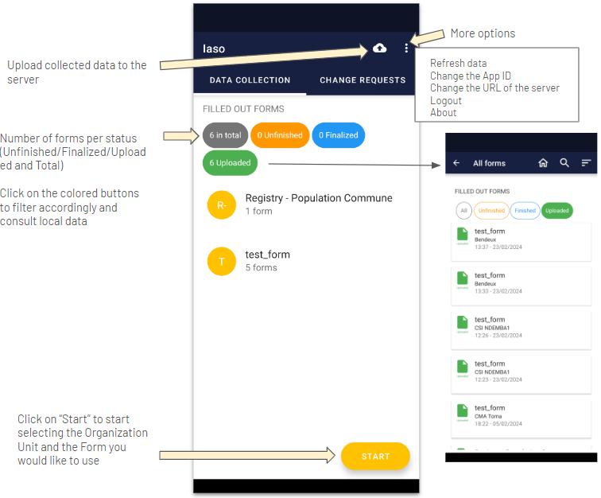
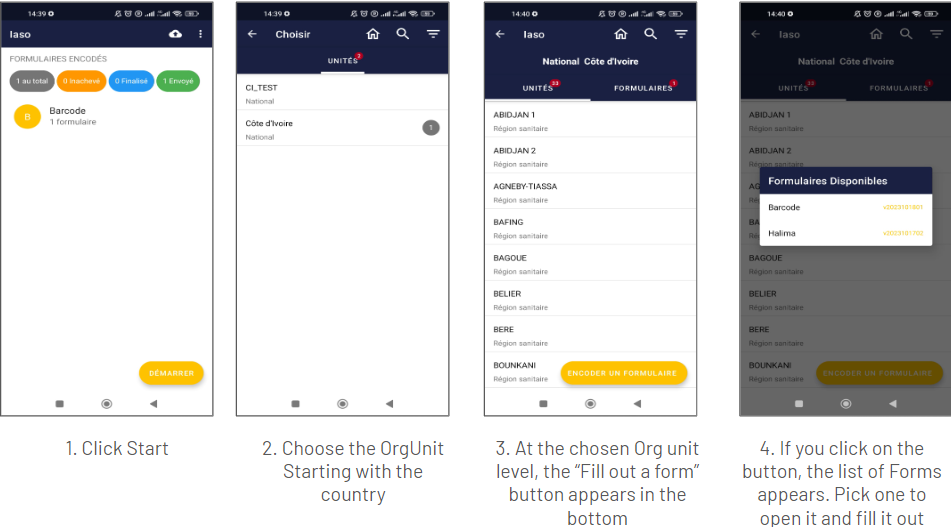

IASO mobile application is available on Google Play Store (Android phones only).

It can work completely offline - once the end user has encoded the data needed, he/she can upload the data collected offline all at once when network is available.

Updates made from the web (forms versions, health pyramid) will be reflected in the App only **after the App data has been refreshed** and this requires network connectivity.

Key tip before testing / using the App - **Make sure you have refreshed data beforehand**

# Run the mobile application for the first time

IASO Mobile application has to be configured on the web part before using (see the part “Project”).

Then you can:

- Download [IASO App](https://play.google.com/store/apps/details?id=com.bluesquarehub.iaso&pcampaignid=web_share) on Google Play

- Insert the server url : https://iaso.bluesquare.org
- Then, enter the App ID 

# Overview of buttons

See below an overview of the main buttons that you can find on the main screen in data collection mode. 

In the More Options part, you can take the below actions:
- Refresh data: you need to have internet connectivity to do so. It will synchronize the mobile application with IASO web data. In order to avoid that it takes too long in low-connectivity settings, you can choose to refresh only sub-parts such as Forms, Organization Units, or other. 
- Change the App ID: you can switch Project by entering another App ID. In order to make sure that there is no data from the former App ID left on the IASO mobile application, please access your parameters and erase storage and cache data from IASO beforehand. 
- Change the URL of the server: this can be handy if you need to switch from Production to Staging server
- Logout: your user can logout. This does not prevent data consultation of local data (data available on IASO on the user's device)
- About: gives the version of the IASO mobile application. It can be good to have to debug.

# Collect data

Once you are connected to the IASO mobile application, you can then proceed with your data collection. Here below are the different screens that you would see for a simple data collection.

You will then have data collection form chosen opening. You can proceed with answering the different questions and press "Next" until the end of the Form.

If you wish to interrupt data collection during input, you can press the back button on the tablet or smartphone.

Once you click on the button, you have 2 options:
- Save Changes: to save all data already filled and the form with unfinalized status. With this option you can, come back and continue enter data 
- Ignore Changes: to delete data filled and the form

**Upload collected data**

If you collect data with your mobile device, they are stored in your device. You need to upload data to the server to make them visible at central level. *Keep in mind that you need internet connection in order to be able to upload data*.

Click on the "Send Finalized Forms" icon on the mobile application home page on the top right corner.

Then, a specific page will open to let you know if the data has been correctly uploaded. Finalize the operation by clicking on "Send to server".

