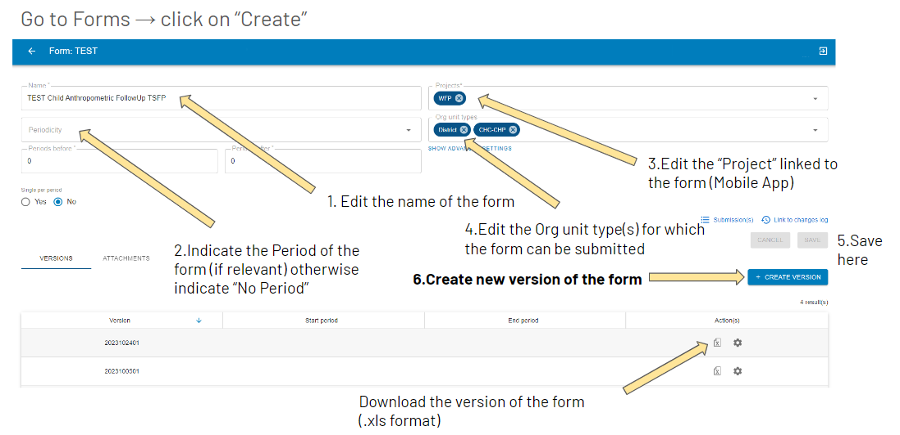
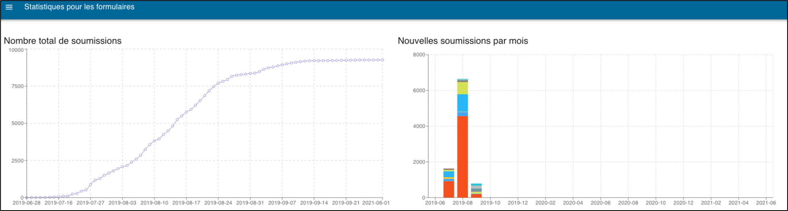
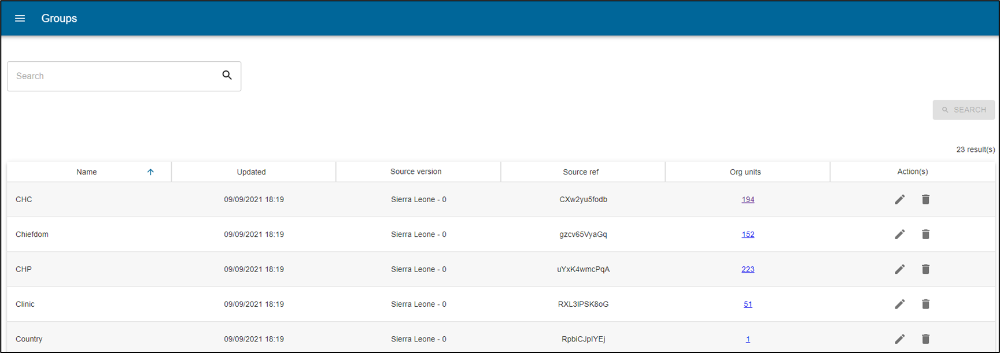
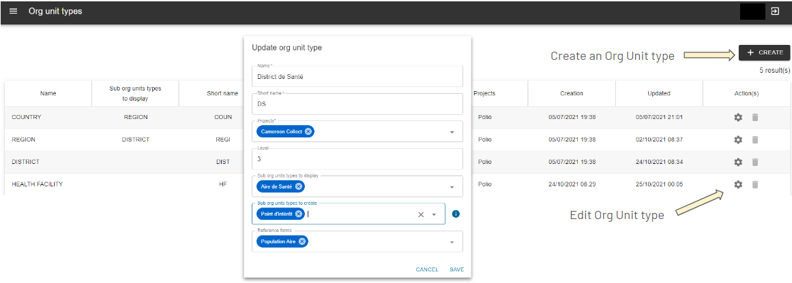
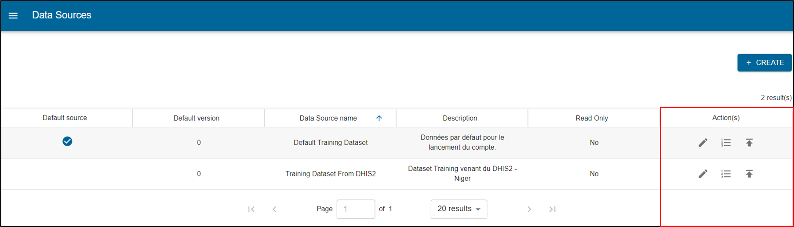
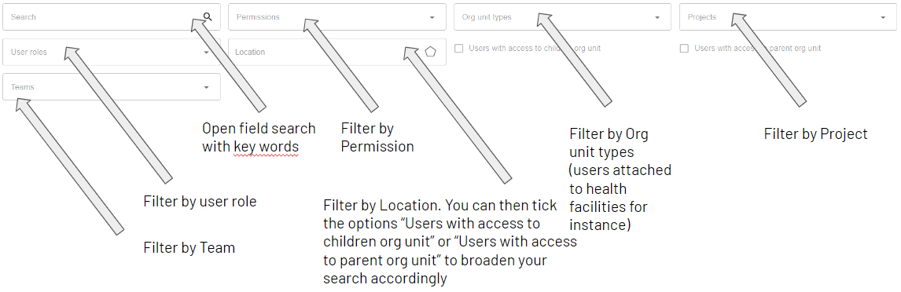

# Web Platform

IASO web platform is intended to administrators for them to define the details of the data collection they would like to proceed with.
Some key assets of IASO are:

- the versioning of all data - every change is tracked and former versions can be retrieved as needed

- geo-structured data collection - forms are linked to clear Geographical levels or "Organization Units"

- the traceability of changes - allowing decentralization of the activities and responsibilities
Administrators can therefore use the web platform to plan, monitor and then evaluate the data collection efforts.

## Login

To log into the web interface, go to
[<u>https://iaso.bluesquare.org/login/</u>](https://iaso.bluesquare.org/login/)
and sign in with your username and password.

You can also reset your password by clicking on the link "Forgot password". This will send an automatic email and allow you to create a new password. 

## Navigating in IASO

## Manage data collection forms

### Forms list

From the forms list, you can search through the available forms of the IASO account you are connected to using the filters:

The below buttons allow you to manage the data collections forms.

### Create/Upload a data collection form
Access the Forms entry in the menu, then click on Form list. 
Click on the button "Create". Once on the Form creation page, follow the below steps:

- Enter a name for your form in the field "Name". 
- Assign one or several [Project(s)](https://iaso.readthedocs.io/en/latest/pages/users/reference/iaso_concepts/iaso_concepts.html#projects) to your form. 
- Assign an [Org unit type](https://iaso.readthedocs.io/en/latest/pages/users/reference/iaso_concepts/iaso_concepts.html#organization-units) to your form. 
- Assign a Period to your form. This is intended for regular data collection (e.g. daily/weekly/yearly). If you don't need this option, just select "No Period".

Tips:

- Check your XLS form before uploading it to IASO using this link: https://getodk.org/xlsform/
- Form ID should stay the same across versions (it cannot be different from a version to another). You will have an error if this is the case.
- Form version (which is not a mandatory field in the settings of the XLS forms) should stay consistent across versions. For instance, if it is a date such as 20240410, then you will not be able to upload a version names 20231025. IASO makes automatic checks to ensure that you are not uploading a former version.

### Form submissions

Once a form has been completed and sent to the server, it creates a "form submission". Every form submission is recorded into the platform and data submitted can be consulted from there. You can use the filters to consult the form submissions as needed:

- Open search (type some key words)
- Per form
- Per Org unit (select the relevant one in the dropdown pyramid)
- Per Org unit type (e.g. Country, District, Village)
- Per submission date (creation from/creation until)
- Per user (type a user name and it will show as dropdown)

This view allows you to search forms through free text entry and several
filters that can be combined. 

Once you have applied at least one form filter, you can download submissions using the "CSV" or "XLSX" buttons.

You can also create a new submission by clicking on "Create". This will open Enketo and ask you which Organization Unit it relates to.

You can also check the submissions on the map view, on which the filters apply. To make sure to have this map view enabled, make sure you have added the feature flag "GPS for each form" to the related [Project](Projects).

The tab "File" allows you to visualize the files that have been submitted together with the forms, such as pictures. When clicking on a given file, you can then be redirected to the relevant form submission. 

### Manage submissions

On the Submissions page, you can see the list of submissions that have been done for the account. You can manage them using the below options.

**Visualise a submission**

You can view a specific submission/submitted form by clicking on the
"View" button (see above).

This allows you to see the data submitted and edit it on Enketo
([open-source](https://github.com/enketo/enketo-express/) web
application.

The “Information” section provides a technical overview of the form.

The “Location” section shows the health pyramid's indication of where
the data was collected.

The “Export Requests” section shows when the data was exported to DHIS2,
by whom, and any errors that occurred during export.

The “Files” section can contain images, videos, documents.

The “Form” section shows all form questions and answers entered during
data collection.

**Download a submission**

The "XML" icon allows you to download a submission in XML format.

The gear icon on the bottom corner at the right hand side shows you a series of icons upon hover. These allow you to:

- Delete a submission
- Edit attached Org Unit or Period
- Export (e.g. to DHIS2)
- Push GPS coordinates from the submission to the Org Unit
- Edit this submission via Enketo
- Lock submission

See below the dedicated sections for more information on each of these actions.

**Delete a submission**

Allows you to delete the form. If it has already been exported to DHIS2,
this will not delete the data in DHIS2. A warning message will appear:

**Edit attached Org Unit or Period**

When you click on “Edit Period and/or Organisational Unit”, a window
opens allowing you to reassign the instance. You can change the time
period or organization unit that has been assigned to the submitted
form.

**Export a submission**

The export function allows you to export the form to DHIS2. Beforehand, it needs to have been mapped using the [DHIS2 mapping](DHIS2) functionality. 

**Edit the submission via Enketo**

To edit a form, click on the Enketo icon (see above).

Edit the form by changing the answers to the questions that need to be
changed. Then click on submit at the bottom of the form.

**Push GPS coordinates from the submission to the Org Unit**

This will use the GPS coordinate collected via the form to push to the Organization Unit GPS coordinates.

**Lock submission**

This functionalty allows you to protect the form submissions from further editing by users who have less permissions than you.

### Form statistics

This view allows you to see statistics about the forms. When clicking on
”Form Statistics" you will open a page with two graphs.

The first one shows the total number of submissions over time and the
second one shows the new submissions per month per form.

### DHIS2 mappings

A great advantage of IASO is that you can export data to DHIS2. When
doing so, prior mapping is necessary. After the form is uploaded, map
the form to match the data item in DHIS2. 

Click on DHIS mappings to see the forms :

In the Form view you can see details of:

-   Actions

-   Name of forms available for mapping

-   Versions

-   Type of the form :

    -   Aggregate : fix

    -   Event : series of singular events

    -   Event Tracker : continuous

-   Number of questionnaire to be mapped

-   Total number of questionnaires

-   Mapping coverage

-   Date of last modification

Click "Create" and a window will open allowing you to
map each questionnaire of the xls forms to the correspondent DHIS2 data
element

The mapping process consists of selecting a question on the left and
deciding whether it should be mapped to DHIS2 or not.

Some questions may not need to be mapped like notes, metadata etc. in
such a case click on never map.

If the question is to be mapped, search for the correspondence DE in the
box by using the name, code or ID and then confirm.

Once confirmed, the question will turn to green and be counted.

### Completeness

This functionality is intended to use cases where Periods have been set to the data collection forms.
In the view “completeness” you will see details of :

-   Buttons to select forms “ready” to be exported, form with “errors”
    > and forms that have been “exported”

-   Periodicity filter : the periodicity filter allows you to organise
    > the data into months, quarters, semesters or years. The list will
    > display the forms available for the selected period, and will
    > indicate how many forms have been submitted for each

-   Synchronise button to synchronise two forms

Click on each of these buttons to have forms ready to be exported,
errors and exported. A periodicity filter is there to organise data in
months, quarters, semester or yearly.

If you click on the number of submissions, you will be taken to the
submissions view, where you can click on the view icon and see the
submissions for that form.

Click on the button to synchronise two
forms

Eg: to get aggregate data from community verification survey, all the
client forms should be synchronised to a single form.

### Completeness statistics

This table view shows you the completeness of the forms submissions in number (number of completed forms) and in percentages (Data completeness). A distinction is made between “direct forms” (which relate to the select Organization unit level) and “lower level forms” (which relates to forms down the hierarchy).

Use the filters (Form name, Parent Organization Unit, Organization Unit type, User, Planning, Teams, Period) to only see statistics in a more specific way.

The "See children" action button allows you to drilldown the geographical hierarchy to identify the level of completeness and spot where issues may have happened. 

The first two columns "itself" indicate the number of forms completed at the level of the Organization Unit highlighted.
The next column "descendants" give information on the number of forms completed at the level in question, but also at all lower levels.

You can also view data completeness with a map view by clicking on the "Map" tab. Be aware that you need to select a Form in the filters beforehand to enable this view.
You can adjust the thresholds to apply to the legend on completeness in the relevant form's advanced settings.

## Georegistry - Organization Units Management

See the [Organization Unit](https://iaso.readthedocs.io/en/doc_test/pages/users/reference/iaso_concepts/iaso_concepts.html#organization-units) definition for more insight on what Organization Units are.
In a nutshell, you can manage your geographical data associated to your account using the Organization Unit part of IASO.

### Organization Units List

Click Organization Units in the menu and then on Organization Unit List to navigate the organization unit pyramid.

You can view in list or map.

You can select an Organization Unit Navigation and:

- Change the name, type, validation status, place in the pyramid, etc. of the OU
- Visualize the OU on a map
- See the history of its modifications

The search results can be exported in CSV, XLSX or GPKG.

Results can be seen in a list or on a map

The status for when a village has just been added and needs to be
reviewed for example.

The external reference is used to export data to DHIS2.

The map helps you to know where the structure is located.

You can see the history of modifications by clicking on the little clock
icon or the details of the filled forms by clicking on the eye icon.

Several searches can be made by adding tabs to the page with the +
button. 

You can choose the colour of the results on the map for each search.

 

**Creation of an Organization Unit**

On the Organization Unit list page, click on "Create". You can then create an Organization Unit as needed. 

You will need to enter the below information before saving:

- Name of the Organization Unit
- Type of the Organization Unit (that you would have previously defined in the Organization Unit Type part)
- Status: New, Validated, or Rejected. 
    - New: the Organization unit has been created but has not been validated yet. If you activate the possibility to create Organization Units from the IASO mobile application, they will first appear as "New" on the web
    - Validated: the Organization unit is validated
    - Rejected: the Organization unit no longer exists or has been merged/split or replaced by another one. IASO does not allow to erase Organization Units in order to keep track of past changes.

Optional fields:

- Aliases: you can add as many aliases as necessary to track the different ways of writing the name of the Organization Unit (e.g. "Ste Marie", "Sainte-Marie", "Sainte Marie", etc.)
- Group: you can organize Organization Units in Groups in IASO. You can multi-select the group(s) that the organization unit you are creating is associated to
- Parent Org Unit: place your Organization Unit at its relevant place in the hierarchy
- Opening and/or Closing date(s): use these fields to indicate the opening or closing date(s) of the Organization Unit

**Edit an Organization Unit or consult details**

To access the detailed view of an Organization Unit, proceed as described below: 

In this view, you have a set of tabs that allow you to edit the Organization Unit as needed:

- Infos: edit the main information relating to this Organization Unit
- Map: consult the geographical information available for this Organization Unit (boundaries or GPS coordinates). You can view geographical data across data sources (if there are several sources). You can also leave a comment
- Children: lists this Organization Unit's children. You can use filter to go through the list in a more detailed way

- Links: in the case of matching an Organization Unit across multiple data sources, the links among the data sources can be found here
- History: allows you to trace back all modifications that were done to the Organization Unit by user
- Forms: lists all data collection forms that are linked to the Organization Unit type of this Organization Unit
- Comments: you can leave a comment about this Organization Unit using this section

**Bulk edition of Organization Units**

You can also edit Organization Units in bulk. 
In order to do this, from the Organization Unit list, tick the boxes of the Organization Units you would like to bulk edit, then hover on the action button. Click on the gear action button, and select the action you would like to perform. 

### Organization Unit Groups

Organisation units can be grouped in organisation unit groups, and these
groups can be further organised into group sets. Together they can mimic
an alternative organisational hierarchy which can be used when creating
reports and other data output. In addition to representing alternative
geographical locations not part of the main hierarchy, these groups are
useful for assigning classification schemes to Organization Units. 

**Manage Organization Unit Groups**

In order to manage the Organization Unit Groups, access the menu entry Organization Units > Groups. 

This view allows you to search the Organisation Unit Groups through free
text entry. 

You can create a new group 
by clicking on the create button. 

Groups can be edited by clicking on the gear icon
or deleted by clicking on the
delete button.

In the table, the column "Org Units" shows the number of Organization Units that are assigned to this group. When you click on the number, you will see the list of that Org Unit
group.

**Assign Organization Units to Groups**

To assign Organization Units to Groups, go to the Organization Units List view from the menu and make a bulk edit of the selected organization Units. See above in section "Bulk edition of Organization Units" for more details on bulk edition of Organization Units.  

### Organization Unit types management

Organization Unit types are specific to IASO (i.e. this is not handled in DHIS2). See the part about [Organization Units](OU) for more details on what Organization Unit types are.

From the Organization Unit menu entry, click on "Organization Unit types". This view lists the Organization Unit types existing in your IASO account. 

**Create an Organization Unit type**

Click on "Create" and enter the below mandatory fields:

- Name of the Organization Unit type. Beware that this should be the "category" / "level in the hierarchy", NOT the specific name of an Organization Unit. E.g. "Country, "Province", "District", and NOT "DRC", "Kinshasa", "Gombe"
- Short name: this will appear on other IASO views. It should be a short version of the full name 
- Project(s): select one or multiple project(s) the Organization Unit type is linked to

These other fields are not mandatory:

- Level: start with 0 for the highest point in the hierarchy, for instance "Country". E.g. Country - 0, Province - 1, District - 2, Village - 3
- Sub org unit types to display: select the below Org Unit type(s) that you would like to display on the Registry view if this main Org Unit type that you are editing is selected.
- Sub Org unit types to create: select the Org Unit type(s) that you would like to enable the creation for in the IASO mobile application. For instance, if you are editing the Org unit type "District", you can enable the creation of "Village" and/or "Point of Interest"
- Reference forms: select one or several data collection Form(s) that will be assigned as reference for this Org Unit type. Reference forms are Forms that are closely linked to the Org Unit type. A typical use case is for an Area to assign a reference Form for Population data. 

### Data Source(s) management

IASO allows to import and handle one or several geographic data source(s). 

#### Data Source(s) List 

Find here the data sources with their names, versions and descriptions. It is possible to
edit the data source, check up on the files’ version history or compare
data sources and export them to DHIS2.

#### Matching

This is rather a "geospatial" functionality : to have several geographical pyramid
sources and try to make links (Example: where in a csv “province x” is
called "PROVINCE X" and in another source it is called "DPS X").

The algorithms run part is intended for data science work.

### Registry

The Registry entry in Organization Unit is a visualization tool allowing users to drilldown in the geographical hierarchy and consult the geographical data as well as data collection associated to the different level(s). 

### Review change proposals

With IASO, supervisors can compare and validate data submissions as they are sent to the server. 
Note that this feature will only work provided that you have activated the "Change requests" feature flag on the IASO Project you would like to validate data collected for. See the Projects part for more information on mobile feature flags in IASO.

On the Review change proposals page, users can use the filters to select the proposals they would like to focus on. See on the picture below the detailed filters.

Supervisors can then click on the gear icon at the end of the relevant line to be able to see the details of the change proposal submitted and compare with the former version on the left.

Supervisors can then select the changes they would like to approve by ticking the boxes of the changes selected on the right column, and then hit "Approve selected changes".
If the changes proposed are not satisfactory, supervisors can reject all changes and provide a comment.

For each change proposal sent, IASO mobile application users will be able to see if they have been approved or rejected, and if rejected, consult the comment. 

## Planning

The Planning feature in IASO allows you to plan field work per team and user in defined zones/organization units and according to a specific timeline. Once data collection activities would have been assigned via the interface, field agents using the mobile application would only be able to see the activities assigned to them, and navigate towards the relevant GPS point(s). 

In order to be able to create a Planning, you will need to have created beforehand Organization units, Users, a Project, Teams of Users/Teams of Teams and data collection Forms for which you would like to use the Planning feature.

### Planning List 

Click on Planning in the menu panel. Under Planning List you will see the list of schedules/plannings that have been
created in IASO. You can search through the different Plannings using the different filters and take the below actions:

- Create Planning
- View Planning: this is where you will access the interface to assign data collection activities to Teams and Users according to geographies
- Edit Planning: edit the Name, Project, Parent Organization Unit and Team it applies to, Form(s), Description
- Duplicate Planning: allows users to copy an existing Planning and readapt it as needed
- Erase Planning

**Create a Planning**

Click on "Create" and you will see the below window opening:

The below fields are mandatory:

- Name
- Project: defines in which mobile app environment the Planning info
will be visible
- Team: it is the team responsible for the planning - this is usually a Team of Teams
- Form(s): select one or several Form(s) to apply to this Planning 
- Org unit: select the base Organization Unit your Planning applies to. Keep in mind that you will drilldown from this base Organization Unit to assign your data collection activities to Teams/Users. 
- start and end dates for your Planning

You can add a description as an option. 

The “Publishing status” (in the lower left
corner) feature makes it possible to ensure, once completed (and all
assignments made), the newly created planning will be available in the
IASO mobile app for the relevant project.

Once you have completed the fields, click "Save" to finish.  

Click on the eye icon
button from the Planning list
to start editing your new Planning via the Map interface.

You can do
the assignment either through the “Map” or the “List” tab. If
processing through the map, first select the Team you would like to assign a geography to in the dropdown, as well as the relevant “Base Org Unit type” in the dropdown. You can then start assigning geographic areas or points directly to the selected Team members directly on the map.

Selected areas will be highlighted with the team’s colour, that you can change as needed. 

In order to assign all children Org Unit of a given parent Org unit to the same Team/User, you can select the "Parent picking mode" before proceeding to your selection.

If you prefer using the List tab, the process is pretty similar. The
main difference being that you work here with a list of names, according
to the selected level. Org units are assigned by clicking in front of
the item name, in the “Assignment” column.

You can sort Org units and Parents by clicking on the column name.

## Entities

We call an “**Entity**” anything that can move or be moved and that we want to track through time and Org Units. For example, a beneficiary, a car, etc.

To differentiate between different kinds of entities, IASO has a concept of “**Entity Type**”.   
IASO heavily relies on [XLSForms](https://xlsform.org), and entities are no exceptions. Therefore, an entity is represented by a submission to a form. This submission is referred to as the **profile**. The entity type defines which form has to be filled in.

### Create an entity

**Enable the feature**

In order to create an entity, your project must first enable the entity feature flag. You can set this flag either during its creation or by updating it later. 

**Create and upload the profile form**

Using the sheet application of your choosing, create an XLSForm which will contain all the questions related to your entity that are either fixed (I.e., first name and last name) or can evolve through time (I.e., a program to which an entity can be affiliated to).  
Upload it on the server using the web application.

| Note: The questions that can evolve through time should not be editable. |
| :---- |

#### **Create the entity type**

In the entity types screen, click on the “CREATE” button. Give the entity type a name and select the newly uploaded form as a reference form:  

| Note: We’ll see later what “List fields” and “Detail info fields” are. |
| :---- |

#### **Create an entity**

In the mobile application, make sure that the data has been refreshed and are up to date with the backend server. You will now be able to see the entity screen.

At the moment, it is not possible to create an Entity from a web interface.

Click the “Add” button in the application.  

Select the entity type you want to create.

You will be prompted to confirm your selection.  

You can then fill out the form to finalize your first entity.

### How to configure how we display an entity? 

Within the entity type’s configuration, it is possible for administrators to define which questions are displayed within lists and within the details screen.   

This impacts how the web and mobile applications display entities, as shown below.

### **In the web interface** 

#### In the list 

#### In the details screen

### **In the mobile application** 

#### In the list

#### In the details screen

### Searching for an entity 

#### **On the web**

In the beneficiary list, you can filter by type and/or enter a query to filter based on the identifier or any of the list fields values.  

#### **In the application** 

Clicking on the magnifying glass icon on the entity screen will lead you to the list of all entities and allow you to filter them quickly based on the identifier or any of the list fields values.  
If you need a more fine-grained selection, you can click on the funnel icon, select a type and fill out the search form (second picture)  

### What are workflows? 

As stated before, an entity is tracked through time and Org Units. In order to achieve this, Iaso links the subsequent submissions for an entity together and allows subsequent submissions to change the profile. In order for you to choose which forms should be presented next and what values override the properties of the profile, you can define a workflow.

#### **Create a workflow** 

In the entity types’ list, click on the workflow icon

In the list of the workflow versions, create the “CREATE” button and give the version a name:  

### **Follow-ups and changes** 

#### Follow-ups 

They represent the next possible forms based on the state of the profile. They are based on a condition.  
In the following example, the mobile application will offer “U5 Registration WFP” as the next possible form if the first name is “Bill”.  

| Reminder: “First Name” is one of the questions in the Entity Type’s form. |
| :---- |

#### Changes 

They represent the mapping of what value from a form will change the values in the profile.

In the example below, the “Target form” is the Entity Type’s form, and the “Source form” is the subsequent submission.  
When a “U5 Registration WFP” form is filled out, the value entered in “Child’s Age in months” will be copied into the profile’s “Age (Months)” question. And the value entered in “Child’s Name” will be copied into the profile’s “First Name” question.  

### **Using values from the profile in subsequent forms**

Sometimes, you want a subsequent form to use values from the profile. In order to do so, just add a question with the same identifier and type as the value from the profile.

I.e., Let’s assume the profile has 2 questions of type “text”: first\_name and last\_name. By adding a read-only similar question in your subsequent forms, the value will be available to you.

### **Publishing workflows** 

Once a workflow version has been published, it is marked as finalized, and it cannot be edited anymore. Only workflows in “draft” can be edited.  
If you want to edit a finalized workflow, you first need to duplicate it using the “Copy version” button. A new draft version is then created with the same content.

## Admin

The Admin part of IASO comprises several parts, which will appear or not depending on the user's permissions:

- Tasks
- Monitoring
- Projects
- Modules
- Users
- User roles
- Teams

### Tasks

This is the IASO batch updates log. An operation log contains information about when and where an operation
ran, the operation status, the number of source and target records
processed, and any log messages.

Examples of tasks include:

- Organization unit bulk update
- DHIS2 data import
- Geopackage import

The statuses are:

- Errored: the Task did not make it through. Users are advised to try again.
- Running: the Task is in process
- Queued: the Task has stopped and will restart if the conditions are met (for instance, if there is better connectivity)
- Killed: the Task was interrupted by the user after it had been started
- Success: the Task has been successfully run

The Task list can be refreshed by pressing the button "Refresh" on the right top hand side. 

### Monitoring

This part allows supervisors to monitor devices that are linked with the IASO account. 
From this page, you can consult:

- The IMEI or device identifier
- If this is a test device or not
- the name of the last owner
- the last time it has been synchronized
- the creation date (first time it has been synchronized)
- the modification date

On the right hand side, you can see the number of devices that are connected under the IASO account you are connected to.

### Projects 

A Project in IASO relates to an instance of mobile application. 
Each Project is identified by a Name and an App ID. See [here](https://iaso.readthedocs.io/en/latest/pages/users/reference/iaso_concepts/iaso_concepts.html#projects) for a more detailed definition of Projects in IASO.

**Create a Project**

From the menu, Admin > Projects > Click on "Create"

Then, add a Project name, and an App ID. 
Be aware that the App ID will have to be entered by IASO mobile application users the first time they connect to the IASO app, so it should not be overly complicated to avoid typing errors. 

You can then select the Feature flags you would like to apply to your Project in the next tab and press "Save". 

**Feature flags definition**

See the table below for more details on the Project Feature flags:

| Feature flag      | Description |
| ----------- | ----------- |
| Authentication      | Users have to enter their login and password on the mobile application before proceeding to the data collection. Please note that this is possible in IASO to proceed to data collection without authentication for simplified processes (also called “anonymous mode”)
| Mobile: show data collection screen   | Enable the feature to collect data from the IASO mobile application (data collection that is not linked to a planning or a change request workflow)       |
| GPS for each form      | Every time a data collection form is submitted, a GPS point is automatically taken and associated to the form submission |
| Enforce users are within reach of the org unit before starting the form      | IASO mobile application users have to be close (50m) to the organization unit GPS point they are collecting data for in order for the form to open |
| Mobile. Show planning screen      | When a planning has been done in IASO via the web interface, the assigned data collection points and tasks are reflected via this tab |
| Mobile: limit download of org unit to what the user has access to      | When loading data into the mobile application, only the geographical zone that is assigned to the user is downloaded, so as to enable offline use. This allows a lighter (and then quicker and less data-consuming) download of data at the start of the IASO mobile application |
| Mobile. Show Map of org unit      | Adds a tab in the mobile application to show the geographic information available for the selected Org Unit in the mobile application. For instance, if a GPS coordinate is available for a health facility, it would show on the map via this tab |
| Request changes to org units      | Enable the feature to propose changes to org units and their related reference form(s) |
| Mobile: Change requests      | Adds the tab allowing to propose changes to org units and their reference form(s) |
| GPS for trajectory     | Enable the user to activate a function that track their position every 15 minutes over a period of time |
| Mobile. Warn the user when forms have been updated     | When new form versions have been uploaded on the web, the IASO mobile application user is notified. Then the user can choose to apply them or not |
| Mobile. Warn the user when forms have been updated and force them to update      | When new form versions have been uploaded on the web, the IASO mobile application user is notified and the update happens automatically |
| Mobile. Warn the user when the org units have been updated      | When changes to the Org units (health pyramid) have been done on the web, the IASO mobile application user is notified. Then the user can choose to apply them or not |
| Mobile. Warn the user when the org units have been updated and force them to update      | When changes to the Org units (health pyramid) have been done on the web, the IASO mobile application user is notified and the update happens automatically |
| Auto upload of finalized forms      | The synchronization of forms that have been filled takes place automatically as soon as the user has connectivity |
| Mobile. Finalized forms are read only      | IASO mobile application users cannot edit the forms once finalized in the mobile application |

### Users

Users can access IASO web and mobile application with login credentials. Each user is assigned permissions and can be limited by location.

Permissions are relatively granular:
- By screen/tab
- Different read/write permissions for important domains
- Restriction of access using the health pyramid
- Batch creation/modification of users
- Customizable user roles (Administrator, Data manager, etc.)

Please note that the permissions assigned from the User management apply to **IASO web only**. IASO does not have a system of permissions for its mobile application, but rather a set of Feature Flags. 

**Create a new IASO user**

From the menu Admin > Users, click on "Create". 

1. Fill in user information

Note that you can also indicate the following information:

- DHIS2 id of the user: you can import a list of DHIS2 users to IASO and keep track of their DHIS2 id in IASO to link then across both systems
- Home page: you can set up a default landing page for that user when connecting to this IASO account
- Projects: select one or several Project(s) to which the newly created user will be linked. If there is no Project indicated here, the user will have access to all Projects of the IASO account by default.
- Language: you can specify in which default language this user will use IASO web. IASO mobile application is based on the default language of the users's device.

2. Assign user permissions

On the next tab “Permissions”, you can enable/disable permissions for that user as needed. Note that in the “?” are tooltips to explain what the permissions do.

3. Restrict user to a specific Location

On the last tab "Location", you can restrict the access of the user you are editing to a sub-part of the Organization Unit hierarchy (hence the user will only be able to see data relating to his/her Geography).
If no Location is specified here, by default the user will see all data available across the entire hierarchy.

**Create users in bulk**

You can create several users at once using a CSV file that you import to IASO.

Use the button “Create from file” and you can then import your list of users (or download the relevant template to do so beforehand). 

**Manage IASO users**

This view allows you to manage users and their permissions. You can search
for a user using the different filters.

You can edit IASO users in bulk using the bulk update feature. First, tick each user you would like to update using the check boxes on the right side of each user line. 

Then select the action(s) you would like to perform for these users. They can be:

- Add or remove from user role(s)
- Add or remove from Project(s)
- Add or remove from Team(s)
- Update default language
- Add or Remove Location (hence limiting these users to the selected Geography)

Click on "Validate" when done. 

### User roles

User roles allow to group users that are granted a set of permissions under the same role. In the User role, you are able to create User roles with their matching permissions, to which Users can be assigned to.

**Create a User role**

From the Admin > User roles page, click on "Create".
 
 

You can then assign this user role to any user through the Permission tab in the User edit popup. Be aware that the User role permissions will apply to the user, but if the User has more permissions that had been previsouly assigned to him/her, he/she will not lose them but they will add up. 

 To assign multiple Users to this newly created user role in bulk, go back to the Users list and proceed to a bulk update (see Manage Users above).

###  Teams

The notion of Teams in IASO is used mainly for the [Planning](Planning) feature. It allows to organize Users in Team hierarchies and assign data collection activities to the relevant geographies as needed for the Planning purposes. 

There are two types of Teams:

- Teams of Users: gathers IASO Users under the same team 
- Teams of Teams: gathers several Teams under a same Team. You can then create hierarchies of Teams

**Create a Team**

From the menu, access Admin > Teams. Click on “Create”

Fill out the below fields:

- Team name
- Manager: select from the Users in IASO
- Project: select the Project to be linked to this Team
- Type: select in the dropdown the type of Team
    - If you select "Team of Users" - then select the Users to be added to that Team
    - If you select "Team of Teams" - then select the Teams to be added to that Team
- Parent: select the Parent Team for this newly created team

You can then use the gear or bin icon on the main page to edit or delete Team(s) as needed. 

