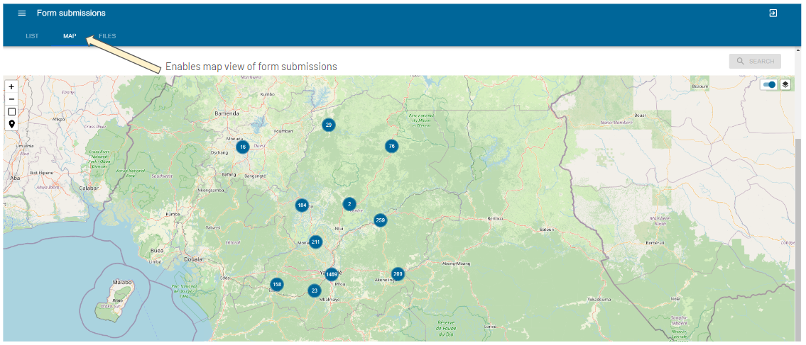
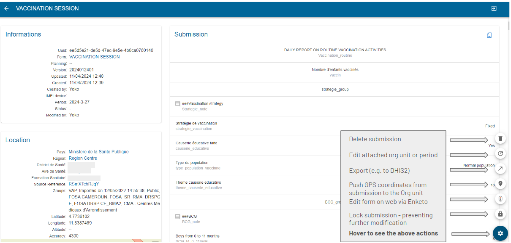
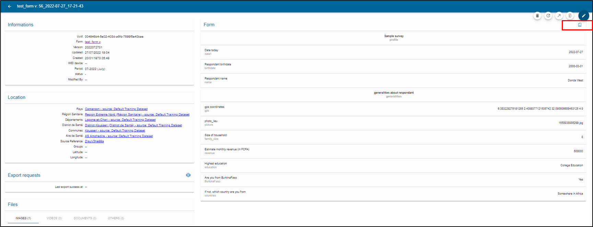
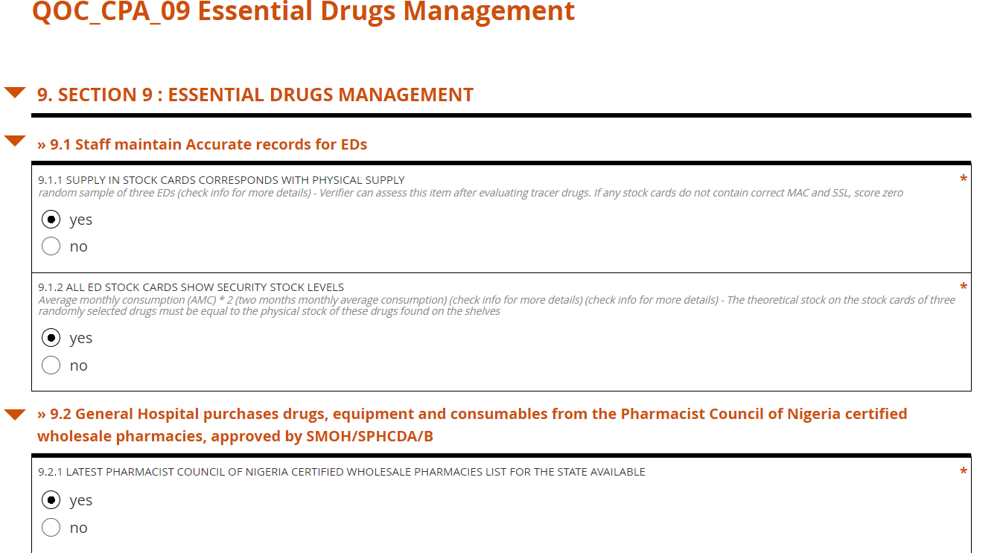
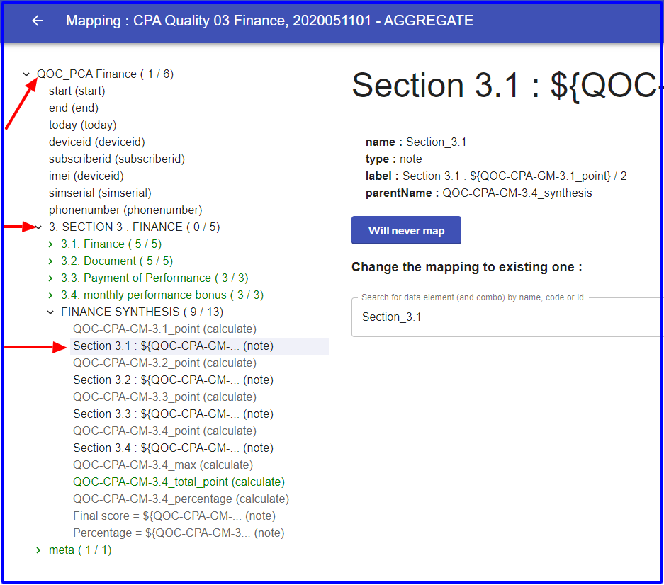
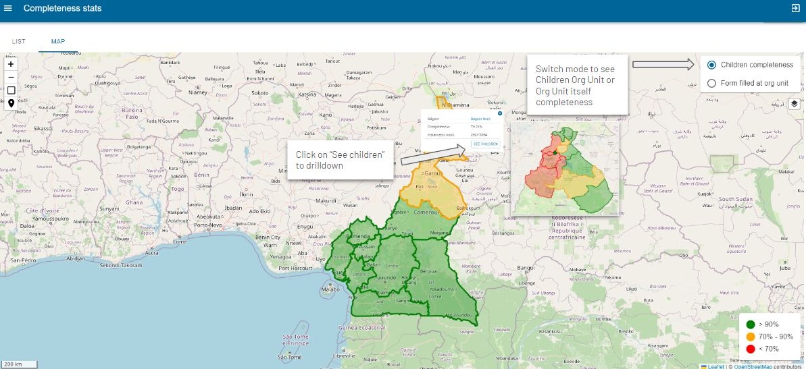
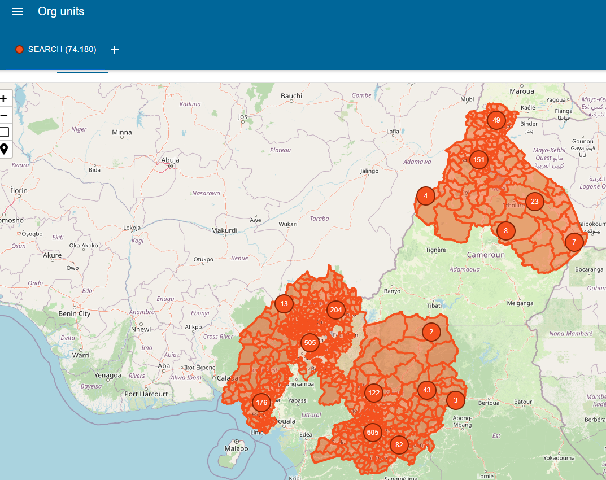
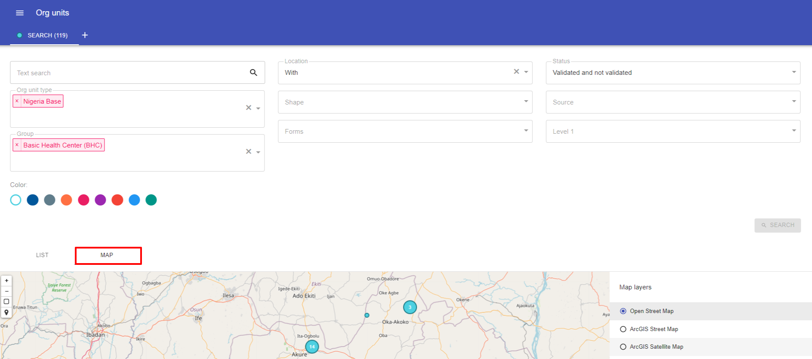
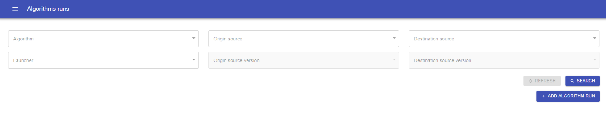
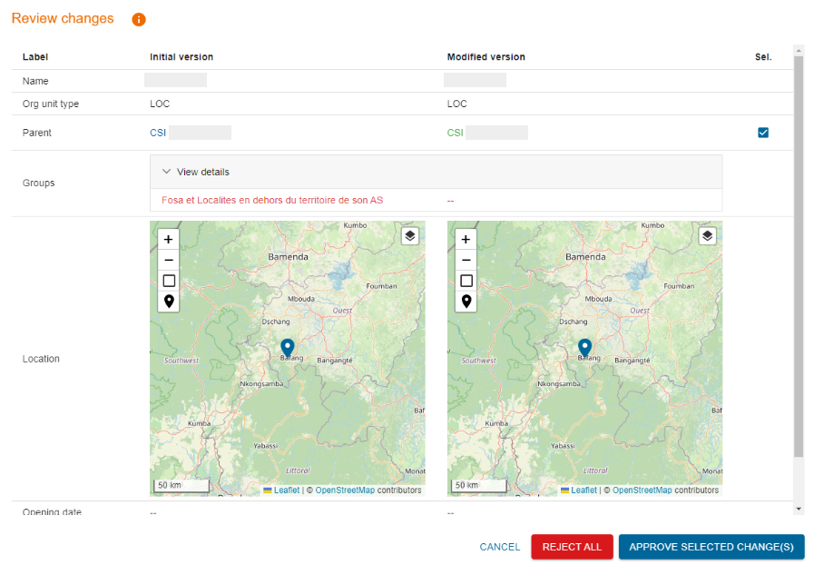

# Plataforma Web

La plataforma web de IASO está destinada a los administradores para que definan los detalles de la recolección de datos que desean realizar.
Algunos elementos clave de IASO son:

- el versionado de todos los datos - cada cambio es rastreado y las versiones anteriores pueden ser recuperadas según sea necesario

- recolección de datos geo-estructurados - los formularios están vinculados a niveles geográficos claros o "Unidades Organizacionales"

- la trazabilidad de los cambios - permitiendo la descentralización de las actividades y responsabilidades
Los administradores pueden por lo tanto usar la plataforma web para planificar, monitorear y luego evaluar los esfuerzos de recolección de datos.

## Inicio de sesión

Para iniciar sesión en la interfaz web, vaya a
[<u>https://iaso.bluesquare.org/login/</u>](https://iaso.bluesquare.org/login/)
e inicie sesión con su nombre de usuario y contraseña.

También puede restablecer su contraseña haciendo clic en el enlace "¿Olvidó su contraseña?". Esto enviará un correo electrónico automático y le permitirá crear una nueva contraseña.

## Navegando en IASO

## Gestionar formularios de recolección de datos

### Lista de formularios

Desde la lista de formularios, puede buscar entre los formularios disponibles de la cuenta IASO a la que está conectado usando los filtros:

Los botones a continuación le permiten gestionar los formularios de recolección de datos.

### Crear/Subir un formulario de recolección de datos
Acceda a la entrada Formularios en el menú, luego haga clic en Lista de formularios.
Haga clic en el botón "Crear". Una vez en la página de creación de formularios, siga los pasos a continuación:

- Ingrese un nombre para su formulario en el campo "Nombre".
- Asigne uno o varios [Proyecto(s)](https://iaso.readthedocs.io/en/latest/pages/users/reference/iaso_concepts/iaso_concepts.html#projects) a su formulario.
- Asigne un [Tipo de unidad organizacional](https://iaso.readthedocs.io/en/latest/pages/users/reference/iaso_concepts/iaso_concepts.html#organization-units) a su formulario.
- Asigne un Período a su formulario. Esto está destinado para recolección de datos regular (por ejemplo, diaria/semanal/anual). Si no necesita esta opción, simplemente seleccione "Sin Período".

Consejos:

- Verifique su formulario XLS antes de subirlo a IASO usando este enlace: https://getodk.org/xlsform/
- El ID del formulario debe permanecer igual entre versiones (no puede ser diferente de una versión a otra). Tendrá un error si este es el caso.
- La versión del formulario (que no es un campo obligatorio en la configuración de los formularios XLS) debe mantenerse consistente entre versiones. Por ejemplo, si es una fecha como 20240410, entonces no podrá subir una versión llamada 20231025. IASO hace verificaciones automáticas para asegurar que no está subiendo una versión anterior.

### Envíos de formularios

Una vez que un formulario ha sido completado y enviado al servidor, crea un "envío de formulario". Cada envío de formulario se registra en la plataforma y los datos enviados se pueden consultar desde allí. Puede usar los filtros para consultar los envíos de formularios según sea necesario:

- Búsqueda abierta (escriba algunas palabras clave)
- Por formulario
- Por Unidad organizacional (seleccione la relevante en la pirámide desplegable)
- Por tipo de Unidad organizacional (por ejemplo, País, Distrito, Villa)
- Por fecha de envío (creación desde/creación hasta)
- Por usuario (escriba un nombre de usuario y aparecerá como desplegable)

Esta vista le permite buscar formularios a través de entrada de texto libre y varios
filtros que se pueden combinar.

Una vez que haya aplicado al menos un filtro de formulario, puede descargar envíos usando los botones "CSV" o "XLSX".

También puede crear un nuevo envío haciendo clic en "Crear". Esto abrirá Enketo y preguntará a qué Unidad Organizacional se relaciona.

También puede verificar los envíos en la vista del mapa, en la que se aplican los filtros. Para asegurarse de tener esta vista de mapa habilitada, asegúrese de haber agregado la función "GPS para cada formulario" al [Proyecto](Projects) relacionado.

La pestaña "Archivo" le permite visualizar los archivos que han sido enviados junto con los formularios, como imágenes. Al hacer clic en un archivo dado, puede ser redirigido al envío de formulario relevante.

### Gestionar envíos

En la página de Envíos, puede ver la lista de envíos que se han hecho para la cuenta. Puede gestionarlos usando las opciones a continuación.

**Visualizar un envío**

Puede ver un envío específico/formulario enviado haciendo clic en el
botón "Ver" (ver arriba).

Esto le permite ver los datos enviados y editarlos en Enketo
(aplicación web [open-source](https://github.com/enketo/enketo-express/)).

La sección "Información" proporciona una descripción técnica del formulario.

La sección "Ubicación" muestra la indicación de la pirámide de salud de dónde
se recolectaron los datos.

La sección "Solicitudes de Exportación" muestra cuándo los datos fueron exportados a DHIS2,
por quién, y cualquier error que ocurrió durante la exportación.

La sección "Archivos" puede contener imágenes, videos, documentos.

La sección "Formulario" muestra todas las preguntas del formulario y respuestas ingresadas durante
la recolección de datos.

**Descargar un envío**

El icono "XML" le permite descargar un envío en formato XML.

El icono de engranaje en la esquina inferior del lado derecho le muestra una serie de iconos al pasar el cursor. Estos le permiten:

- Eliminar un envío
- Editar Unidad Organizacional o Período adjuntos
- Exportar (por ejemplo, a DHIS2)
- Empujar coordenadas GPS del envío a la Unidad Organizacional
- Editar este envío vía Enketo
- Bloquear envío

Vea a continuación las secciones dedicadas para más información sobre cada una de estas acciones.

**Eliminar un envío**

Le permite eliminar el formulario. Si ya ha sido exportado a DHIS2,
esto no eliminará los datos en DHIS2. Aparecerá un mensaje de advertencia:

**Editar Unidad Organizacional o Período adjuntos**

Cuando hace clic en "Editar Período y/o Unidad Organizacional", se abre una ventana
que le permite reasignar la instancia. Puede cambiar el período de tiempo
o la unidad organizacional que ha sido asignada al formulario
enviado.

**Exportar un envío**

La función de exportación le permite exportar el formulario a DHIS2. Previamente, necesita haber sido mapeado usando la funcionalidad de [mapeo DHIS2](DHIS2).

**Editar el envío vía Enketo**

Para editar un formulario, haga clic en el icono Enketo (ver arriba).

Edite el formulario cambiando las respuestas a las preguntas que necesitan ser
cambiadas. Luego haga clic en enviar en la parte inferior del formulario.

**Empujar coordenadas GPS del envío a la Unidad Organizacional**

Esto usará la coordenada GPS recolectada a través del formulario para empujar a las coordenadas GPS de la Unidad Organizacional.

**Bloquear envío**

Esta funcionalidad le permite proteger los envíos de formularios de edición adicional por usuarios que tienen menos permisos que usted.

### Estadísticas de formularios

Esta vista le permite ver estadísticas sobre los formularios. Al hacer clic en
"Estadísticas de Formularios" abrirá una página con dos gráficos.

El primero muestra el número total de envíos a lo largo del tiempo y el
segundo muestra los nuevos envíos por mes por formulario.

### Mapeos DHIS2

Una gran ventaja de IASO es que puede exportar datos a DHIS2. Al
hacerlo, es necesario un mapeo previo. Después de que el formulario es subido, mapee
el formulario para que coincida con el elemento de datos en DHIS2.

Haga clic en Mapeos DHIS para ver los formularios:

En la vista de Formulario puede ver detalles de:

-   Acciones

-   Nombre de formularios disponibles para mapeo

-   Versiones

-   Tipo del formulario:

    -   Agregado: fijo

    -   Evento: serie de eventos singulares

    -   Rastreador de Eventos: continuo

-   Número de cuestionarios a ser mapeados

-   Número total de cuestionarios

-   Cobertura de mapeo

-   Fecha de última modificación

Haga clic en "Crear" y se abrirá una ventana que le permitirá
mapear cada cuestionario de los formularios xls al elemento de datos
de DHIS2 correspondiente

El proceso de mapeo consiste en seleccionar una pregunta a la izquierda y
decidir si debe ser mapeada a DHIS2 o no.

Algunas preguntas pueden no necesitar ser mapeadas como notas, metadatos, etc. en
tal caso haga clic en nunca mapear.

Si la pregunta debe ser mapeada, busque el DE correspondiente en la
caja usando el nombre, código o ID y luego confirme.

Una vez confirmado, la pregunta se pondrá verde y será contada.

### Completitud

Esta funcionalidad está destinada a casos de uso donde se han establecido Períodos para los formularios de recolección de datos.
En la vista "completitud" verá detalles de:

-   Botones para seleccionar formularios "listos" para ser exportados, formularios con "errores"
    > y formularios que han sido "exportados"

-   Filtro de periodicidad: el filtro de periodicidad le permite organizar
    > los datos en meses, trimestres, semestres o años. La lista
    > mostrará los formularios disponibles para el período seleccionado, e
    > indicará cuántos formularios han sido enviados para cada uno

-   Botón Sincronizar para sincronizar dos formularios

Haga clic en cada uno de estos botones para tener formularios listos para ser exportados,
errores y exportados. Un filtro de periodicidad está ahí para organizar datos en
meses, trimestres, semestre o anualmente.

Si hace clic en el número de envíos, será llevado a la
vista de envíos, donde puede hacer clic en el icono de ver y ver los
envíos para ese formulario.

Haga clic en el botón  para sincronizar dos
formularios

Por ejemplo: para obtener datos agregados de la encuesta de verificación de la comunidad, todos los
formularios del cliente deben sincronizarse a un solo formulario.

### Estadísticas de completitud

Esta vista de tabla le muestra la completitud de los envíos de formularios en número (número de formularios completados) y en porcentajes (Completitud de datos). Se hace una distinción entre "formularios directos" (que se relacionan con el nivel de Unidad Organizacional seleccionado) y "formularios de nivel inferior" (que se relacionan con formularios abajo en la jerarquía).

Use los filtros (Nombre del formulario, Unidad Organizacional padre, Tipo de Unidad Organizacional, Usuario, Planificación, Equipos, Período) para ver estadísticas solo de una manera más específica.

El botón de acción "Ver hijos" le permite profundizar en la jerarquía geográfica para identificar el nivel de completitud y detectar dónde pueden haber ocurrido problemas.

Las primeras dos columnas "en sí mismo" indican el número de formularios completados al nivel de la Unidad Organizacional destacada.
La siguiente columna "descendientes" da información sobre el número de formularios completados al nivel en cuestión, pero también en todos los niveles inferiores.

También puede ver la completitud de datos con una vista de mapa haciendo clic en la pestaña "Mapa". Tenga en cuenta que necesita seleccionar un Formulario en los filtros previamente para habilitar esta vista.
Puede ajustar los umbrales para aplicar a la leyenda sobre completitud en la configuración avanzada del formulario relevante.

## Georegistry - Gestión de Unidades Organizacionales

Vea la definición de [Unidad Organizacional](https://iaso.readthedocs.io/en/doc_test/pages/users/reference/iaso_concepts/iaso_concepts.html#organization-units) para más información sobre qué son las Unidades Organizacionales.
En resumen, puede gestionar sus datos geográficos asociados a su cuenta usando la parte de Unidad Organizacional de IASO.

### Lista de Unidades Organizacionales

Haga clic en Unidades Organizacionales en el menú y luego en Lista de Unidades Organizacionales para navegar la pirámide de unidades organizacionales.

Puede ver en lista o mapa.

Puede seleccionar una Navegación de Unidad Organizacional y:

- Cambiar el nombre, tipo, estado de validación, lugar en la pirámide, etc. de la UO
- Visualizar la UO en un mapa
- Ver el historial de sus modificaciones

Los resultados de búsqueda pueden ser exportados en CSV, XLSX o GPKG.

Los resultados pueden verse en una lista o en un mapa

El estado para cuando una villa ha sido añadida y necesita ser
revisada por ejemplo.

La referencia externa se usa para exportar datos a DHIS2.

El mapa le ayuda a saber dónde está ubicada la estructura.

Puede ver el historial de modificaciones haciendo clic en el pequeño icono de reloj
o los detalles de los formularios completados haciendo clic en el icono del ojo.

Se pueden hacer varias búsquedas agregando pestañas a la página con el
botón +. 

Puede elegir el color de los resultados en el mapa para cada búsqueda.

 

**Creación de una Unidad Organizacional**

En la página de lista de Unidades Organizacionales, haga clic en "Crear". Luego puede crear una Unidad Organizacional según sea necesario.

Necesitará ingresar la información a continuación antes de guardar:

- Nombre de la Unidad Organizacional
- Tipo de la Unidad Organizacional (que habría definido previamente en la parte de Tipo de Unidad Organizacional)
- Estado: Nuevo, Validado, o Rechazado.
    - Nuevo: la Unidad organizacional ha sido creada pero no ha sido validada aún. Si activa la posibilidad de crear Unidades Organizacionales desde la aplicación móvil IASO, aparecerán primero como "Nuevo" en la web
    - Validado: la Unidad organizacional está validada
    - Rechazado: la Unidad organizacional ya no existe o ha sido fusionada/dividida o reemplazada por otra. IASO no permite borrar Unidades Organizacionales para mantener el registro de cambios pasados.

Campos opcionales:

- Alias: puede agregar tantos alias como sea necesario para rastrear las diferentes formas de escribir el nombre de la Unidad Organizacional (por ejemplo, "Ste Marie", "Sainte-Marie", "Sainte Marie", etc.)
- Grupo: puede organizar las Unidades Organizacionales en Grupos en IASO. Puede multi-seleccionar el/los grupo(s) con los que la unidad organizacional que está creando está asociada
- Unidad Organizacional padre: coloque su Unidad Organizacional en su lugar relevante en la jerarquía
- Fecha(s) de apertura y/o cierre: use estos campos para indicar la fecha de apertura o cierre de la Unidad Organizacional

**Editar una Unidad Organizacional o consultar detalles**

Para acceder a la vista detallada de una Unidad Organizacional, proceda como se describe a continuación:

En esta vista, tiene un conjunto de pestañas que le permiten editar la Unidad Organizacional según sea necesario:

- Infos: edite la información principal relacionada con esta Unidad Organizacional
- Mapa: consulte la información geográfica disponible para esta Unidad Organizacional (límites o coordenadas GPS). Puede ver datos geográficos a través de fuentes de datos (si hay varias fuentes). También puede dejar un comentario
- Hijos: lista los hijos de esta Unidad Organizacional. Puede usar filtro para revisar la lista de una manera más detallada

- Enlaces: en el caso de coincidir una Unidad Organizacional a través de múltiples fuentes de datos, los enlaces entre las fuentes de datos pueden encontrarse aquí
- Historial: le permite rastrear todas las modificaciones que se hicieron a la Unidad Organizacional por usuario
- Formularios: lista todos los formularios de recolección de datos que están enlazados al tipo de Unidad Organizacional de esta Unidad Organizacional
- Comentarios: puede dejar un comentario sobre esta Unidad Organizacional usando esta sección

**Edición en lote de Unidades Organizacionales**

También puede editar Unidades Organizacionales en lote.
Para hacer esto, desde la lista de Unidades Organizacionales, marque las casillas de las Unidades Organizacionales que le gustaría editar en lote, luego pase el cursor sobre el botón de acción. Haga clic en el botón de acción de engranaje, y seleccione la acción que le gustaría realizar.

### Grupos de Unidades Organizacionales

Las unidades organizacionales pueden ser agrupadas en grupos de unidades organizacionales, y estos
grupos pueden ser organizados además en conjuntos de grupos. Juntos pueden imitar
una jerarquía organizacional alternativa que puede ser usada al crear
reportes y otra salida de datos. Además de representar ubicaciones
geográficas alternativas que no son parte de la jerarquía principal, estos grupos son
útiles para asignar esquemas de clasificación a las Unidades Organizacionales.

**Gestionar Grupos de Unidades Organizacionales**

Para gestionar los Grupos de Unidades Organizacionales, acceda a la entrada del menú Unidades Organizacionales > Grupos.

Esta vista le permite buscar los Grupos de Unidades Organizacionales a través de
entrada de texto libre.

Puede crear un nuevo grupo 
haciendo clic en el botón crear.

Los grupos pueden ser editados haciendo clic en el icono de engranaje
o eliminados haciendo clic en el
botón eliminar.

En la tabla, la columna "Unidades Org" muestra el número de Unidades Organizacionales que están asignadas a este grupo. Cuando hace clic en el número, verá la lista de ese grupo de Unidad Organizacional.

**Asignar Unidades Organizacionales a Grupos**

Para asignar Unidades Organizacionales a Grupos, vaya a la vista de Lista de Unidades Organizacionales desde el menú y haga una edición en lote de las Unidades Organizacionales seleccionadas. Vea arriba en la sección "Edición en lote de Unidades Organizacionales" para más detalles sobre la edición en lote de Unidades Organizacionales.

### Gestión de tipos de Unidades Organizacionales

Los tipos de Unidades Organizacionales son específicos de IASO (es decir, esto no se maneja en DHIS2). Vea la parte sobre [Unidades Organizacionales](OU) para más detalles sobre qué son los tipos de Unidades Organizacionales.

Desde la entrada del menú Unidad Organizacional, haga clic en "Tipos de Unidades Organizacionales". Esta vista lista los tipos de Unidades Organizacionales existentes en su cuenta IASO.

**Crear un tipo de Unidad Organizacional**

Haga clic en "Crear" e ingrese los campos obligatorios a continuación:

- Nombre del tipo de Unidad Organizacional. Tenga cuidado de que esto debe ser la "categoría" / "nivel en la jerarquía", NO el nombre específico de una Unidad Organizacional. Por ejemplo, "País", "Provincia", "Distrito", y NO "RDC", "Kinshasa", "Gombe"
- Nombre corto: esto aparecerá en otras vistas de IASO. Debe ser una versión corta del nombre completo
- Proyecto(s): seleccione uno o múltiples proyecto(s) al que el tipo de Unidad Organizacional está vinculado

Estos otros campos no son obligatorios:

- Nivel: comience con 0 para el punto más alto en la jerarquía, por ejemplo "País". Por ejemplo, País - 0, Provincia - 1, Distrito - 2, Villa - 3
- Tipos de sub unidades organizacionales a mostrar: seleccione el/los tipo(s) de Unidad Organizacional de abajo que le gustaría mostrar en la vista de Registro si este tipo principal de Unidad Organizacional que está editando es seleccionado.
- Tipos de Sub Unidades organizacionales a crear: seleccione el/los tipo(s) de Unidad Organizacional que le gustaría habilitar para la creación en la aplicación móvil IASO. Por ejemplo, si está editando el tipo de Unidad organizacional "Distrito", puede habilitar la creación de "Villa" y/o "Punto de Interés"
- Formularios de referencia: seleccione uno o varios Formulario(s) de recolección de datos que serán asignados como referencia para este tipo de Unidad Organizacional. Los formularios de referencia son Formularios que están estrechamente vinculados al tipo de Unidad Organizacional. Un caso de uso típico es para un Área asignar un Formulario de referencia para datos de Población.

### Gestión de Fuente(s) de Datos

IASO permite importar y manejar una o varias fuente(s) de datos geográficos.

#### Lista de Fuente(s) de Datos

Encuentre aquí las fuentes de datos con sus nombres, versiones y descripciones. Es posible
editar la fuente de datos, verificar el historial de versiones de los archivos o comparar
fuentes de datos y exportarlas a DHIS2.

#### Coincidencia

Esta es más bien una funcionalidad "geoespacial": tener varias fuentes de pirámide geográfica
e intentar hacer enlaces (Ejemplo: donde en un csv "provincia x" se
llama "PROVINCIA X" y en otra fuente se llama "DPS X").

La parte de ejecución de algoritmos está destinada para trabajo de ciencia de datos.

### Registro

La entrada de Registro en Unidad Organizacional es una herramienta de visualización que permite a los usuarios profundizar en la jerarquía geográfica y consultar los datos geográficos así como la recolección de datos asociada a los diferentes nivel(es).

### Revisar propuestas de cambio

Con IASO, los supervisores pueden comparar y validar envíos de datos mientras son enviados al servidor.
Tenga en cuenta que esta característica solo funcionará siempre que haya activado la bandera de característica "Solicitudes de cambio" en el Proyecto IASO para el que le gustaría validar datos recolectados. Vea la parte de Proyectos para más información sobre banderas de características móviles en IASO.

En la página Revisar propuestas de cambio, los usuarios pueden usar los filtros para seleccionar las propuestas en las que les gustaría enfocarse. Vea en la imagen a continuación los filtros detallados.

Los supervisores pueden luego hacer clic en el icono de engranaje al final de la línea relevante para poder ver los detalles de la propuesta de cambio enviada y comparar con la versión anterior a la izquierda.

Los supervisores pueden luego seleccionar los cambios que les gustaría aprobar marcando las casillas de los cambios seleccionados en la columna derecha, y luego presionar "Aprobar cambios seleccionados".
Si los cambios propuestos no son satisfactorios, los supervisores pueden rechazar todos los cambios y proporcionar un comentario.

Para cada propuesta de cambio enviada, los usuarios de la aplicación móvil IASO podrán ver si han sido aprobados o rechazados, y si rechazados, consultar el comentario.

## Planificación

La característica de Planificación en IASO le permite planificar trabajo de campo por equipo y usuario en zonas/unidades organizacionales definidas y según una línea de tiempo específica. Una vez que las actividades de recolección de datos hayan sido asignadas a través de la interfaz, los agentes de campo que usan la aplicación móvil solo podrían ver las actividades asignadas a ellos, y navegar hacia el/los punto(s) GPS relevante(s).

Para poder crear una Planificación, necesitará haber creado previamente Unidades organizacionales, Usuarios, un Proyecto, Equipos de Usuarios/Equipos de Equipos y formularios de recolección de datos para los cuales le gustaría usar la característica de Planificación.

### Lista de Planificación

Haga clic en Planificación en el panel del menú. Bajo Lista de Planificación verá la lista de horarios/planificaciones que han sido
creadas en IASO. Puede buscar a través de las diferentes Planificaciones usando los diferentes filtros y tomar las acciones a continuación:

- Crear Planificación
- Ver Planificación: aquí es donde accederá a la interfaz para asignar actividades de recolección de datos a Equipos y Usuarios según geografías
- Editar Planificación: editar el Nombre, Proyecto, Unidad Organizacional padre y Equipo al que se aplica, Formulario(s), Descripción
- Duplicar Planificación: permite a los usuarios copiar una Planificación existente y readaptarla según sea necesario
- Borrar Planificación

**Crear una Planificación**

Haga clic en "Crear" y verá la ventana a continuación abriéndose:

Los campos a continuación son obligatorios:

- Nombre
- Proyecto: define en qué ambiente de aplicación móvil la información de Planificación
será visible
- Equipo: es el equipo responsable de la planificación - esto es usualmente un Equipo de Equipos
- Formulario(s): seleccione uno o varios Formulario(s) para aplicar a esta Planificación
- Unidad organizacional: seleccione la Unidad Organizacional base a la que se aplica su Planificación. Tenga en cuenta que profundizará desde esta Unidad Organizacional base para asignar sus actividades de recolección de datos a Equipos/Usuarios.
- fechas de inicio y fin para su Planificación

Puede agregar una descripción como opción.

El "Estado de publicación" (en la esquina inferior izquierda
) hace posible asegurar, una vez completado (y todas
las asignaciones hechas), que la planificación recién creada estará disponible en la
aplicación móvil IASO para el proyecto relevante.

Una vez que haya completado los campos, haga clic en "Guardar" para terminar.

Haga clic en el icono del ojo
desde la lista de Planificación
para comenzar a editar su nueva Planificación a través de la interfaz del Mapa.

Puede hacer
la asignación ya sea a través de la pestaña "Mapa" o "Lista". Si
procesa a través del mapa, primero seleccione el Equipo al que le gustaría asignar una geografía en el desplegable, así como el "Tipo de Unidad Organizacional base" relevante en el desplegable. Luego puede comenzar a asignar áreas geográficas o puntos directamente a los miembros del Equipo seleccionados directamente en el mapa.

Las áreas seleccionadas serán resaltadas con el color del equipo, que puede cambiar según sea necesario.

Para asignar todas las Unidades Organizacionales hijas de una Unidad Organizacional padre dada al mismo Equipo/Usuario, puede seleccionar el "Modo de selección padre" antes de proceder a su selección.

Si prefiere usar la pestaña Lista, el proceso es bastante similar. La
diferencia principal es que trabaja aquí con una lista de nombres, según
el nivel seleccionado. Las unidades organizacionales son asignadas haciendo clic en frente del
nombre del elemento, en la columna "Asignación".

Puede ordenar Unidades Organizacionales y Padres haciendo clic en el nombre de la columna.

## Entidades

Llamamos una "**Entidad**" a cualquier cosa que pueda moverse o ser movida y que queramos rastrear a través del tiempo y Unidades Organizacionales. Por ejemplo, un beneficiario, un carro, etc.

Para diferenciar entre diferentes tipos de entidades, IASO tiene un concepto de "**Tipo de Entidad**".
IASO depende mucho de [XLSForms](https://xlsform.org), y las entidades no son excepción. Por lo tanto, una entidad está representada por un envío a un formulario. Este envío se refiere como el **perfil**. El tipo de entidad define qué formulario tiene que ser completado.

### Cómo crear una entidad

**Habilitar la característica**

Para crear una entidad, su proyecto debe primero habilitar la bandera de característica de entidad. Puede establecer esta bandera ya sea durante su creación o actualizándola más tarde.

**Crear y subir el formulario de perfil**

Usando la aplicación de hoja de su elección, cree un XLSForm que contendrá todas las preguntas relacionadas con su entidad que son ya sea fijas (es decir, nombre y apellido) o pueden evolucionar a través del tiempo (es decir, un programa al que una entidad puede estar afiliada).
Súbalo al servidor usando la aplicación web.

| Nota: Las preguntas que pueden evolucionar a través del tiempo no deben ser editables. |
| :---- |

#### **Crear el tipo de entidad**

En la pantalla de tipos de entidades, haga clic en el botón "CREAR". Dé al tipo de entidad un nombre y seleccione el formulario recién subido como formulario de referencia:

| Nota: Veremos más tarde qué son "Campos de lista" y "Campos de información de detalle". |
| :---- |

#### **Crear una entidad**

En la aplicación móvil, asegúrese de que los datos hayan sido refrescados y estén actualizados con el servidor backend. Ahora podrá ver la pantalla de entidad.

En este momento, no es posible crear una Entidad desde una interfaz web.

Haga clic en el botón "Agregar" en la aplicación.

Seleccione el tipo de entidad que quiere crear.

Se le pedirá confirmar su selección.

Luego puede completar el formulario para finalizar su primera entidad.

### ¿Cómo configurar cómo mostramos una entidad?

Dentro de la configuración del tipo de entidad, es posible para los administradores definir qué preguntas se muestran dentro de las listas y dentro de la pantalla de detalles.

Esto impacta cómo las aplicaciones web y móvil muestran entidades, como se muestra a continuación.

#### **En la interfaz web**

##### En la lista

##### En la pantalla de detalles

#### **En la aplicación móvil**

##### En la lista

##### En la pantalla de detalles

### Buscar una entidad

#### **En la web**

En la lista de beneficiarios, puede filtrar por tipo y/o ingresar una consulta para filtrar basado en el identificador o cualquiera de los valores de campos de lista.

#### **En la aplicación**

Hacer clic en el icono de lupa en la pantalla de entidad lo llevará a la lista de todas las entidades y le permitirá filtrarlas rápidamente basado en el identificador o cualquiera de los valores de campos de lista.
Si necesita una selección más refinada, puede hacer clic en el icono de embudo, seleccionar un tipo y completar el formulario de búsqueda (segunda imagen)

### ¿Qué son los flujos de trabajo?

Como se declaró antes, una entidad es rastreada a través del tiempo y Unidades Organizacionales. Para lograr esto, Iaso vincula los envíos subsecuentes para una entidad juntos y permite que los envíos subsecuentes cambien el perfil. Para que pueda elegir qué formularios deben presentarse a continuación y qué valores anulan las propiedades del perfil, puede definir un flujo de trabajo.

#### **Crear un flujo de trabajo**

En la lista de tipos de entidades, haga clic en el icono de flujo de trabajo

En la lista de las versiones de flujo de trabajo, cree el botón "CREAR" y dé a la versión un nombre:

### **Seguimientos y cambios**

#### Seguimientos

Representan los próximos formularios posibles basados en el estado del perfil. Están basados en una condición.
En el siguiente ejemplo, la aplicación móvil ofrecerá "Registro U5 WFP" como el próximo formulario posible si el primer nombre es "Bill".

| Recordatorio: "Primer Nombre" es una de las preguntas en el formulario del Tipo de Entidad. |
| :---- |

#### Cambios

Representan el mapeo de qué valor de un formulario cambiará los valores en el perfil.

En el ejemplo a continuación, el "Formulario objetivo" es el formulario del Tipo de Entidad, y el "Formulario fuente" es el envío subsecuente.
Cuando un formulario "Registro U5 WFP" es completado, el valor ingresado en "Edad del niño en meses" será copiado en la pregunta "Edad (Meses)" del perfil. Y el valor ingresado en "Nombre del niño" será copiado en la pregunta "Primer Nombre" del perfil.

### **Usar valores del perfil en formularios subsecuentes**

Algunas veces, quiere que un formulario subsecuente use valores del perfil. Para hacer esto, simplemente agregue una pregunta con el mismo identificador y tipo que el valor del perfil.

Es decir, Asumamos que el perfil tiene 2 preguntas de tipo "texto": primer\_nombre y apellido. Al agregar una pregunta similar de solo lectura en sus formularios subsecuentes, el valor estará disponible para usted.

### **Publicar flujos de trabajo**

Una vez que una versión de flujo de trabajo ha sido publicada, está marcada como finalizada, y no puede ser editada más. Solo los flujos de trabajo en "borrador" pueden ser editados.
Si quiere editar un flujo de trabajo finalizado, primero necesita duplicarlo usando el botón "Copiar versión". Una nueva versión de borrador es entonces creada con el mismo contenido.

## Admin

La parte Admin de IASO comprende varias partes, que aparecerán o no dependiendo de los permisos del usuario:

- Tareas
- Monitoreo
- Proyectos
- Módulos
- Usuarios
- Roles de usuario
- Equipos

### Tareas

Este es el registro de actualizaciones por lotes de IASO. Un registro de operación contiene información sobre cuándo y dónde una operación
corrió, el estado de la operación, el número de registros fuente y objetivo
procesados, y cualquier mensaje de registro.

Ejemplos de tareas incluyen:

- Actualización en lote de unidad organizacional
- Importación de datos DHIS2
- Importación de Geopackage

Los estados son:

- Error: la Tarea no lo logró. Se aconseja a los usuarios intentar de nuevo.
- Ejecutándose: la Tarea está en proceso
- En cola: la Tarea se ha detenido y se reiniciará si se cumplen las condiciones (por ejemplo, si hay mejor conectividad)
- Eliminada: la Tarea fue interrumpida por el usuario después de que había sido iniciada
- Éxito: la Tarea ha sido ejecutada exitosamente

La lista de Tareas puede ser refrescada presionando el botón "Refrescar" en el lado superior derecho.

### Monitoreo

Esta parte permite a los supervisores monitorear dispositivos que están vinculados con la cuenta IASO.
Desde esta página, puede consultar:

- El IMEI o identificador del dispositivo
- Si este es un dispositivo de prueba o no
- el nombre del último propietario
- la última vez que ha sido sincronizado
- la fecha de creación (primera vez que ha sido sincronizado)
- la fecha de modificación

En el lado derecho, puede ver el número de dispositivos que están conectados bajo la cuenta IASO a la que está conectado.

### Proyectos

Un Proyecto en IASO se relaciona con una instancia de aplicación móvil.
Cada Proyecto es identificado por un Nombre y un ID de App. Vea [aquí](https://iaso.readthedocs.io/en/latest/pages/users/reference/iaso_concepts/iaso_concepts.html#projects) para una definición más detallada de Proyectos en IASO.

**Crear un Proyecto**

Desde el menú, Admin > Proyectos > Haga clic en "Crear"

Luego, agregue un nombre de Proyecto, y un ID de App.
Tenga en cuenta que el ID de App tendrá que ser ingresado por los usuarios de aplicación móvil IASO la primera vez que se conecten a la app IASO, por lo que no debe ser excesivamente complicado para evitar errores de tipeo.

Luego puede seleccionar las banderas de características que le gustaría aplicar a su Proyecto en la siguiente pestaña y presionar "Guardar".

**Definición de banderas de características**

Vea la tabla a continuación para más detalles sobre las banderas de características del Proyecto:

| Bandera de característica      | Descripción |
| ----------- | ----------- |
| Autenticación      | Los usuarios tienen que ingresar su inicio de sesión y contraseña en la aplicación móvil antes de proceder a la recolección de datos. Tenga en cuenta que esto es posible en IASO proceder a la recolección de datos sin autenticación para procesos simplificados (también llamado "modo anónimo")
| Móvil: mostrar pantalla de recolección de datos   | Habilitar la característica para recolectar datos desde la aplicación móvil IASO (recolección de datos que no está vinculada a una planificación o un flujo de trabajo de solicitud de cambio)       |
| GPS para cada formulario      | Cada vez que un formulario de recolección de datos es enviado, un punto GPS es automáticamente tomado y asociado al envío del formulario |
| Forzar que los usuarios estén dentro del alcance de la unidad organizacional antes de comenzar el formulario      | Los usuarios de aplicación móvil IASO tienen que estar cerca (50m) del punto GPS de la unidad organizacional para la que están recolectando datos para que el formulario se abra |
| Móvil. Mostrar pantalla de planificación      | Cuando una planificación ha sido hecha en IASO a través de la interfaz web, los puntos de recolección de datos asignados y tareas se reflejan a través de esta pestaña |
| Móvil: limitar descarga de unidad organizacional a lo que el usuario tiene acceso      | Al cargar datos en la aplicación móvil, solo la zona geográfica que está asignada al usuario es descargada, para habilitar uso fuera de línea. Esto permite una descarga más ligera (y entonces más rápida y menos consumidora de datos) de datos al inicio de la aplicación móvil IASO |
| Móvil. Mostrar Mapa de unidad organizacional      | Agrega una pestaña en la aplicación móvil para mostrar la información geográfica disponible para la Unidad Organizacional seleccionada en la aplicación móvil. Por ejemplo, si una coordenada GPS está disponible para una instalación de salud, se mostraría en el mapa a través de esta pestaña |
| Solicitar cambios a unidades organizacionales      | Habilitar la característica para proponer cambios a unidades organizacionales y sus formulario(s) de referencia relacionados |
| Móvil: Solicitudes de cambio      | Agrega la pestaña que permite proponer cambios a unidades organizacionales y sus formulario(s) de referencia |
| GPS para trayectoria     | Habilitar al usuario activar una función que rastrea su posición cada 15 minutos durante un período de tiempo |
| Móvil. Advertir al usuario cuando los formularios han sido actualizados     | Cuando nuevas versiones de formularios han sido subidas en la web, el usuario de aplicación móvil IASO es notificado. Luego el usuario puede elegir aplicarlas o no |
| Móvil. Advertir al usuario cuando los formularios han sido actualizados y forzarlos a actualizar      | Cuando nuevas versiones de formularios han sido subidas en la web, el usuario de aplicación móvil IASO es notificado y la actualización ocurre automáticamente |
| Móvil. Advertir al usuario cuando las unidades organizacionales han sido actualizadas      | Cuando cambios a las Unidades organizacionales (pirámide de salud) han sido hechos en la web, el usuario de aplicación móvil IASO es notificado. Luego el usuario puede elegir aplicarlos o no |
| Móvil. Advertir al usuario cuando las unidades organizacionales han sido actualizadas y forzarlos a actualizar      | Cuando cambios a las Unidades organizacionales (pirámide de salud) han sido hechos en la web, el usuario de aplicación móvil IASO es notificado y la actualización ocurre automáticamente |
| Subida automática de formularios finalizados      | La sincronización de formularios que han sido completados toma lugar automáticamente tan pronto como el usuario tiene conectividad |
| Móvil. Los formularios finalizados son de solo lectura      | Los usuarios de aplicación móvil IASO no pueden editar los formularios una vez finalizados en la aplicación móvil |

### Usuarios

Los usuarios pueden acceder a la aplicación web y móvil de IASO con credenciales de inicio de sesión. Cada usuario tiene permisos asignados y puede ser limitado por ubicación.

Los permisos son relativamente granulares:
- Por pantalla/pestaña
- Diferentes permisos de lectura/escritura para dominios importantes
- Restricción de acceso usando la pirámide de salud
- Creación/modificación en lote de usuarios
- Roles de usuario personalizables (Administrador, Gestor de datos, etc.)

Tenga en cuenta que los permisos asignados desde la gestión de Usuarios se aplican **solo a IASO web**. IASO no tiene un sistema de permisos para su aplicación móvil, sino más bien un conjunto de Banderas de Características.

**Crear un nuevo usuario IASO**

Desde el menú Admin > Usuarios, haga clic en "Crear".

1. Complete la información del usuario

Tenga en cuenta que también puede indicar la siguiente información:

- ID DHIS2 del usuario: puede importar una lista de usuarios DHIS2 a IASO y mantener el registro de su id DHIS2 en IASO para vincularlos a través de ambos sistemas
- Página de inicio: puede configurar una página de aterrizaje predeterminada para ese usuario al conectarse a esta cuenta IASO
- Proyectos: seleccione uno o varios Proyecto(s) al cual el usuario recién creado será vinculado. Si no hay Proyecto indicado aquí, el usuario tendrá acceso a todos los Proyectos de la cuenta IASO por defecto.
- Idioma: puede especificar en qué idioma predeterminado este usuario usará IASO web. La aplicación móvil IASO está basada en el idioma predeterminado del dispositivo del usuario.

2. Asignar permisos de usuario

En la siguiente pestaña "Permisos", puede habilitar/deshabilitar permisos para ese usuario según sea necesario. Tenga en cuenta que en los "?" hay tooltips para explicar qué hacen los permisos.

3. Restringir usuario a una Ubicación específica

En la última pestaña "Ubicación", puede restringir el acceso del usuario que está editando a una sub-parte de la jerarquía de Unidad Organizacional (por lo tanto el usuario solo podrá ver datos relacionados con su Geografía).
Si no se especifica Ubicación aquí, por defecto el usuario verá todos los datos disponibles a través de toda la jerarquía.

**Crear usuarios en lote**

Puede crear varios usuarios a la vez usando un archivo CSV que importa a IASO.

Use el botón "Crear desde archivo" y luego puede importar su lista de usuarios (o descargar la plantilla relevante para hacerlo previamente).

**Gestionar usuarios IASO**

Esta vista le permite gestionar usuarios y sus permisos. Puede buscar
por un usuario usando los diferentes filtros.

Puede editar usuarios IASO en lote usando la característica de actualización en lote. Primero, marque cada usuario que le gustaría actualizar usando las casillas de verificación en el lado derecho de cada línea de usuario.

Luego seleccione la(s) acción(es) que le gustaría realizar para estos usuarios. Pueden ser:

- Agregar o quitar de rol(es) de usuario
- Agregar o quitar de Proyecto(s)
- Agregar o quitar de Equipo(s)
- Actualizar idioma predeterminado
- Agregar o Quitar Ubicación (por lo tanto limitando estos usuarios a la Geografía seleccionada)

Haga clic en "Validar" cuando termine.

### Roles de usuario

Los roles de usuario permiten agrupar usuarios que tienen un conjunto de permisos bajo el mismo rol. En el Rol de usuario, puede crear Roles de usuario con sus permisos coincidentes, a los cuales los Usuarios pueden ser asignados.

**Crear un Rol de usuario**

Desde la página Admin > Roles de usuario, haga clic en "Crear".
 
 

Luego puede asignar este rol de usuario a cualquier usuario a través de la pestaña Permiso en la ventana emergente de edición de Usuario. Tenga en cuenta que los permisos de Rol de usuario se aplicarán al usuario, pero si el Usuario tiene más permisos que habían sido previamente asignados a él/ella, no los perderá sino que se sumarán.

 Para asignar múltiples Usuarios a este rol de usuario recién creado en lote, regrese a la lista de Usuarios y proceda a una actualización en lote (vea Gestionar Usuarios arriba).

###  Equipos

La noción de Equipos en IASO se usa principalmente para la característica de [Planificación](Planning). Permite organizar Usuarios en jerarquías de Equipo y asignar actividades de recolección de datos a las geografías relevantes según sea necesario para los propósitos de Planificación.

Hay dos tipos de Equipos:

- Equipos de Usuarios: reúne Usuarios IASO bajo el mismo equipo
- Equipos de Equipos: reúne varios Equipos bajo un mismo Equipo. Luego puede crear jerarquías de Equipos

**Crear un Equipo**

Desde el menú, acceda a Admin > Equipos. Haga clic en "Crear"

Complete los campos a continuación:

- Nombre del equipo
- Gerente: seleccione de los Usuarios en IASO
- Proyecto: seleccione el Proyecto a ser vinculado a este Equipo
- Tipo: seleccione en el desplegable el tipo de Equipo
    - Si selecciona "Equipo de Usuarios" - entonces seleccione los Usuarios a ser agregados a ese Equipo
    - Si selecciona "Equipo de Equipos" - entonces seleccione los Equipos a ser agregados a ese Equipo
- Padre: seleccione el Equipo Padre para este equipo recién creado

Luego puede usar el icono de engranaje o papelera en la página principal para editar o eliminar Equipo(s) según sea necesario.