# Plateforme Web

La plateforme web IASO est destinée aux administrateurs pour leur permettre de définir les détails de la collecte de données qu'ils souhaitent réaliser.
Voici quelques atouts clés d'IASO :

- le versionnement de toutes les données : chaque modification est tracée et les versions précédentes peuvent être récupérées si nécessaire ;
- la collecte de données géo-structurée : les formulaires sont liés à des niveaux géographiques clairs ou à des "unités d'organisation" ;
- la traçabilité des modifications : permettant la décentralisation des activités et des responsabilités.

Les administrateurs peuvent ainsi utiliser la plateforme web pour planifier, surveiller et ensuite évaluer les efforts de collecte de données.

## Connexion

Pour vous connecter à l'interface web, rendez-vous sur
[<u>https://iaso.bluesquare.org/login/</u>](https://iaso.bluesquare.org/login/)
et connectez-vous avec votre nom d'utilisateur et votre mot de passe.

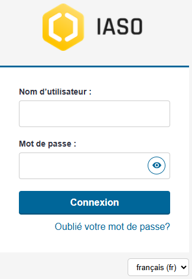

Vous pouvez également réinitialiser votre mot de passe en cliquant sur le lien "Mot de passe oublié". Un e-mail automatique vous sera envoyé pour vous permettre de créer un nouveau mot de passe. 

## Navigation dans IASO

## Gérer les formulaires de collecte de données

### Liste des formulaires

Depuis la liste des formulaires, vous pouvez rechercher parmi les formulaires disponibles du compte IASO auquel vous êtes connecté en utilisant les filtres suivants :

Les boutons ci-dessous vous permettent de gérer les formulaires de collecte de données :

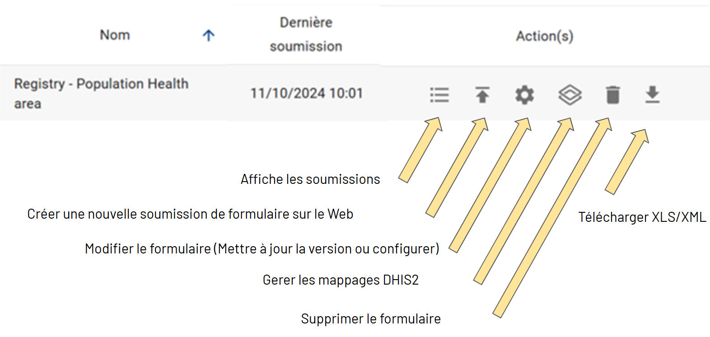

### Créer/Téléverser un formulaire de collecte de données
Accédez à l'entrée "Formulaires" dans le menu, puis cliquez sur "Liste des formulaires".
Cliquez sur le bouton "Créer". Une fois sur la page de création de formulaire, suivez les étapes ci-dessous :

- Saisissez un nom pour votre formulaire dans le champ "Nom". 
- Attribuez un ou plusieurs [Project(s)](https://iaso.readthedocs.io/en/latest/pages/users/reference/iaso_concepts/iaso_concepts.html#projects) à votre formulaire. 
- Attribuez un [Org unit type](https://iaso.readthedocs.io/en/latest/pages/users/reference/iaso_concepts/iaso_concepts.html#organization-units) à votre formulaire. 
- Attribuez une période à votre formulaire. Cela est destiné à la collecte de données régulière (par exemple, quotidienne/hebdomadaire/annuelle). Si cette option n'est pas nécessaire, sélectionnez simplement "Pas de période".

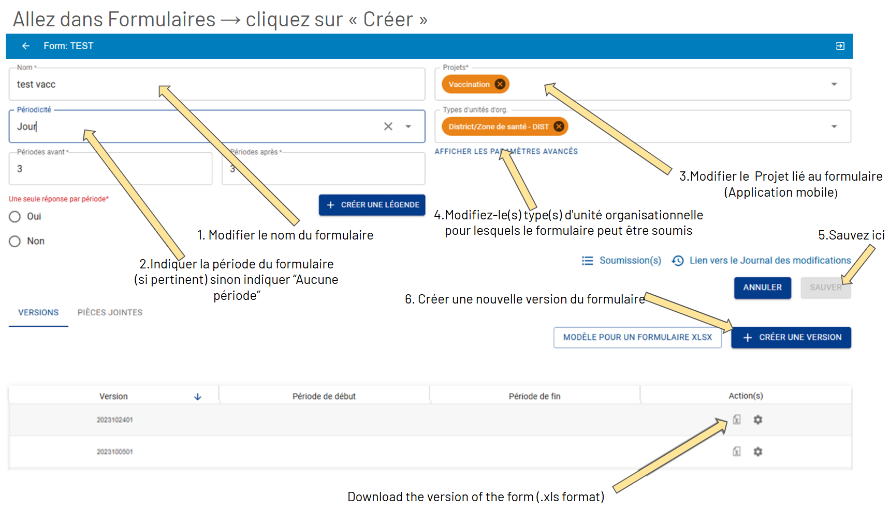

Astuces :

- Vérifiez votre formulaire XLS avant de le téléverser dans IASO à l'aide de ce lien : https://getodk.org/xlsform/
- L'ID du formulaire doit rester identique entre les versions (il ne peut pas différer d'une version à l'autre). Une erreur sera générée si ce n'est pas le cas.
- La version du formulaire (qui n'est pas un champ obligatoire dans les paramètres des formulaires XLS) doit rester cohérente entre les versions. Par exemple, si la version est une date comme 20240410, vous ne pourrez pas téléverser une version nommée 20231025. IASO effectue des vérifications automatiques pour s'assurer que vous ne téléversez pas une version antérieure.

### Soumissions de formulaires

Une fois un formulaire rempli et envoyé au serveur, il génère une "soumission de formulaire". Chaque soumission est enregistrée sur la plateforme et les données soumises peuvent être consultées à partir de là. Vous pouvez utiliser les filtres pour consulter les soumissions de formulaire selon vos besoins :

Recherche ouverte : saisissez des mots-clés ;
- Par formulaire : filtrez par formulaire spécifique ;
- Par unité d'organisation : sélectionnez l'unité pertinente dans la pyramide déroulante ;
- Par type d'unité d'organisation : par exemple, Pays, District, Village ;
- Par date de soumission : création de/à ;
- Par utilisateur : saisissez un nom d'utilisateur pour qu'il apparaisse dans le menu déroulant.

Vous pouvez utiliser les filtres pour consulter les soumissions de formulaire selon vos besoins :

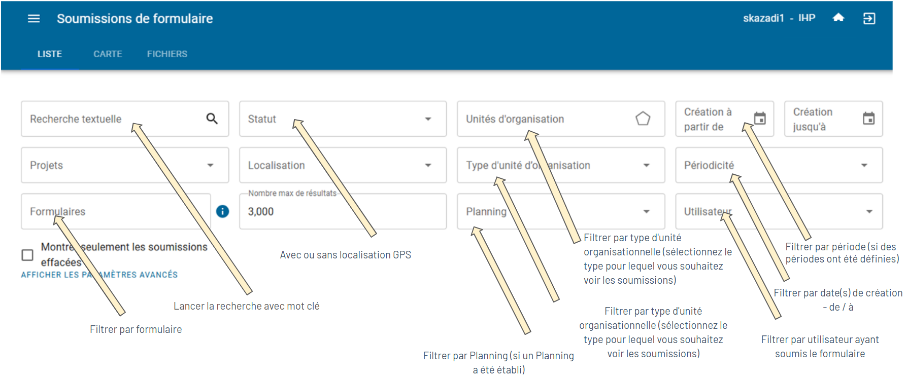

Une fois qu'au moins un filtre de formulaire a été appliqué, vous pouvez télécharger les soumissions à l'aide des boutons "CSV" ou "XLSX".

Vous pouvez également créer une nouvelle soumission en cliquant sur "Créer". Cela ouvrira Enketo et vous demandera à quelle unité d'organisation elle se rapporte.

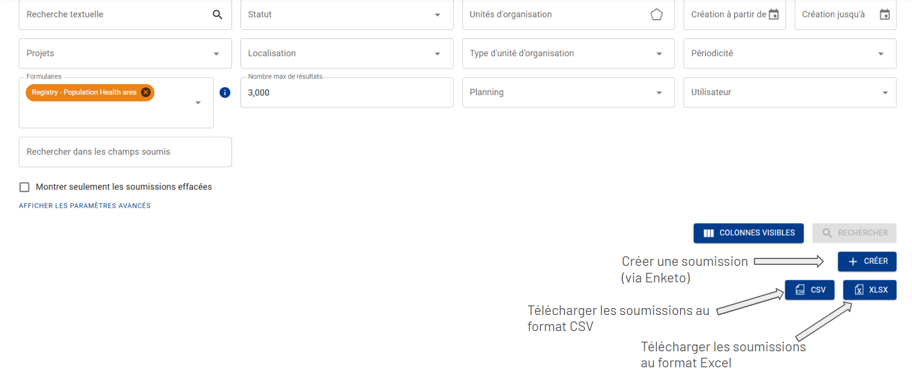

Vous pouvez également vérifier les soumissions dans la vue cartographique. Les filtres appliqués s'y reflèteront également. Pour vous assurer que cette vue cartographique est activée, veillez à avoir ajouté l'indicateur de fonctionnalité "GPS pour chaque formulaire" au [Projet](Projects) concerné.

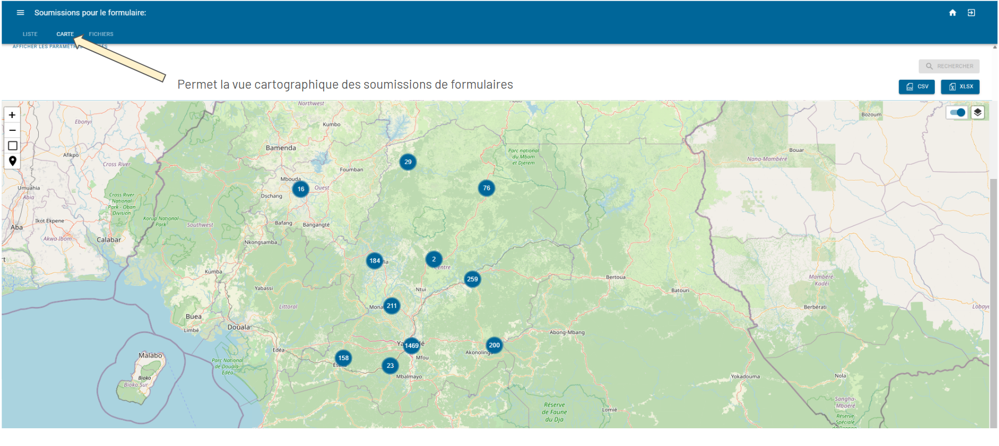

L'onglet "Fichier" vous permet de visualiser les fichiers soumis avec les formulaires, tels que des photos. En cliquant sur un fichier donné, vous serez redirigé vers la soumission de formulaire correspondante. 

### Gérer les soumissions de formulaires

Sur la page des soumissions, vous pouvez trouver la liste des soumissions de formulaires qui ont été effectuées. Vous pouvez les gérer en utilisant les fonctionnalités ci-dessous.

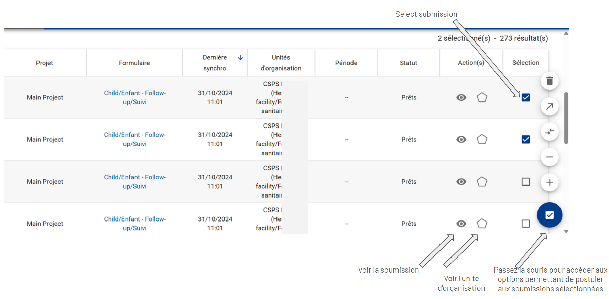

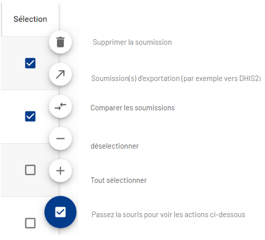

**Visualiser une soumission**

Vous pouvez visualiser une soumission ou un formulaire soumis en cliquant sur le bouton "Voir" (voir ci-dessus).

Cela vous permet de voir les données soumises et de les modifier via Enketo
([open-source](https://github.com/enketo/enketo-express/) web
application).

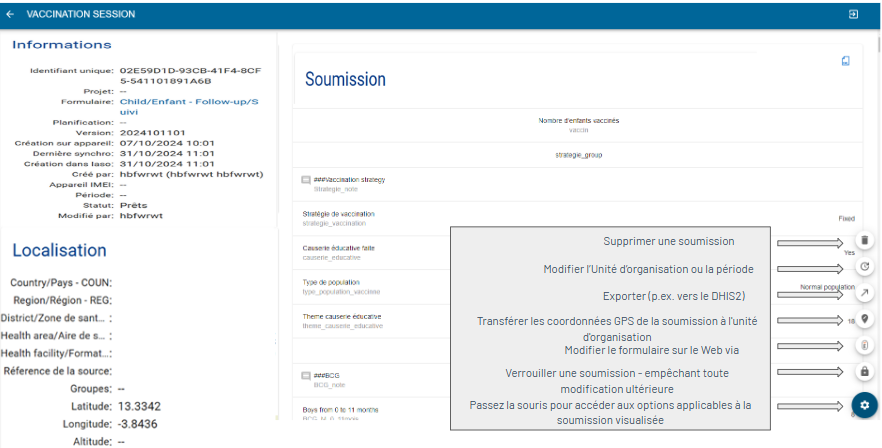

La section "Informations" fournit une vue d'ensemble technique du formulaire.

La section "Localisation" montre l'indication dans la pyramide sanitaire de l'endroit où les données ont été collectées.

La section "Demandes d'exportation" indique quand les données ont été exportées vers DHIS2, par qui, et les éventuelles erreurs survenues pendant l'exportation.

La section "Fichiers" peut contenir des images, vidéos ou documents.

La section "Formulaire" montre toutes les questions et réponses saisies pendant la collecte de données.

**Télécharger une soumission**

L'icône "XML" vous permet de télécharger une soumission au format XML.

L'icône en forme d'engrenage, en bas à droite, affiche une série d'options au survol. Ces options permettent de :

- Supprimer une soumission
- Modifier l'unité d'organisation ou la période associée
- Exporter (par exemple, vers DHIS2)
- Pousser les coordonnées GPS de la soumission vers l'unité d'organisation
- Modifier la soumission via Enketo
- Verrouiller la soumission

Voir ci-dessous les sections dédiées pour plus d'informations sur chacune de ces actions.

**Supprimer une soumission**

Permet de supprimer le formulaire. Si celui-ci a déjà été exporté vers DHIS2, cela ne supprimera pas les données dans DHIS2. Un message d'avertissement apparaîtra.

**Modifier l'unité d'organisation ou la période associée**

En cliquant sur "Modifier la période et/ou l'unité d'organisation", une fenêtre s'ouvre, vous permettant de réassigner l'instance. Vous pouvez modifier la période ou l'unité d'organisation assignée au formulaire soumis.

**Exporter une soumission**

La fonction d'exportation permet d'exporter le formulaire vers DHIS2. Au préalable, il doit avoir été mappé à l'aide de la fonctionnalité de [mapping DHIS2](DHIS2) functionality. 

**Modifier la soumission via Enketo**

Pour modifier un formulaire, cliquez sur l'icône Enketo (voir ci-dessus).

Modifiez le formulaire en changeant les réponses aux questions nécessaires. Ensuite, cliquez sur "Soumettre" en bas du formulaire.

**Pousser les coordonnées GPS de la soumission vers l'unité d'organisation**

Cette action permet d'utiliser les coordonnées GPS collectées via le formulaire pour les associer aux coordonnées GPS de l'unité d'organisation.

**Verrouiller une soumission**

Cette fonctionnalité vous permet de protéger les soumissions de formulaire contre toute modification ultérieure par des utilisateurs ayant moins de permissions que vous.

### Statistiques des formulaires

Cette vue vous permet de consulter les statistiques concernant les formulaires. En cliquant sur "Statistiques des formulaires", vous ouvrirez une page contenant deux graphiques :

- Le premier montre le nombre total de soumissions au fil du temps.
- Le second montre les nouvelles soumissions par mois et par formulaire.

### Correspondances avec DHIS2

Un grand avantage d'IASO est la possibilité d'exporter des données vers DHIS2. Pour cela, un mappage préalable est nécessaire. Une fois le formulaire téléversé, il faut mapper le formulaire pour qu'il corresponde à un élément de données dans DHIS2.

Cliquez sur "DHIS mappings" pour voir les formulaires.

Dans la vue du formulaire, vous pouvez consulter les détails suivants :

- Actions
- Nom des formulaires disponibles pour les correspondances
- Versions
- Type du formulaire :
  - Aggregate : données fixes
  - Event : série d'événements singuliers
  - Event Tracker : continu
- Nombre de questionnaires à mapper
- Nombre total de questionnaires
- Couverture des correspondances
- Date de la dernière modification
  
Cliquez sur "Créer" et une fenêtre s'ouvrira, vous permettant de mapper chaque questionnaire des formulaires XLS à l'élément de données correspondant dans DHIS2.

Le processus de correspondance consiste à sélectionner une question à gauche et à décider si elle doit être mappée à DHIS2 ou non.

Certaines questions, comme des notes ou des métadonnées, peuvent ne pas nécessiter de correspondance. Dans ce cas, cliquez sur "Ne jamais mapper".

Si la question doit être mappée, recherchez l'élément correspondant dans le champ en utilisant le nom, le code ou l'ID, puis confirmez.

Une fois confirmée, la question deviendra verte et sera comptabilisée.

### Complétude

Cette fonctionnalité est destinée aux cas où des périodes ont été définies pour les formulaires de collecte de données.
Dans la vue "Complétude", vous verrez les détails suivants :

- Boutons pour sélectionner les formulaires "prêts" à être exportés, les formulaires avec des "erreurs" et ceux qui ont été "exportés".
- Filtre de périodicité : permet d'organiser les données par mois, trimestre, semestre ou année. La liste affichera les formulaires disponibles pour la période sélectionnée et indiquera combien de formulaires ont été soumis pour chacun.
- Bouton de synchronisation pour synchroniser deux formulaires.

Cliquez sur chacun de ces boutons pour afficher les formulaires prêts à être exportés, avec des erreurs ou déjà exportés. Un filtre sur la période permet d'organiser les données par périodicité : mois, trimestre, semestre ou année. 

En cliquant sur le nombre de soumissions, vous serez redirigé vers la vue des soumissions, où vous pourrez cliquer sur l'icône "Voir" pour consulter les soumissions de ce formulaire.

Cliquez sur le bouton pour synchroniser deux formulaires.

Exemple : pour obtenir des données agrégées à partir d'une enquête de vérification communautaire, tous les formulaires des clients doivent être synchronisés dans un seul formulaire.

### Statistiques de complétude

Cette vue en tableau montre la complétude des soumissions de formulaires en nombre (nombre de formulaires complétés) et en pourcentage (complétude des données). Une distinction est faite entre les "formulaires directs" (relatifs au niveau d'unité d'organisation sélectionné) et les "formulaires de niveau inférieur" (relatifs aux formulaires dans la hiérarchie inférieure).

Utilisez les filtres (Nom du formulaire, Unité d'organisation parente, Type d'unité d'organisation, Utilisateur, Planification, Équipes, Période) pour consulter les statistiques de manière plus spécifique.

Le bouton "Voir les enfants" permet de naviguer dans la hiérarchie géographique pour identifier le niveau de complétude et repérer où des problèmes peuvent être survenus.

Les deux premières colonnes "lui-même" indiquent le nombre de formulaires complétés au niveau de l'unité d'organisation mise en évidence.
La colonne suivante "descendants" donne des informations sur le nombre de formulaires complétés au niveau en question, mais aussi à tous les niveaux inférieurs.

Vous pouvez également visualiser la complétude des données sous forme de carte en cliquant sur l'onglet "Carte". Notez que vous devez sélectionner un formulaire dans les filtres pour activer cette vue.
Vous pouvez ajuster les seuils appliqués à la légende sur la complétude dans les paramètres avancés du formulaire concerné.

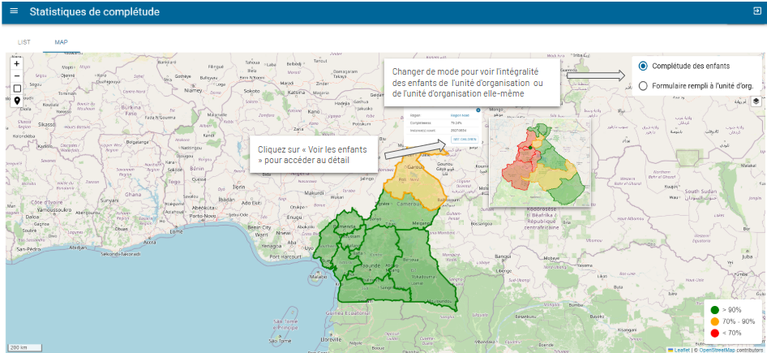

## Géoregistre - Gestion des unités d'organisation

Consultez la définition des [Unités d'Oeganisation](https://iaso.readthedocs.io/en/doc_test/pages/users/reference/iaso_concepts/iaso_concepts.html#organization-units) pour mieux comprendre ce qu'elles représentent.
En résumé, vous pouvez gérer vos données géographiques associées à votre compte en utilisant la partie "Unités d'organisation" d'IASO.

### Liste des unités d'organisation

Cliquez sur "Unités d'organisation" dans le menu, puis sur "Liste des unités d'organisation" pour naviguer dans la pyramide des unités d'organisation.

Vous pouvez les visualiser sous forme de liste ou sur une carte.

Vous pouvez sélectionner une unité d'organisation et effectuer les actions suivantes :

- Modifier le nom, le type, le statut de validation, la position dans la pyramide, etc.
- Visualiser l'unité d'organisation sur une carte.
- Consulter l'historique de ses modifications.

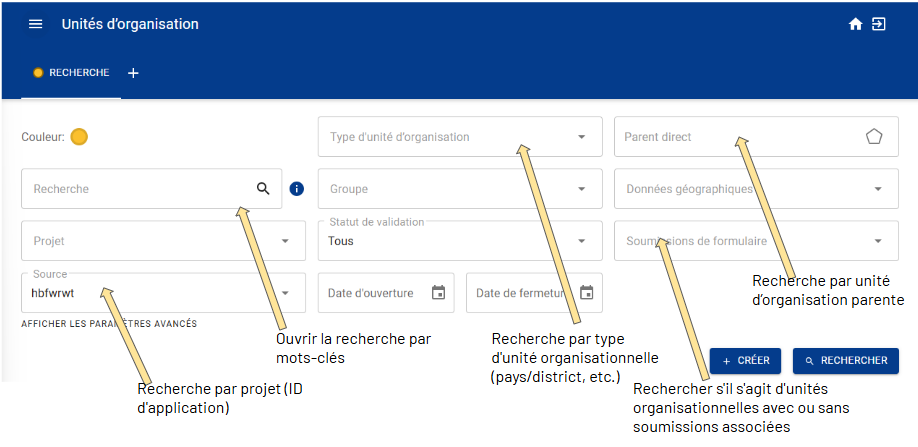

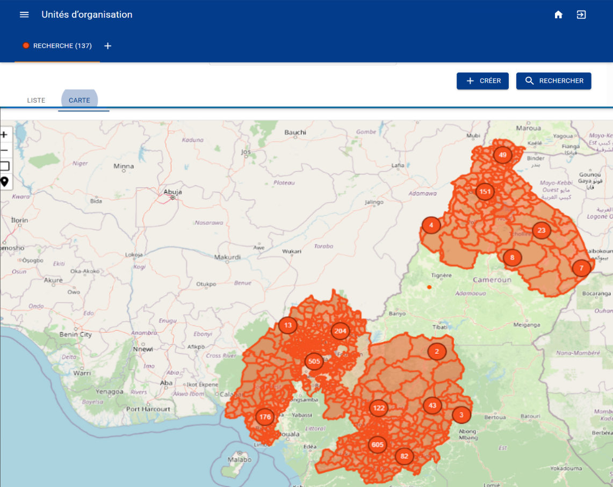

Les résultats de la recherche peuvent être exportés en CSV, XLSX ou GPKG.

Les résultats peuvent être visualisés sous forme de liste ou sur une carte.

Le statut indique, par exemple, qu'un village vient d'être ajouté et doit être révisé.

La référence externe est utilisée pour exporter des données vers DHIS2.

La carte permet de localiser la structure.

Vous pouvez consulter l'historique des modifications en cliquant sur la petite icône d'horloge ou les détails des formulaires remplis en cliquant sur l'icône en forme d'œil.

Plusieurs recherches peuvent être effectuées en ajoutant des onglets à la page avec le bouton +. 

Vous pouvez choisir la couleur des résultats sur la carte pour chaque recherche.

**Création d'une unité d'organisation**

Sur la page de la liste des unités d'organisation, cliquez sur "Créer". Vous pouvez alors créer une unité d'organisation selon vos besoins.

Vous devrez saisir les informations suivantes avant d'enregistrer :

- Nom de l'unité d'organisation.
- Type de l'unité d'organisation (préalablement défini dans la partie Type d'unité d'organisation).
- Statut : Nouveau, Validé ou Rejeté.
  - Nouveau : l'unité d'organisation a été créée mais n'a pas encore été validée. Si vous activez la possibilité de créer des unités d'organisation depuis l'application mobile IASO, elles apparaîtront d'abord comme "Nouvelles" sur le web.
  - Validé : l'unité d'organisation est validée.
  - Rejeté : l'unité d'organisation n'existe plus ou a été fusionnée/éclatée ou remplacée par une autre. IASO n'autorise pas la suppression des unités d'organisation pour garder une trace des changements passés.

Champs optionnels :

- Alias : ajoutez autant d'alias que nécessaire pour suivre les différentes manières d'écrire le nom de l'unité d'organisation (par ex. : "Ste Marie", "Sainte-Marie", "Sainte Marie", etc.).
- Groupe : organisez les unités d'organisation en groupes dans IASO. Vous pouvez sélectionner plusieurs groupes auxquels l'unité d'organisation est associée.
- Unité parente : placez votre unité d'organisation à son emplacement pertinent dans la hiérarchie.
- Date(s) d'ouverture et/ou de fermeture : utilisez ces champs pour indiquer la ou les dates d'ouverture ou de fermeture de l'unité d'organisation.

**Modifier ou consulter les détails d'une unité d'organisation**

Pour accéder à la vue détaillée d'une unité d'organisation, procédez comme suit :

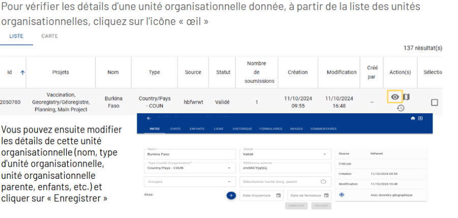

Dans cette vue, vous disposez de plusieurs onglets permettant de modifier l'unité d'organisation selon vos besoins :

- Infos : modifiez les principales informations relatives à cette unité d'organisation.
- Carte : consultez les informations géographiques disponibles pour cette unité d'organisation (frontières ou coordonnées GPS). Vous pouvez visualiser les données géographiques provenant de plusieurs sources, s'il y en a. Vous pouvez également laisser un commentaire.
- Enfants : liste les enfants de cette unité d'organisation. Vous pouvez utiliser des filtres pour parcourir la liste de manière plus détaillée.

- Liens : en cas de correspondance d'une unité d'organisation entre plusieurs sources de données, les liens entre ces sources sont affichés ici.
- Historique : permet de retracer toutes les modifications apportées à l'unité d'organisation par utilisateur.
- Formulaires : liste tous les formulaires de collecte de données liés au type de cette unité d'organisation.
- Commentaires : vous pouvez laisser un commentaire sur cette unité d'organisation via cette section.

**Édition en masse des unités d'organisation**

Vous pouvez également modifier plusieurs unités d'organisation en masse.
Pour ce faire, dans la liste des unités d'organisation, cochez les cases des unités que vous souhaitez éditer en masse, puis survolez le bouton d'action. Cliquez sur l'icône en forme d'engrenage et sélectionnez l'action que vous souhaitez effectuer.

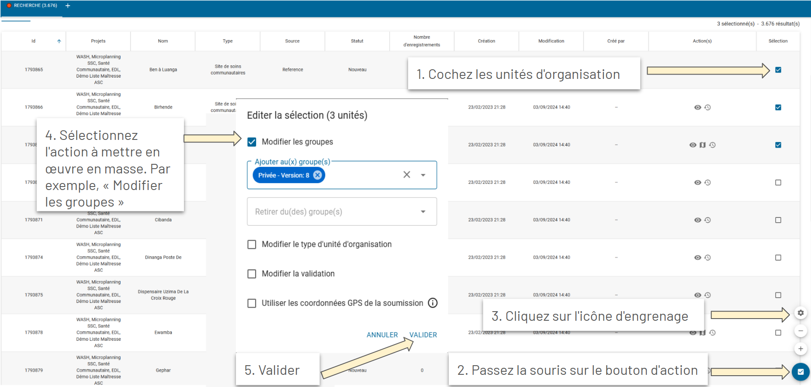

### Groupes d'unités d'organisation

Les unités d'organisation peuvent être regroupées dans des groupes, et ces groupes peuvent être organisés en ensembles de groupes. Ensemble, ils peuvent imiter une hiérarchie organisationnelle alternative, utilisable lors de la création de rapports ou d'autres sorties de données. En plus de représenter des localisations géographiques alternatives ne faisant pas partie de la hiérarchie principale, ces groupes sont utiles pour attribuer des schémas de classification aux unités d'organisation.

**Gestion des groupes d'unités d'organisation**

Pour gérer les groupes d'unités d'organisation, accédez au menu Unités d'organisation > Groupes.

Cette vue vous permet de rechercher des groupes d'unités d'organisation via une entrée de texte libre.

Vous pouvez créer un nouveau groupe en cliquant sur le bouton "Créer".

Les groupes peuvent être modifiés en cliquant sur l'icône en forme d'engrenage ou supprimés en cliquant sur l'icône de suppression.

Dans le tableau, la colonne "Unités d'organisation" affiche le nombre d'unités assignées à ce groupe. En cliquant sur ce nombre, vous verrez la liste des unités associées au groupe.

**Assigner des unités d'organisation à des groupes**

Pour assigner des unités d'organisation à des groupes, accédez à la liste des unités d'organisation dans le menu et effectuez une édition en masse des unités sélectionnées. Consultez la section "Édition en masse des unités d'organisation" ci-dessus pour plus de détails.  

### Gestion des types d'unités d'organisation

Les types d'unités d'organisation sont spécifiques à IASO (c'est-à-dire qu'ils ne sont pas gérés dans DHIS2). Consultez la section sur les [Unités d'Organisation](OU) pour plus de détails sur ce que sont les types d'unités d'organisation.

Dans le menu des unités d'organisation, cliquez sur "Types d'unités d'organisation". Cette vue liste les types existants dans votre compte IASO.

**Créer un type d'unité d'organisation**

Cliquez sur "Créer" et saisissez les champs obligatoires suivants :

- Nom : cela doit représenter une "catégorie" ou un "niveau dans la hiérarchie", et non le nom spécifique d'une unité. Exemple : "Pays", "Province", "District" et non "RDC", "Kinshasa", "Gombe".
- Nom court : une version abrégée du nom qui apparaîtra dans d'autres vues d'IASO.
- Projet(s) : sélectionnez un ou plusieurs projets auxquels ce type d'unité d'organisation est lié.

Champs facultatifs :

- Niveau : commencez par 0 pour le point le plus élevé de la hiérarchie (exemple : Pays - 0, Province - 1, District - 2, Village - 3).
- Types d'unités subalternes à afficher : sélectionnez les types à afficher dans la vue "Registre" si le type principal est sélectionné.
- Types d'unités subalternes à créer : sélectionnez les types que vous souhaitez permettre de créer dans l'application mobile IASO. Par exemple, si vous éditez le type "District", vous pouvez autoriser la création de "Village" ou "Point d'intérêt".
- Formulaires de référence : sélectionnez un ou plusieurs formulaires de collecte de données assignés comme référence pour ce type d'unité. Ces formulaires sont étroitement liés au type d'unité. Exemple typique : un formulaire pour des données de population pour une zone.

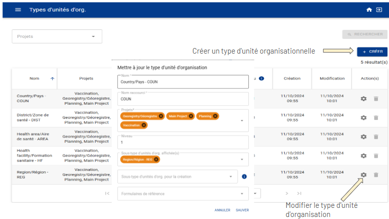

### Gestion des sources de données

IASO permet d'importer et de gérer une ou plusieurs sources de données géographiques.

#### Liste des sources de données

Vous trouverez ici les sources de données avec leurs noms, versions et descriptions. Il est possible de modifier une source de données, de consulter l'historique des versions ou de comparer les sources et de les exporter vers DHIS2.

#### Correspondance

Cette fonctionnalité est plutôt géospatiale : elle permet d'établir des liens entre plusieurs pyramides géographiques.
Exemple : dans un CSV, une "province x" peut être appelée "PROVINCE X" dans une source, et "DPS X" dans une autre.

Les algorithmes exécutés sont destinés au travail de science des données.

### Registre

L'entrée "Registre" dans les unités d'organisation est un outil de visualisation permettant aux utilisateurs de naviguer dans la hiérarchie géographique et de consulter les données géographiques ainsi que les données collectées associées aux différents niveaux.

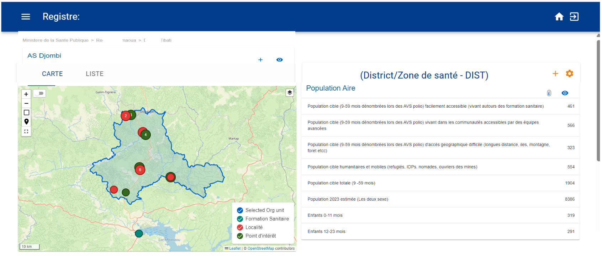

### Examiner les demandes de changement

Avec IASO, les superviseurs peuvent comparer et valider les soumissions de données envoyées au serveur.
Notez que cette fonctionnalité ne fonctionne que si l'indicateur "Demandes de modification" est activé pour le projet IASO correspondant. Consultez la section sur les projets pour plus d'informations sur les indicateurs de fonctionnalités mobiles dans IASO.

Sur la page "Examiner les propositions de modification", les utilisateurs peuvent utiliser les filtres pour sélectionner les propositions sur lesquelles ils souhaitent se concentrer. Voir ci-dessous les filtres détaillés :

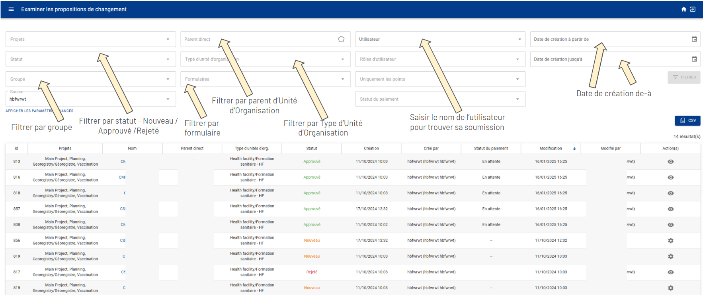

Les superviseurs peuvent ensuite cliquer sur l'icône en forme d'engrenage à la fin de la ligne concernée pour voir les détails de la proposition de modification soumise et les comparer à la version précédente affichée à gauche.
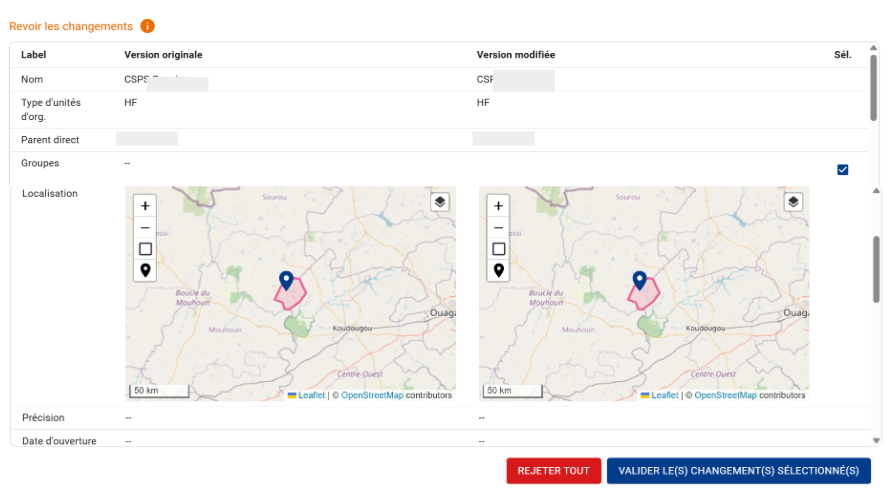

Les superviseurs peuvent sélectionner les modifications qu'ils souhaitent approuver en cochant les cases des modifications sélectionnées dans la colonne de droite, puis cliquer sur "Approuver les modifications sélectionnées".
Si les propositions ne sont pas satisfaisantes, les superviseurs peuvent rejeter toutes les modifications et fournir un commentaire.

Pour chaque proposition envoyée, les utilisateurs de l'application mobile IASO pourront voir si elles ont été approuvées ou rejetées, et en cas de rejet, consulter le commentaire.

## Planning

La fonctionnalité de planification dans IASO permet de planifier le travail sur le terrain par équipe et par utilisateur dans des zones/unitées d'organisation définies et selon une chronologie spécifique. Une fois les activités de collecte de données assignées via l'interface, les agents de terrain utilisant l'application mobile ne verront que les activités qui leur ont été attribuées et pourront se diriger vers les points GPS correspondants.

Pour créer une planification, vous devez avoir préalablement créé des unités d'organisation, des utilisateurs, un projet, des équipes d'utilisateurs/équipes d'équipes et des formulaires de collecte de données que vous souhaitez utiliser avec la fonctionnalité de planification.

### Liste des plannings 

Cliquez sur "Planning" dans le menu. Dans la liste des plannings, vous verrez les plannings qui ont été créés dans IASO. Vous pouvez rechercher parmi les différents planning à l'aide des filtres disponibles et effectuer les actions suivantes :

- Créer un planning
- Voir le planning : accéder à l'interface pour assigner des activités de collecte de données aux équipes et utilisateurs selon les zones géographiques.
- Modifier le planning : modifier le nom, le projet, l'unité d'organisation parente, l'équipe concernée, les formulaires, ou la description.
- Dupliquer le planning : permet de copier une planification existante et de l'adapter au besoin.
- Supprimer le planning

**Créer un Planning**

Cliquez sur "Créer" et la fenêtre s'ouvrira.

Les champs suivants sont obligatoires :

- Nom
- Projet : définit l'environnement de l'application mobile dans lequel les informations de la planification seront visibles.
- Équipe : l'équipe responsable de la planification (généralement une équipe d'équipes).
- Formulaire(s) : sélectionnez un ou plusieurs formulaires à appliquer à cette planification.
- Unité d'organisation : sélectionnez l'unité d'organisation de base à laquelle votre planification s'applique. Notez que vous naviguerez à partir de cette unité de base pour assigner vos activités de collecte de données aux équipes/utilisateurs.
- Dates de début et de fin : déterminez la durée de validité de votre planification.
Vous pouvez également ajouter une description en option.

La fonctionnalité "Statut de publication" (en bas à gauche) permet de s'assurer qu'une fois complétée (et toutes les assignations effectuées), la nouvelle planification sera disponible dans l'application mobile IASO pour le projet correspondant.

Une fois les champs remplis, cliquez sur "Enregistrer" pour finaliser.  

**Éditer une planification via l'interface cartographique**

Dans la liste des planifications, cliquez sur l'icône en forme d'œil pour commencer à éditer votre nouvelle planification via l'interface cartographique.

Vous pouvez effectuer les assignations soit via l'onglet "Carte", soit via l'onglet "Liste". Si vous travaillez via la carte, commencez par sélectionner l'équipe à laquelle vous souhaitez assigner une zone géographique dans le menu déroulant, ainsi que le "type d'unité de base" pertinent. Vous pouvez ensuite assigner directement des zones ou points géographiques aux membres de l'équipe sélectionnée sur la carte.

Les zones sélectionnées seront mises en évidence avec la couleur de l'équipe, que vous pouvez modifier au besoin.

Pour assigner toutes les unités d'organisation enfants d'une unité parente donnée à la même équipe/utilisateur, sélectionnez le "Mode sélection par parent" avant de procéder.

**Utiliser l'onglet Liste**

Si vous préférez utiliser l'onglet Liste, le processus est similaire. La principale différence est que vous travaillez ici avec une liste de noms selon le niveau sélectionné. Les unités d'organisation sont assignées en cliquant devant le nom de l'élément dans la colonne "Assignation".

Vous pouvez trier les unités d'organisation et les parents en cliquant sur le nom des colonnes.

Voici la traduction en français tout en conservant la mise en forme Markdown :  

---

## Entités

Nous appelons une "**Entité**" tout ce qui peut se déplacer ou être déplacé et que nous voulons suivre dans le temps et les unités organisationnelles. Par exemple, un bénéficiaire, une voiture, etc.

Pour différencier les différents types d’entités, IASO utilise le concept de "**Type d’entité**".   
IASO repose fortement sur [XLSForms](https://xlsform.org), et les entités ne font pas exception. Ainsi, une entité est représentée par une soumission à un formulaire. Cette soumission est appelée **profil**. Le type d’entité définit quel formulaire doit être rempli.

### Comment créer une entité  

**Activer la fonctionnalité**  

Pour créer une entité, votre projet doit d’abord activer le drapeau de fonctionnalité des entités. Vous pouvez activer ce drapeau lors de la création du projet ou en le mettant à jour ultérieurement.  

  

**Créer et téléverser le formulaire de profil**  

En utilisant l'application de tableur de votre choix, créez un formulaire XLSForm contenant toutes les questions liées à votre entité, qu'elles soient fixes (ex. : prénom et nom) ou évolutives dans le temps (ex. : un programme auquel une entité peut être affiliée).  
Téléversez-le sur le serveur en utilisant l’application web.  

| Remarque : Les questions susceptibles d'évoluer dans le temps ne doivent pas être modifiables. |
| :---- |  

#### **Créer le type d'entité**  

Dans l’écran des types d’entités, cliquez sur le bouton “CRÉER”. Donnez un nom au type d’entité et sélectionnez le formulaire récemment téléversé comme formulaire de référence :  

  

| Remarque : Nous verrons plus tard ce que sont les "Champs de liste" et les "Champs d’informations détaillées". |
| :---- |  

#### **Créer une entité**  

Dans l’application mobile, assurez-vous que les données ont été rafraîchies et sont à jour avec le serveur backend. Vous pourrez alors voir l’écran des entités.  

À ce jour, il n’est pas possible de créer une entité via une interface web.  

Cliquez sur le bouton "Ajouter" dans l’application.  

  

Sélectionnez le type d’entité que vous souhaitez créer.  

  

Une confirmation de votre sélection vous sera demandée.  

  

Vous pouvez alors remplir le formulaire pour finaliser votre première entité.  

### Comment configurer l'affichage d'une entité ?  

Dans la configuration du type d’entité, les administrateurs peuvent définir quelles questions s'affichent dans les listes et dans l’écran de détails.  

  

Cela influence la manière dont les applications web et mobiles affichent les entités, comme illustré ci-dessous.  

#### **Dans l’interface web**  

##### Dans la liste  

  

##### Dans l’écran de détails  

  

#### **Dans l’application mobile**  

##### Dans la liste  

  

##### Dans l’écran de détails  

  

### Recherche d'une entité  

#### **Sur le web**  

Dans la liste des bénéficiaires, vous pouvez filtrer par type et/ou saisir une requête pour filtrer en fonction de l'identifiant ou de toute valeur des champs de liste.  

  

#### **Dans l’application**  

En cliquant sur l'icône de loupe sur l’écran des entités, vous accéderez à la liste de toutes les entités et pourrez les filtrer rapidement en fonction de l’identifiant ou de toute valeur des champs de liste.  
Si vous avez besoin d'une sélection plus fine, cliquez sur l’icône d’entonnoir, sélectionnez un type et remplissez le formulaire de recherche (deuxième image).  

  

### Qu'est-ce qu'un workflow ?  

Comme mentionné précédemment, une entité est suivie dans le temps et les unités organisationnelles. Pour cela, IASO relie les soumissions successives d’une entité et permet aux nouvelles soumissions de modifier le profil. Pour définir les formulaires qui doivent être présentés ensuite et quelles valeurs doivent modifier le profil, vous pouvez définir un workflow.  

#### **Créer un workflow**  

Dans la liste des types d’entités, cliquez sur l’icône de workflow.  

  

Dans la liste des versions du workflow, cliquez sur le bouton “CRÉER” et donnez un nom à la version :  

  

### **Suivis et modifications**  

#### Suivis  

Ils représentent les prochains formulaires possibles en fonction de l’état du profil. Ils sont basés sur une condition.  
Dans l’exemple suivant, l’application mobile proposera "Inscription U5 WFP" comme prochain formulaire possible si le prénom est "Bill".  

  

| Rappel : "Prénom" est l’une des questions du formulaire du type d’entité. |
| :---- |  

#### Modifications  

Elles représentent le mapping des valeurs d’un formulaire vers les valeurs du profil.  

Dans l’exemple ci-dessous, le “Formulaire cible” est le formulaire du type d’entité, et le “Formulaire source” est la soumission suivante.  
Lorsque le formulaire "Inscription U5 WFP" est rempli, la valeur entrée dans "Âge de l’enfant en mois" sera copiée dans la question "Âge (mois)" du profil. Et la valeur saisie dans "Nom de l’enfant" sera copiée dans la question "Prénom" du profil.  

  

### **Utilisation des valeurs du profil dans les formulaires suivants**  

Si vous souhaitez qu’un formulaire ultérieur utilise des valeurs du profil, ajoutez une question avec le même identifiant et le même type que la valeur du profil.  

### **Publication des workflows**  

Une fois qu’une version de workflow est publiée, elle est marquée comme finalisée et ne peut plus être modifiée. Seuls les workflows en mode "brouillon" peuvent être édités.  
Si vous souhaitez modifier un workflow finalisé, dupliquez-le avec le bouton "Copier la version". Une nouvelle version brouillon sera alors créée avec le même contenu.

## Admin

La partie "Admin" d'IASO comprend plusieurs sections, qui apparaîtront ou non en fonction des permissions de l'utilisateur :

- Tâches
- Monitoring
- Projets
- Modules
- Utilisateurs
- Rôles utilisateurs
- Équipes

### Tâches

Ceci correspond au journal des mises à jour en masse d'IASO. Un journal d'opérations contient des informations sur le moment et l'endroit où une opération a été exécutée, le statut de l'opération, le nombre d'enregistrements sources et cibles traités, ainsi que les messages de journal.

Exemples de tâches :

- Mise à jour en masse des unités d'organisation
- Importation de données DHIS2
- Importation de Geopackage

Les statuts possibles sont :

- Errored : la tâche n'a pas été exécutée avec succès. Les utilisateurs sont invités à réessayer.
- Running : la tâche est en cours d'exécution.
- Queued : la tâche s'est arrêtée et redémarrera lorsque les conditions seront remplies (par exemple, meilleure connectivité).
- Killed : la tâche a été interrompue par l'utilisateur après son démarrage.
- Success : la tâche a été exécutée avec succès.
- La liste des tâches peut être actualisée en cliquant sur le bouton "Actualiser" en haut à droite.

### Monitoring

Cette section permet aux superviseurs de surveiller les appareils liés au compte IASO.
Depuis cette page, vous pouvez consulter :

- L'IMEI ou identifiant de l'appareil.
- Si c'est un appareil de test ou non.
- Le nom du dernier propriétaire.
- La dernière synchronisation.
- La date de création (première synchronisation).
- La date de modification.

Sur la droite, vous pouvez voir le nombre d'appareils connectés au compte IASO auquel vous êtes connecté.

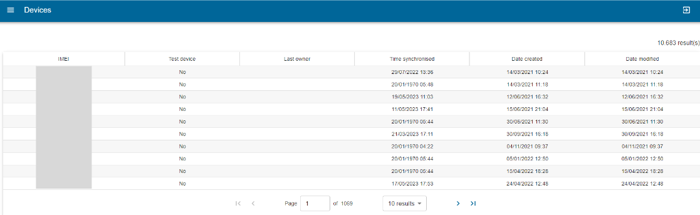

### Projets

Un projet dans IASO correspond à une instance d'application mobile.
Chaque projet est identifié par un nom et un identifiant d'application (App ID). Consultez [ici](https://iaso.readthedocs.io/en/latest/pages/users/reference/iaso_concepts/iaso_concepts.html#projects) pour une définition plus détaillée des projets dans IASO.

**Créer un projet**

Dans le menu, Admin > Projets > Cliquez sur "Créer".

Ajoutez ensuite un nom de projet et un App ID.
Notez que l'App ID devra être saisi par les utilisateurs de l'application mobile IASO lors de leur première connexion à l'application. Il est donc recommandé d'utiliser un identifiant simple pour éviter les erreurs de saisie.

Vous pouvez ensuite sélectionner les indicateurs de fonctionnalités (Feature Flags) que vous souhaitez appliquer à votre projet dans l'onglet suivant, puis cliquer sur "Enregistrer".

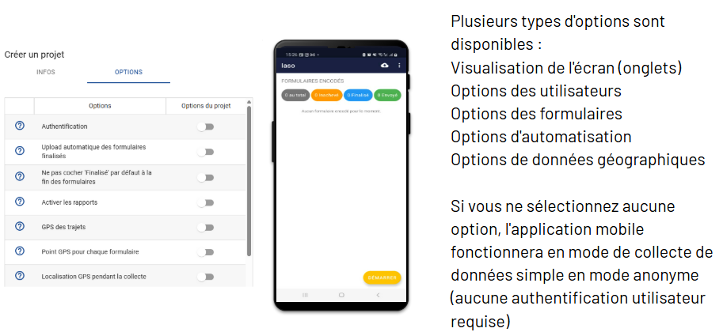

**Définition des options mobile**

Voici un tableau détaillant les indicateurs de fonctionnalités des projets :

| Option mobile      | Description |
| ----------- | ----------- |
| Authentification      | Les utilisateurs doivent entrer un nom d'utilisateur et un mot de passe avant de procéder à la collecte de données. Si cette option n'est pas activée, la collecte de données peut se faire en mode anonyme. Attention, cette option est indispensable pour plusieurs autres fonctionnalités (le planning, la demande de changement, les entités, etc.).
| Mobile: collecte de données   | Active l'onglet de collecte de données dans IASO (si la collecte de données n'est pas liée à un planning, une demande de changement, ou aux entités)       |
| GPS pour chaque formulaire      | Chaque fois qu'un formulaire de collecte est rempli, un point GPS est pris automatiquement et est lié à la soumission de formulaire. |
| Forcer les utilisateurs à se trouver proche du point assigné      | L'utilisateur doit se trouver à maximum 50m de l'unité d'organisation pour laquelle il collecte les données. |
| Mobile. Onglet Planning      | Activer l'onglet Planning dans l'application mobile. |
| Mobile: Limiter le téléchargement des données au périmètre autorisé de l'utilisateur      | Afin d'économiser les données lors du téléchargement, seules les unités d'organisation de la zone assignée à l'utilisateur vont être téléchargées. Cela facilite également la collecte hors ligne. |
| Mobile. Onglet de carte de l'unité d'organisation      | Ajoute un onglet montrant les données géographiques de l'unité d'organisation sélectionnée (point GPS ou frontières) |
| Demandes de changement      | Active la fonctionnalité pour pouvoir proposer des changements à l'unité d'organisation et à son/ses formulaire(s) de référence |
| GPS de trajectoire     | Trace les mouvements de l'utilisateur en prenant un point GPS toutes les 15 min |
| Mobile. Nouvelle version de formulaire disponible: notification   | L'utilisateur est averti quand une nouvelle version du formulaire est disponible |
| Mobile. Nouvelle version de formulaire disponible: mise à jour forcée      | L'utilisateur est averti quand une nouvelle version du formulaire est disponible et la mise à jour se fait automatiquement |
| Mobile. Mise à jour de l'unité d'organisation : notification      | L'utilisateur est averti quand un changement a été apporté à la pyramide sanitaire |
| Mobile. Mise à jour de l'unité d'organisation : mise à jour forcée      | L'utilisateur est averti quand un changement a été apporté à la pyramide sanitaire et la mise à jour se fait automatiquement |
| Téléversement automatique des formlaires      | La synchronisation des formulaires finalisés se fait automatiquement quand la connexion est disponible |
| Mobile. Formulaires finalisés en lecture seule      | Une fois finalisés, les formulaires ne sont plus modifiables |

### Utilisateurs

Les utilisateurs peuvent accéder à l'application web et mobile IASO avec des identifiants de connexion. Chaque utilisateur se voit attribuer des permissions et peut être limité à certaines zones géographiques.

Les permissions sont relativement granulaires :

- Par écran/onglet
- Différentes permissions de lecture/écriture selon les domaines
- Restriction d'accès basée sur la pyramide sanitaire
- Création/modification d'utilisateurs en lot
- Rôles d'utilisateur personnalisables (administrateur, gestionnaire de données, etc.)

Veuillez noter que les permissions assignées depuis la partie web de IASO ne s'appliquent qu'à **l'application web**.
Les options mobiles se gèrent dans la partie Projets.

**Créer un nouvel utilisateur**

Depuis le menu Admin > Utilisateurs, cliquez sur "Créer".

1. Remplissez les informations de l'utilisateur.

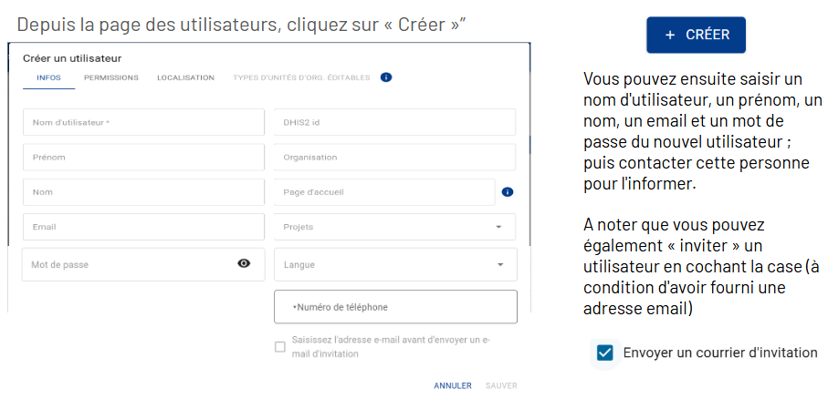

Notez que vous pouvez également indiquer les informations suivantes :

- ID DHIS2 de l'utilisateur : vous pouvez importer une liste d'utilisateurs DHIS2 dans IASO et conserver leur ID DHIS2 dans IASO pour les lier entre les deux systèmes.
- Page d'accueil : vous pouvez définir une page d'accueil par défaut pour cet utilisateur lorsqu'il se connecte à ce compte IASO.
- Projets : sélectionnez un ou plusieurs projet(s) auxquels le nouvel utilisateur sera lié. Si aucun projet n'est indiqué ici, l'utilisateur aura par défaut accès à tous les projets du compte IASO.
- Langue : vous pouvez spécifier la langue par défaut que cet utilisateur utilisera sur l'interface web d'IASO. L'application mobile IASO se base sur la langue par défaut du dispositif de l'utilisateur.

2. Assignez les permissions nécessaires via l'onglet "Permissions".

On the next tab “Permissions”, you can enable/disable permissions for that user as needed. Note that in the “?” are tooltips to explain what the permissions do.
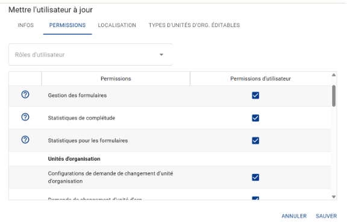

3. Restreignez l'utilisateur à une zone géographique via l'onglet "Localisation".

Dans l'onglet suivant "Permissions", vous pouvez activer ou désactiver les permissions pour cet utilisateur selon vos besoins. Notez que des infobulles (symbolisées par un "?") sont disponibles pour expliquer la fonction de chaque permission.

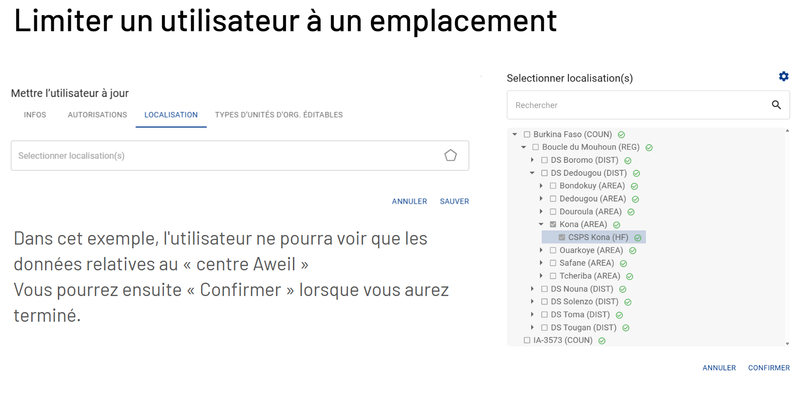

**Créer des utilisateurs en masse**

Vous pouvez créer plusieurs utilisateurs à la fois en utilisant un fichier CSV que vous importez dans IASO.

Utilisez le bouton "Créer depuis un fichier", puis importez votre liste d'utilisateurs (ou téléchargez le modèle correspondant au préalable).

**Gérer les utilisateurs IASO**

Cette vue vous permet de gérer les utilisateurs et leurs permissions. Vous pouvez rechercher un utilisateur en utilisant différents filtres.

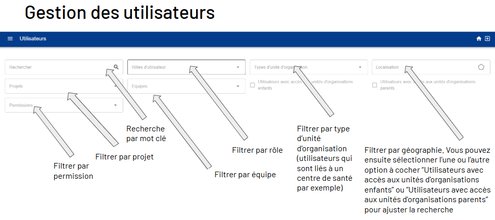

Vous pouvez modifier les utilisateurs IASO en masse grâce à la fonctionnalité de mise à jour en lot. Commencez par cocher les utilisateurs que vous souhaitez mettre à jour à l'aide des cases situées à droite de chaque ligne.

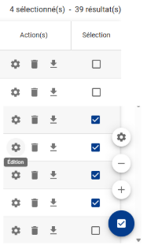

Sélectionnez ensuite l'action ou les actions que vous souhaitez effectuer pour ces utilisateurs. Elles peuvent inclure :

- Ajouter ou supprimer des rôles utilisateur
- Ajouter ou supprimer des projets
- Ajouter ou supprimer des équipes
- Mettre à jour la langue par défaut
- Ajouter ou supprimer une localisation (ce qui limite ces utilisateurs à la géographie sélectionnée)

Cliquez sur "Valider" une fois terminé.

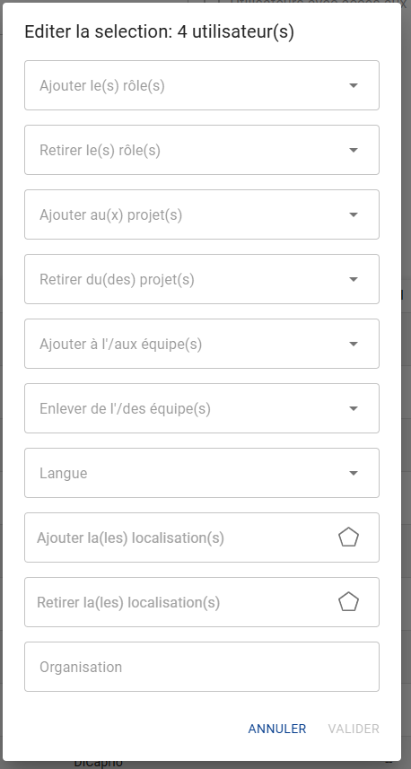

### Rôles utilisateur

Les rôles utilisateur permettent de regrouper des utilisateurs bénéficiant d'un ensemble de permissions sous un même rôle. Dans un rôle utilisateur, vous pouvez créer des rôles avec leurs permissions correspondantes, auxquelles des utilisateurs peuvent être assignés.

**Créer un rôle utilisateur**

Depuis le menu Admin > Rôles utilisateur, cliquez sur "Créer".
 
 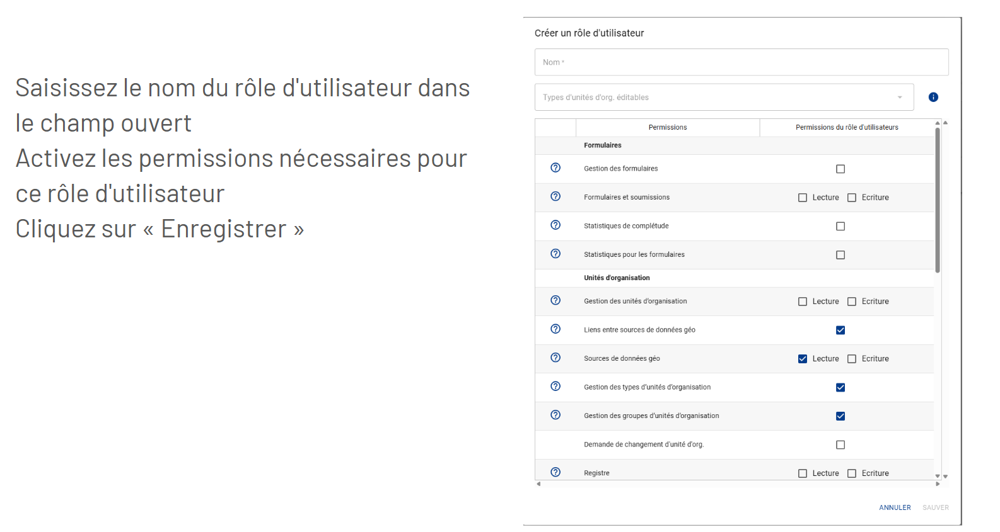

Vous pouvez ensuite assigner ce rôle utilisateur à n'importe quel utilisateur via l'onglet "Permissions" dans la fenêtre d'édition de l'utilisateur. Notez que les permissions du rôle utilisateur s'appliqueront à l'utilisateur, mais si cet utilisateur dispose déjà de permissions supplémentaires, celles-ci ne seront pas supprimées mais viendront s'ajouter.

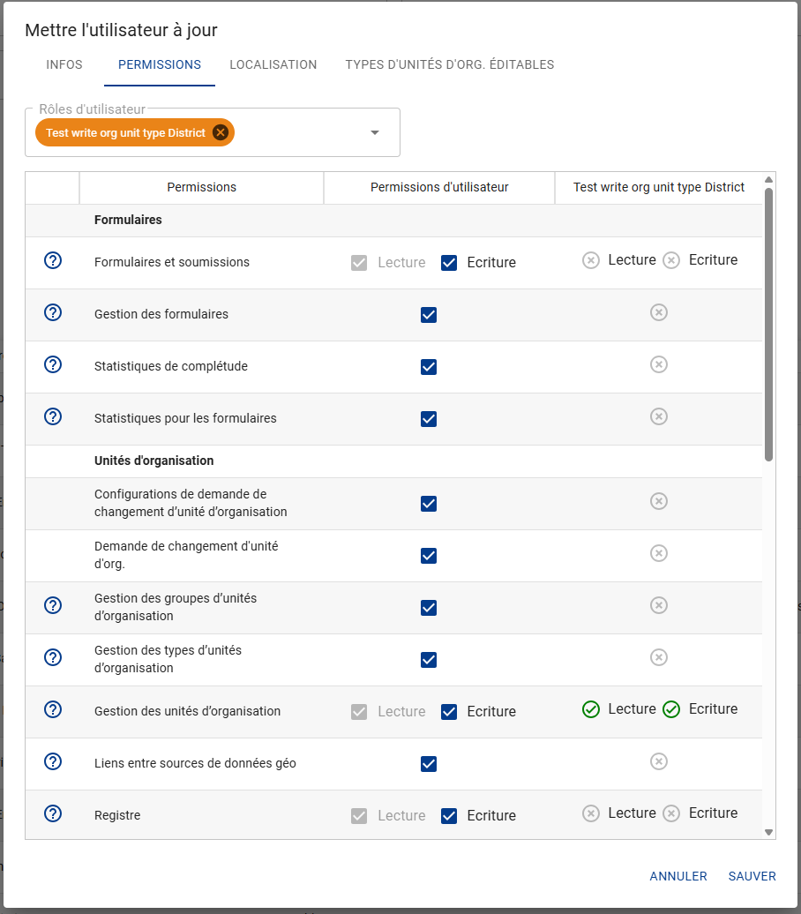

 Pour assigner plusieurs utilisateurs à ce nouveau rôle utilisateur en masse, retournez à la liste des utilisateurs et procédez à une mise à jour en lot (voir la section "Gérer les utilisateurs" ci-dessus).

###  Équipes

La notion d'équipes dans IASO est principalement utilisée pour la fonctionnalité de [Planning](Planning). Elle permet d'organiser les utilisateurs en hiérarchies d'équipes et d'assigner des activités de collecte aux zones géographiques pertinentes pour les besoins de planification.

Deux types d'équipes existent :

- Équipes d'utilisateurs : regroupent les utilisateurs IASO sous une même équipe.
- Équipes d'équipes : regroupent plusieurs équipes sous une même équipe. Vous pouvez ainsi créer des hiérarchies d'équipes.

**Créer une équipe**

Depuis le menu, accédez à Admin > Équipes. Cliquez sur "Créer".

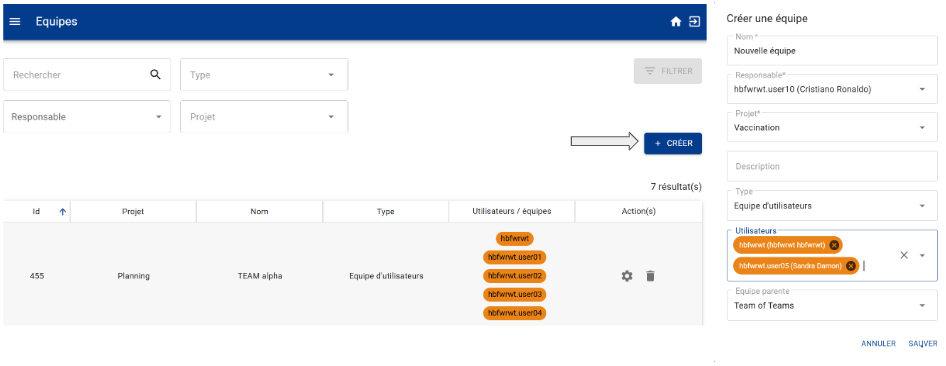

Remplissez les champs suivants :

- Nom de l'équipe
- Responsable : sélectionnez parmi les utilisateurs dans IASO.
- Projet : sélectionnez le projet auquel l'équipe sera liée.
- Type : sélectionnez dans le menu déroulant le type d'équipe :
  - Si vous sélectionnez "Équipe d'utilisateurs", ajoutez les utilisateurs à inclure dans cette équipe.
  - Si vous sélectionnez "Équipe d'équipes", ajoutez les équipes à inclure dans cette équipe.
- Parent : sélectionnez l'équipe parente pour cette nouvelle équipe.

Vous pouvez ensuite utiliser l'icône en forme d'engrenage ou la corbeille sur la page principale pour modifier ou supprimer les équipes selon vos besoins.

