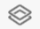
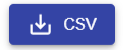
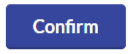
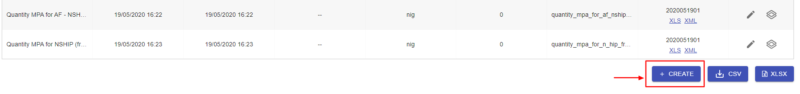
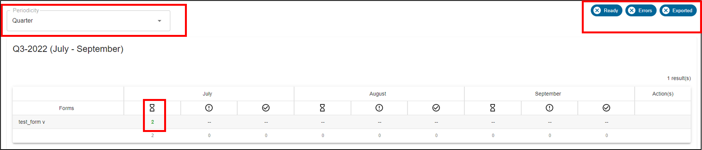
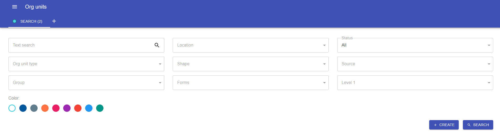
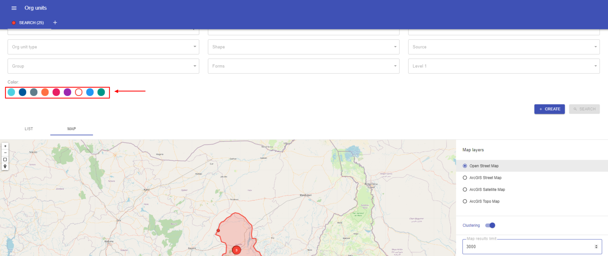
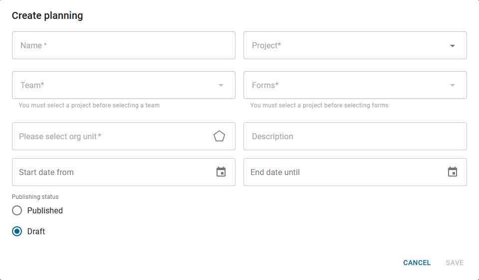

# Web interface

### Overview

Iaso is a platform (a georegistry) developed mainly
at Bluesquare which has 3 main functionalities:

-   Data collection (trough forms)
    -   Create forms
    -   Validation of data collection
    -   View forms sent from the mobile app
    -   Export results ( CSV/Geopackage) into a data warehouse, such as
    -   Export collected data to DHIS2
-   Data management (trough territorial hierarchies)
    -   Location of structures using GPS
    -   Mapping of multiple data sources
    -   Distribution of validation work by geographic sub-area
    -   Traceability of changes

-   Micro planning
    - Manage teams of users
    - Create plannings with deadlines
    - In the context of a planning, assign org units to visit to teams and individual users
    - Monitor the good execution of your planning

Iaso supports the continuous management of geographical
information based on master lists of generic
geographical objects called organizational units (“org. units”),
which are for example health areas, schools, provinces, health
districts, or wells).

Iaso prevents data fragmentation and lack of standardisation that can
lead to duplicative efforts, imprecise metrics, time consuming data
integration efforts and errors.

Iaso as georegistry is used in several countries in support of a process
where updated data improves the health information system based on
DHIS2.

Iaso provides a number of core features in support of continuous
geospatial data management: a **mobile application**, a **web
dashboard**, a **matching featur**e to merge various data sources, a
**data scienc**e and **scripting** interface and a seamless
bi-directional **integration** with DHIS2.

### Login

To log into the web interface, go to
[<u>https://iaso.bluesquare.org/login/</u>](https://iaso.bluesquare.org/login/)
and sign in with the username and password.

Once in the interface, you will see the Menu button in the top left of
the screen:

The menu allows you to navigate to the different windows for managing:

-   Forms

-   Org. units

-   Planning

-   Admin

In this manual, we’ll first start with an overview of buttons and then
move to the different functionalities by following the order of the
menu.

## Quick overview of buttons

|Button                                                                       | Description
|-----------------------------------------------------------------------------|-----------------------------------------------------------------------------------|
|    | Allows to show the main menu for the app                                          |
|   | This is the view icon to show more details about the selected element             |
|       | The pencil icon allows to edit or modify an element                               |
|   | DHIS mapping allows to map questions with DHIS2 dataElements                      |
|   | This icon allow to hide the menu bar                                              |
| | This buttons allow to scroll-up the content of a table |
|   | This button allows to create a new element in the platform                        |
|    | This button allows to download forms to CSV format                                |
|  | Download forms to XLSX format                                                     |
|   | This button allows searching for an element by many criteria                      |
|  | Allows to refresh data                                                            |
|     | Allows to add a tabpanel for searching a element                                  |
|   | Allows to define that a question name will not map with a dataElement             |
|  | Validate the mapping between a selected form question with a data element Dhis2   |
|     | These buttons allow to filter forms sent by status (ready, with error or Exported)|

## Forms

Forms (in the context of data collection surveys) are used to collect
information from a targeted group of people. Forms are written
questionnaires that will be filled by field agents when they are
face-to-face with the person, household, health centre of interest.

This view allows you to create and view forms then map to DHIS2 and get
data entry completeness.

### List

The "list" view contains the list of forms available in Iaso. It allows
you to search, view, modify or create forms.

-   Search:

The textbox “search” allows you to search on the name of the form or the
form ID using the command line "ids:" followed by the form IDs separated
by commas. This allows multiple questionnaires to be searched at once.

Example: ids: 17727, 16768, 19999, 14444

-   Click on View button to view the form :

In the Form view you can see details of

· When the form has been updated

· What Organisation Unit

· For what period

· Download the file in XML

· When the form was created

-   To modify click on the edition button of the form

An edition window opens where you can modify the form informations

-   Name

-   XLSForm

-   Periodicity : Frequency of encoding the form. Ex: 'Monthly' when
    > there is a form to fill in every month. This is an optional field
    > that should not be filled if the form is a “one shot” event.
    > However, if you plan to re-use the form the following year, you
    > could indicate 'Annual'.

-   Number of periods before and after : defines in the mobile
    > application how many months in the past or future it is possible
    > to enter the form. Ex: If you note 2 forward and 2 backward, it
    > will be possible today (August 1) to fill the form for the periods
    > from June to October.

-   Whether only one answer is possible or more

-   Project

-   Type of organisation unit

-   Name of field in “device” : Allows you to filter by the unique
    > identifier assigned to each smartphone (IMEI number) that has
    > submitted a form.

-   Name of “location” field : Allows to filter on GPS positions
    > (provided through the form submission but also automatically).

-   Synchronise with another form

-   To add a new form, click on the “**create**”
    > button

A window will open allowing you to enter the information required to
create a new form.

-   Form name

-   XLSForm

-   Periodicity

-   Number of periods before and after

-   If only one answer is possible or more

-   Project

-   Type of organisational unit

-   Name of the “device” field

-   Name of the “location” field

> And you can choose whether or not to save the changes made.

-   Archive

Whenever a form is deleted, it is sent to the Archives. This allows
tracking of deletion and restoring forms that were deleted by mistake.

To restore a form click on the restore button.

**Download**

-   To download the **list of forms**, you can click on the CSV and XLSX
    > buttons. You will find the different forms, the groups they are
    > assigned to, the creation and modification dates...

-   To download a **specific form**, click on the XLS or XML links on
    > the form line. This option allows you to see the different
    > questions, options and details of the form.

You can search the results with the filters provided, and export results
in CSV or XLSX.

### Submissions

Submissions are forms that have been submitted by the field agents
(usually through the mobile app).

This view allows you to search forms through free text entry and several
filters that can be combined.

The "verify" button allows you to select all, unselect all, export the
selection to DHIS2, compare submissions (Ex : remove duplicates, compare
2 hospitals in the same region..) or delete the selection. If you hover
the mouse over the verify button, the options appear.

**Visualise a submission**

You can view a specific submission/submitted form by clicking on the
"View" button.

This allows you to see the data submitted and edit it on Enketo
([open-source](https://github.com/enketo/enketo-express/) web
application that uses a popular [open-source form
format](https://getodk.github.io/xforms-spec/)).

The “Information” section provides a technical overview of the form.

The “Location” section shows the health pyramid's indication of where
the data was collected.

The “Export Requests” section shows when the data was exported to DHIS2,
by whom, and any errors that occurred during export.

The “Files” section can contain images, videos, documents.

The “Form” section shows all form questions and answers entered during
data collection.

The icons at the top right (after clicking on the pencil) allow you to:

-   Correct a form submission: click on the Enketo icon

-   Export the submission

-   Modify the time period and/or the organisational unit

-   Delete the form submission

**Edit a submission**

To edit a form, click the Enketo button  to open the edit page.

Edit the form by changing the answers to the questions that need to be
changed. Click on submit at the bottom of the form

**Export a submission**

The export function allows you to export the form to DHIS2.

**Modify the period or the organisation unit**

When you click on “Edit Period and/or Organisational Unit”, a window
opens allowing you to reassign the instance. You can change the time
period or organisational unit that has been assigned to the submitted
form.

**Delete a submission**

Allows you to delete the form. If it has already been exported to DHIS2,
this will not delete the data in DHIS2. A warning message will appear:

If this was done by mistake, you can restore the form via the
[<u>Archives</u>](#kix.gvzp3gqzxu9n) page.

**Download a submission**

The "XML" icon allows you to download a submission in XML format.

### Form statistics

This view allows you to see statistics about the forms. When clicking on
”Form Statistics" you will open a page with two graphs.

The first one shows the total number of submissions over time and the
second one shows the new submissions per month per form.

### DHIS2 mappings

A great advantage of Iaso is that you can export data to DHIS2. When
doing so, prior mapping is necessary. After the form is uploaded, map
the form to match the data item in DHIS2. To match, use match with
DHIS2.

Click on DHIS mappings to see the forms :

In the Form view you can see details of:

-   Actions

-   Name of forms available for mapping

-   Versions

-   Type of the form :

    -   Aggregate : fix

    -   Event : series of singular events

    -   Event Tracker : continuous

-   Number of questionnaire to be mapped

-   Total number of questionnaires

-   Mapping coverage

-   Date of last modification

Click on action to take of a form and a window will open allowing you to
map each questionnaire of the xls forms to the correspondent DHIS2 data
element

The mapping process consists of selecting a question on the left and
deciding whether it should be mapped to DHIS2 or not.

Some questions may not need to be mapped like notes, metadata etc. in
such a case click on never map.

If the question is to be mapped, search for the correspondence DE in the
box by using the name, code or ID and then confirm.

Once confirmed, the question will turn to green and be counted.

### Completeness

In the view “completeness” you will see details of :

-   Buttons to select forms “ready” to be exported, form with “errors”
    > and forms that have been “exported”

-   Periodicity filter : the periodicity filter allows you to organise
    > the data into months, quarters, semesters or years. The list will
    > display the forms available for the selected period, and will
    > indicate how many forms have been submitted for each

-   Synchronise button to synchronise two forms

Click on each of these buttons to have forms ready to be exported,
errors and exported. A periodicity filter is there to organise data in
months, quarters, semester or yearly.

If you click on the number of submissions, you will be taken to the
submissions view, where you can click on the view icon and see the
submissions for that form.

Click on the button to synchronise two
forms

Eg: to get aggregate data from community verification survey, all the
client forms should be synchronised to a single form.

## Organisation Unit

The location of the data, the geographical context, is represented as
organisational units. Organisational units can be either a health
facility or department/sub-unit providing services or an administrative
unit representing a geographical area (e.g. a health district).

Organisation units are located within a hierarchy, also referred to as a
tree. The hierarchy will reflect the health administrative structure and
its levels. Typical levels in such a hierarchy are the national,
province, district and facility levels.

Example of an Org Unit : Kerala Child Hospital, Benue district,..

### List

This view allows you to search the Organisation Unit pyramid (in order
to find an org unit) through free text entry and several filters that
can be combined.

The search results can be exported in CSV, XLSX or GPKG.

Results can be seen in a list or on a map

The status for when a village has just been added and needs to be
reviewed for example.

The external reference is used to export data to DHIS2.

The map helps you to know where the structure is located.

You can see the history of modifications by clicking on the little clock
icon or the details of the filled forms by clicking on the eye icon.

Several searches can be made by adding tabs to the page with the +
button. 

You can choose the colour of the results on the map for each search.

## 

**Creation** of an organisational unit in the platform

Allows you to create an organisational unit at any level. We can
therefore add a municipality, a province, etc. (Reserved for System
Administrator only).

Advantage:

-   Easier than creating via tablet for the administrator

-   Allows you to create an organisational unit at any level and
    > directly validate it

-   Allows before creation to verify that this unit does not already
    > exist elsewhere and therefore to move it rather than create it.

### Group

Organisation units can be grouped in organisation unit groups, and these
groups can be further organised into group sets. Together they can mimic
an alternative organisational hierarchy which can be used when creating
reports and other data output. In addition to representing alternative
geographical locations not part of the main hierarchy, these groups are
useful for assigning classification schemes to health facilities, e.g.
based on the type or ownership of the facilities. Example:

This view allows you to search the Organisation Unit Groups through free
text entry. Groups can be edited by clicking on the pencil icon
or deleted by clicking on the
delete button or a new group can be created
by clicking on the create button
.

When you click on “Org Units” , you will see the list of that Org Unit
group.

### Organisation unit type

This is specific to Iaso and not exported to DHIS2.

Example DRC Health Pyramid:

-   Country (level 0) = Org Unit Type

-   Province (level 1) = Org Unit Type

-   Health zone (level 2) = Org Unit Type

-   Air de santé (level 3) = Org Unit Type

-   Health Centre (level 4), Hospital (level 4), School (level 4),
    > Village (level 4), Individual (level 4) = Org Unit Type

### Data Source

The data source is the place where the data comes from.

#### List 

Data sources with their names, versions, descriptions. It is possible to
edit the data source, check up on the files’ version history or compare
data sources and export them to DHIS2.

#### Matching

1.  List

This part is for the "management of the pyramid".

This is rather a "geospatial" functionality : to have several pyramid
sources and try to make links (Example: where in a csv “province x” is
called "PROVINCE X" and in another source it is called "DPS X").

1.  Algorithms runs

The algorithms run part is intended for data science work.

## Planning

The micro planning feature makes it possible to plan for field work
(census, surveys, etc.) It can be found in the main menu panel.

Before jumping straight to the “Planning” feature, some steps are
required. You need to create a project, forms, users and teams
beforehand.

To create new user.s, see [here](#users). However, during the
User creation process, in the “Location” tab, it might be a good idea to
restrict each user to the org unit s.he is/will be assigned to.
Optionally, you can also edit the user afterward, once the org unit has
been assigned.

To create teams, see [here](#user-permissions).

### List 

Under "List" you will see the list of schedules/plannings that have been
created in Iaso. This is also the place where you can proceed to create
a schedule or planning.

Click on “Planning” in the menu panel and on the

icon.

The “Project” field will define in which mobile app environment the info
will be visible. The “Teams” is the team responsible for the planning.
The “Forms” field defines which form they will have to complete.

Once you have completed the fields, click Save to finish. Click on the
 button from the Planning list
to edit your new planning. The “Publishing status” (in the lower left
corner ) feature makes it possible to ensure, once completed (and all
assignments made), the newly created planning will be available in the
Iaso mobile app for the relevant project.

In order to assign areas to the teams, click on
. This gives you the list of
teams in your project along with the map of the project area. You can do
the assignment either through the “Map” tab or the “List” tab. If
processing through the map, first activate the “Parent picking mode” to
help you select the level at which you want to work. Next, select the
relevant team and then the areas on the map by clicking on them.

In other words, the field “Base organisation unit type” permits you to
define the level (within the pyramid) at which you distribute the work.
The “Parent organisation unit type” field helps you in that work by
letting you select a whole district at once (without having to click on
every area separately and manually).

Selected areas will be highlighted with the team’s colour.

You can change the colours of each team by simply clicking on the colour
in front of the team and choosing the one you prefer.

If you prefer using the List tab, the process is pretty similar. The
main difference being that you work here with a list of names, according
to the selected level. Org units are assigned by clicking in front of
the item name, in the “Assignment” column.

You can sort Org units and Parents by clicking on the column name.

It is also possible to go to a lower level (user / team member) to
assign org units to each team member, using the same process (through
list or map). Select the team in the dropdown list and choose the
relevant org unit level (must be lower than the team level) then click
on  to apply the filter. You can
now assign org units in a similar way as you did for teams.

Assignments are not limited to org units in the form of areas. It is
possible to assign interest points/facilities (places such as health
centres, schools, churches etc.) to teams or users. Like other types of
org units, it can be managed through the “Map” or the “List” tabs

Example below presents the steps to schedule a campaign using the
micro-planning functionality:

Step 1: Create the project

Step 2: Create teams

Step 3: Specify the expected start date and end date of the campaign

Step 4: Create and assign a form to the schedule

Step 5: Specify areas / part of the country/ org units involved in the
census

Step 6: Assign teams to their org units

The screenshot below allows you to see the work content of the different
teams per colour.

## Admin

### Tasks

This is the Iaso operations log that is usually used by admins to
trace/debug errors.

An operation log contains information about when and where an operation
ran, the operation status, the number of source and target records
processed, and any log messages.

### Projects

The basis of Iaso. Usually the first thing that will be created in Iaso.

### Users

Users are the people using Iaso (web and/or mobile version). A user has
a user account (login and password).

This view allows you to manage users and their access. You can search
for a user through a free text entry.

In the view you can see details of:

-   Users names

-   First name

-   Last name

-   Email address

-   Action(s)

Click on edit under actions(s) to update user roles

Click on **+CREATE** to add a new user. Fill in the details and define
permission levels. For example, you can limit access by region.

You can modify info and permissions for a user by clicking on the pencil
icon .

You can change the app language by clicking on the language version
menu.

###  User Permissions

-   Data completeness

> This allows to see the number of forms filled in in a specific area.
> In real time

-   Statistic data completeness  
    > Completeness per org unit% gens remplis entierement le formulaire
    > terminé formulaire

-   submissions

> This feature allows app users to fill in a form and submit it

-   Update submissions  
    > Allow user to updates the submissions

-   Forms

> This role enables you to create a new form

-   Mapping with DHIS2

> To map data element from DHIS2 with data element in Iaso. Access to
> the datasource

-   Organisation units

> To manage the health pyramid behind the project ( edit, add, delete
> health facilities, health zone) and access to the organizat!ion unit
> menu

-   Pages

> This allows to add links with external pages such as dashboards (Power
> BI)

-   Projects

> This allows the user to create a new project, (one app per project) →
> to check

-   Sources

> WHen you have different pyramids, and data source ex: project data and
> pyramid SNIS. Allow users to change the source version.

-   Sources matching

> ?

-   Tasks

> This permission allows you to create new tasks to a user in bulk and
> to access to the background tasks.

-   Teams

> Create/update teams with specific rights according to the permission,
> project or geographical area. Access to teams.

-   Update submissions

> Rights to change values in a form submission on the web interface

-   Users

> This allows you to see all users, change their permissions and their
> allowed geographies, create a new user or an administrator

-   Links  
    > Access to algorithms runs in orgunit/datasource

-   Report  
    > Access to report API what is it?

-   Planning  
    > Access to the planning ( just access to rights to change/ create
    > it?)

-   Assignments  
    > Access to planning assignment, what is it?

-   Entities  
    > Access to entities but what’s an entity?

-   Storages  
    > Access to storages what’s a storage?

-   Workflows  
    > Access to workflows, what’s a workflow?

-   Polio_budget-admin  
    > Make user admin of budgets

-   Iaso Polio  
    > Access to polio plug in

The api is very restrictive, the csv file format must follow the exact
example as shown above. Org units accept full names or ids. ID is
preferred as there can be multiple org units with the same name.

User type (example of RDC)

-   System administrator

Tasks: Set up the basic structure (metadata) of the system.  
Recommended authorities: Add, update and delete the core elements of the
system, for example data elements, indicators and data sets, plan
campaigns, create micro planning, Data completeness stat, Mapping with
DHIS2, Organisation units, Pages, Projects, Sources, Sources matching,
Tasks, Teams, Update submissions, Users, Create a new user (later pay
user)  
see all results of people below, edit results, change forms, Only system
administrators should modify metadata.

-   National health managers/Province/Zone health managers

Tasks: Monitor and analyse data  
Recommended authorities: Access to the reports module, the GIS, Data
Quality apps and the dashboard, plan campaigns, create new users, update
submissions, validate submissions, create teams, see Data completeness
dashboard, Form submissions, Forms, Mapping with DHIS2, Organisation
units, Pages, Projects, Sources, Sources matching, Tasks, Teams, Users,
→ only for specific area/ provinces/HZ.  
Don't need access to enter data, modify data elements or data sets.

-   National/District/Facility health information system division
    > officer

Tasks: Enter data that comes from facilities which are not able to do so
directly, Monitor, evaluate and analyse data  
Recommended authorities: Access to all the analysis and validation apps,
Access to the Data Entry app. Data completeness, Form submissions,
Organization Units validation and edition. Ideally
user management within their entity when this will be
decentralised.

###  Teams

A team is a group of users that work towards a same goal (ex: group of
field agents that collect data in a same region).

The team creation feature is located in the main menu panel, in the
section “Admin”.

Use the

icon to create a new team. Fill the form by entering the appropriate
information

If it is the first team you are creating, in the “Type” field, select
“Team of users”. Once selected, a new field named “Users” will appear,
allowing you to choose users who will be part of the team. Once done,
save the changes. The newly created team will appear in the list.
Members of the team are displayed in the team’s row.

Once you’re done with creating teams and assigning users to each team,
you can now create teams of teams if needed. Teams of teams are created
the same way as Team of users by choosing “Team of teams” in the “Type”
field. Instead of “Users”, you’ll now have to choose “Team”. Select all
the teams part of the new team of teams.

Teams can be edited by clicking on the pencil icon
or deleted by clicking on the
button

## Logout 

Finally, you disconnect from the app by clicking on the “**logout”**
button.

