# Mobile app

### Overview

Bluesquare instantiates a Iaso app for each project, and these are
available through the PlayStore: [https://play.google.com/](https://play.google.com/).

Once you have downloaded the app, you connect to your project with the
same username and password you use to connect to Iaso web. The
information available in the mobile version is the same as in the web
version. However, don't forget to refresh the data when you connect.

The language of the application depends on the language of the device
used. You can change the language in the settings of your device
(mobile, tablet..).

The apps is structured as follows:

-   Homepage (where you arrive when you login or icon of the house)

    -   Setting

    -   Start

    -   Upload (cloud icon)

    -   Micro-planning

    -   Edit & view

As for the web version, we’ll first start with an overview of buttons
and then move to the different functionalities according to the app’s
structure.

## Quick overview of buttons

|Button                                                                       | Description
|-----------------------------------------------------------------------------|-----------------------------------------------------------------------------------|
|    | The left arrow button in the top left corner allows you to navigate
|    | The Home icon button brings you directly back to the homepage, you will see a list of all the forms you have filled out, and can filter them by total, unfinished, finalised, uploaded.
|    | The Filter icon button allows you to view only a selection of Organisation units depending on the type. If this is not set up, the only option available is to see the whole health pyramid 
|    | The Sort button allows you to sort the forms by name period, or encoding date 
|    | The Skip button allows you to navigate to the beginning or end of the form
|    | The Save button allows you to save the data collected so far.
|    | The Upload button allows you to upload data to the server. Only finalised forms will be uploaded
|    | The Orange menu button allows you to refresh the app data and view app details
|    | The White menu button allows you to edit a form that has already been started
|    | The Start button allows you to start collecting data.

## Homepage 

#### List of forms

On the homepage are listed forms that have been accessed, either
completed, finalised… In the case of the first use, this page will be
blank and all filters will show “0”.

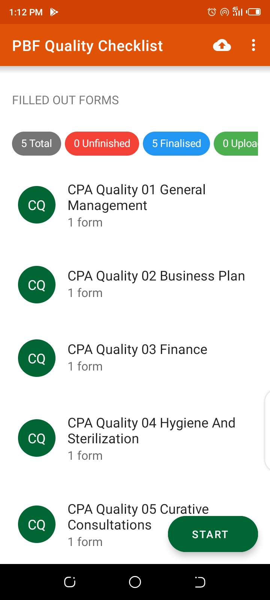

Click on the magnifying glass and type the name of a form you want to
see.

If you click on  to the right of a form, you
can change the time period or the organisational unit. Each org unit can
have 1 or multiple forms attached to it. It’s possible to suggest org
units in the field if something is missing (source of truth is backed).

If you click on a form in this list, you can view it. If you click on a
question in a form, you can change the answer. You can choose whether or
not to save the changes when you exit the form. And at any time, you can/> to save the changes and
return to the Organization Unit page.

### Setting

Next to the upload button is a menu button that gives access to “Refresh
data”,“Change the App ID”, “Change the URL of the server”, “Logout”and
“About”.

For admins only : Change the App ID in order to login as a different
user. Bluesquare Developers can Change the URL of the server in order to
go to a playground for example.

Go to settings by clicking the 3 dots on the upper right corner of the
screen homepage.

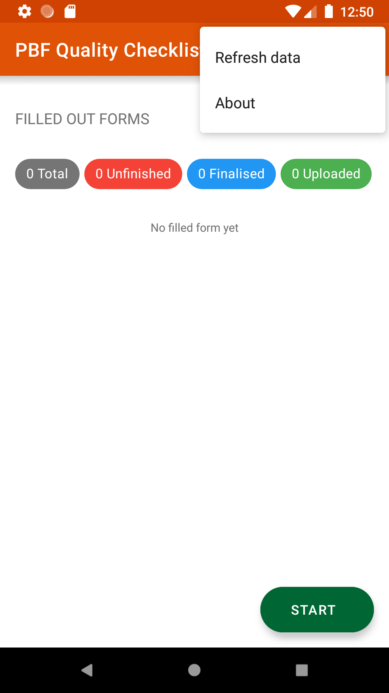

#### Refresh data

Click Refresh data to refresh the health pyramid, the available forms or
both.

Choose what you want to refresh to retrieve the last available data from
the server. You need to have access to the internet for this to work.
This may take a few minutes.

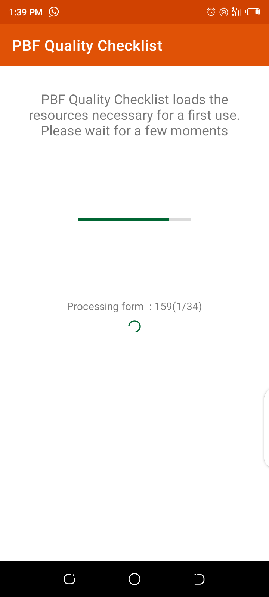

#### Logout

The logout option allows you to log out of the application. In this
case, you will have to re-enter your credentials the next time you use
it. This can be useful if several people use the same device but
different accounts. Otherwise, the application keeps your credentials.

#### About

The "About" option shows you the name and version of the application, as
well as information about ODK, the open source tool on which Iaso is
based.

### Start

From the main menu, tap on « Start» to get to the health structure and
start data entry.

#### Units Tab

In the “UNITS” tab you can navigate through the health pyramid of the
organisation unit you are collecting for. The health pyramid structure
can differ from one country to another. The button “Fill out a form”
will appear at applicable levels. For each level a small indicator tells
you how many Organisation Units exist in the level you are viewing.

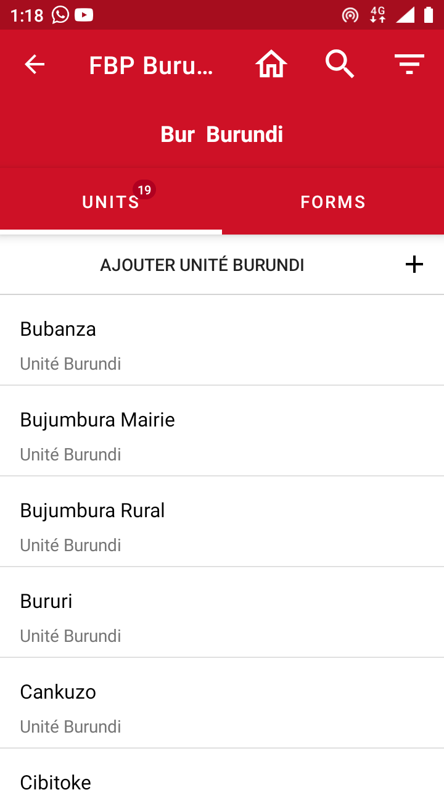

Simply click on the pyramid level you are interested in and sub-levels
will appear.

##### Data collection

When you have selected the desired Organisation Unit, click on the “Fill
out a form”.

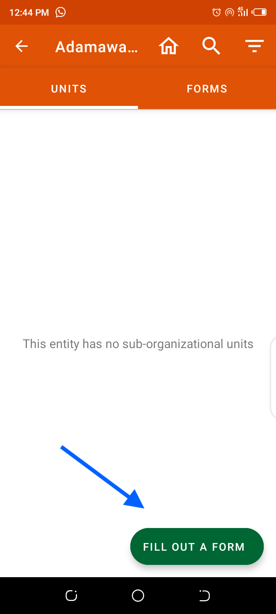

You will need to select from the list of available forms (if there are
more than one in the app).

You will then be prompted to select the period you are collecting for.

A confirmation message will allow you to check you have selected the
correct organisation unit, form and period. Click on “Proceed” if it is
correct, and on “Cancel” if you need to change a parameter.
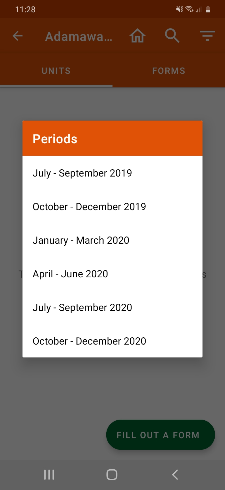

Once you have selected the correct parameters go on to filling out the
form. Questions with a star (\*) are mandatory.
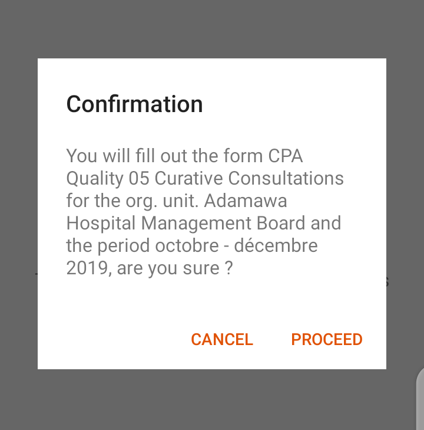

Some forms will ask you to “Get geographical coordinates”. To do this,
click on the “Get coordinates” button, wait for the coordinates to be as
precise as possible (this may take a few minutes) and then click on
“Save the coordinates”. 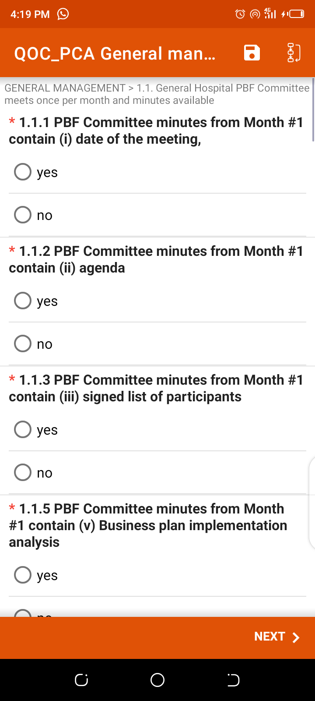

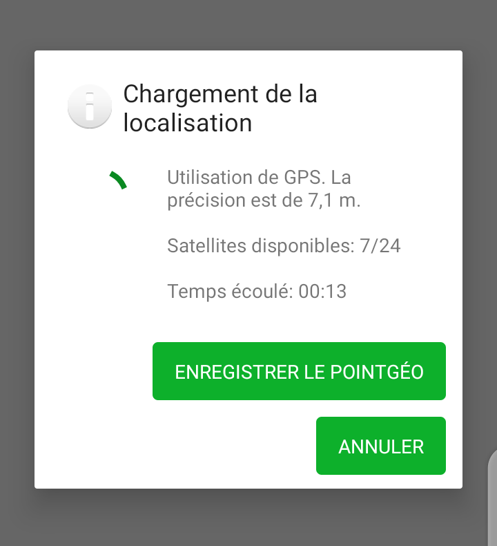

At the end of a form you may encounter a summary page where you can view
the points obtained for each question or section.

When you get to the end, you can choose to “Mark the form as finalised”
or not by checking the box. Then click on “Save and Exit”. At the end of
the form, if you want to be able to review and correct the form, DON’T
mark it as finalised.

You can give a name to the form to make it easier to find it later -
NOTE - this is only for personal use to find the form. The name will not
be sent to the data management
system.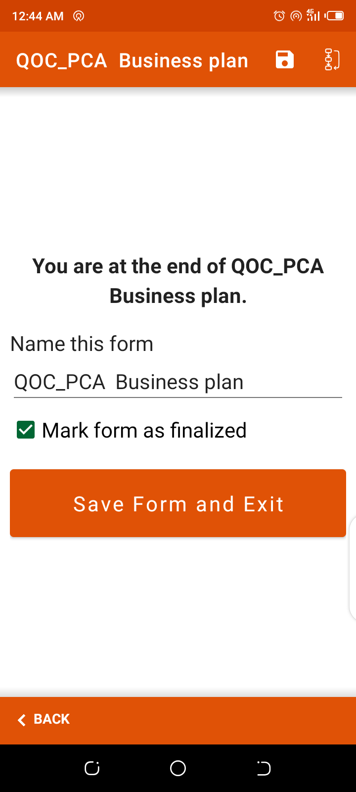

The form will be saved and available from the main menu under
« Unfinished ».

##### How to interrupt data collection?

1. Option one

Tap on the three boxes with arrows in the top right corner of the screen

Then Tap on « Go to end »

Save the Form

You can give a name to the form to make it easier to find it later -
NOTE - This is only for personal use to find the form. The name will not
be sent to the data management system

The form will be saved and available from the main menu under
“Unfinished” or “Finalised”.

You are then directed to the screen showing the forms you have filled in
for the Organisation Unit you are working on.

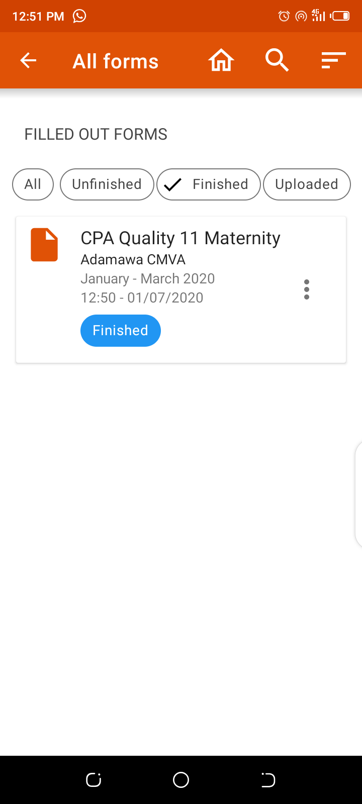

2. Option two

If you want to leave the form, click on the arrow at the bottom of your
device. You will be asked if you wish to save the changes or not. Again,
you can choose to save the form.

If you want to leave the form without saving this is the way to do it.
Simply click on “Ignore changes” and you will leave the form. However if
the form was previously saved only the changes since the last save will
not be saved.

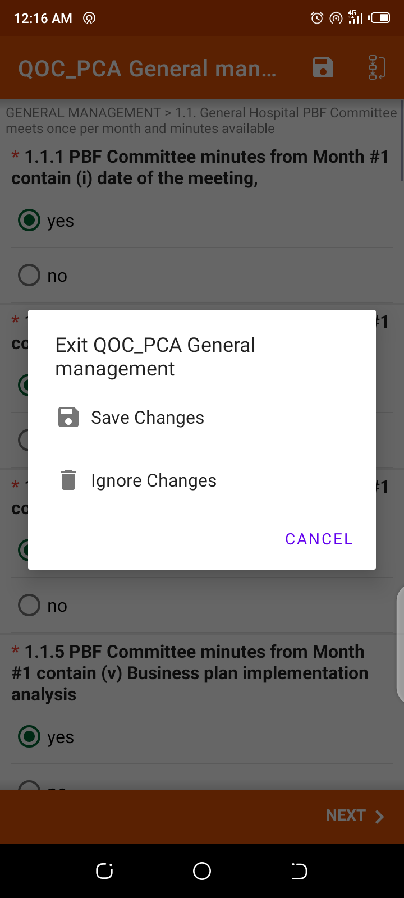

If there are many forms and you are looking for a specific one you can
click on the search button and type in the name of the form.

If you click on the three dots on the right of a form, you can change
theOrganisation Unit.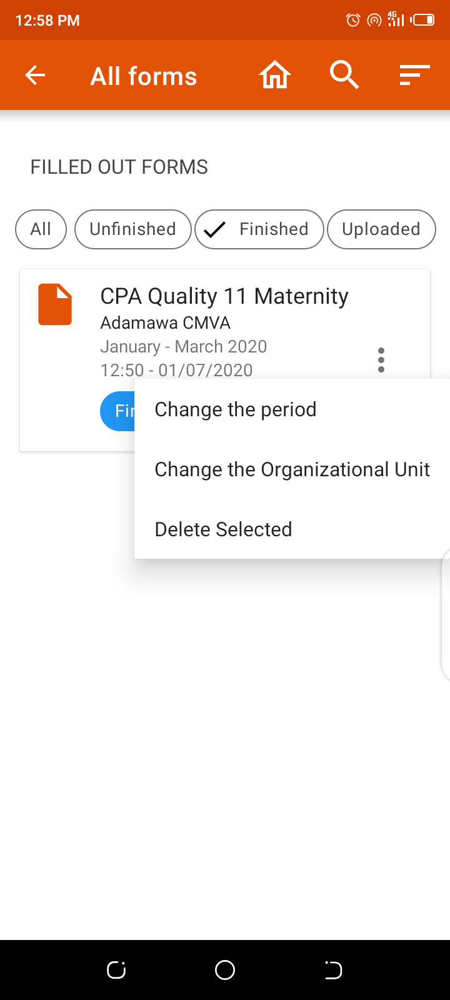

If you click on a form in this list, you can view it. If you click on a
question in a form you can edit the answer. You can choose to save
changes or not when exiting the form. And at any point you can click on
the “Save the Form” button, your changes will be saved and you will
return to the Organisation Unit page.

#### Forms Tab

In the “FORMS” tab you can see the list of forms that have been filled
in for the organisation unit you have navigated to in the “UNITS” tab.
If you have not started collecting data for the organisation unit yet,
there will be no forms in the “FORMS” tab.

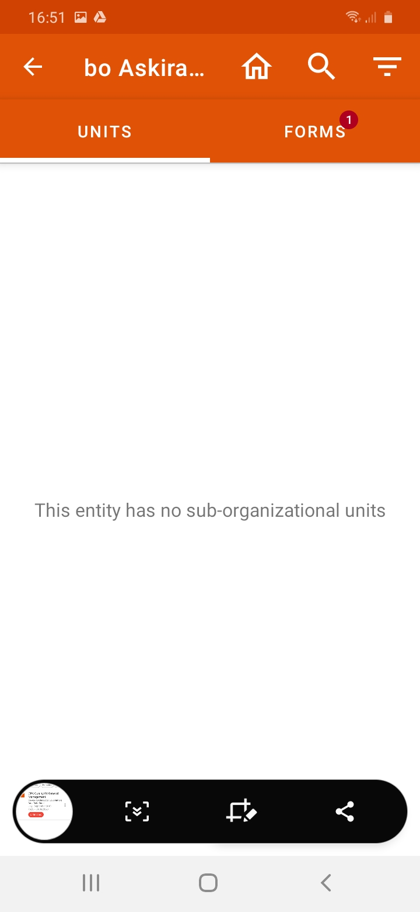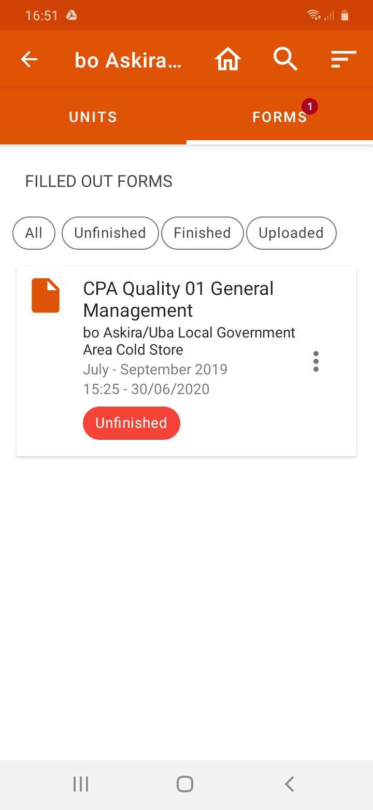

### Upload

Once you have collected the data, the forms need to be uploaded to the
server so the data can be used in the system. In order to do so, you
will need to have access to the internet.

#### Finalise forms

-   To submit a Form your first need to finalise it

-   Click on “Unfinished” on the homepage

-   Open the Form you want to finalise

-   Review the form until the end

-   If the data is correct, tick the box « Mark Form as Finalised »

-   The Form will be available from the main menu under « Finalised »

#### Send data

-   Once data entry is complete, connect your tablet or phone to wifi or
    > turn mobile data on

-   Tap on the cloud button (top right) to upload the forms

You will be prompted to confirm the forms upload.

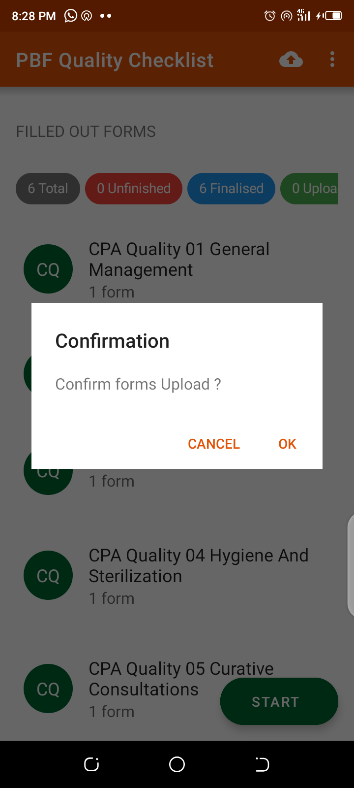

Note that only the forms that have been finalised will be uploaded to
the server.

-   All the finalised forms will be sent to the server

-   You can view all Sent forms from on the homepage under « Uploaded ».

### Micro-planning

Example of a scenario “July schedules" in the context of micro-planning:

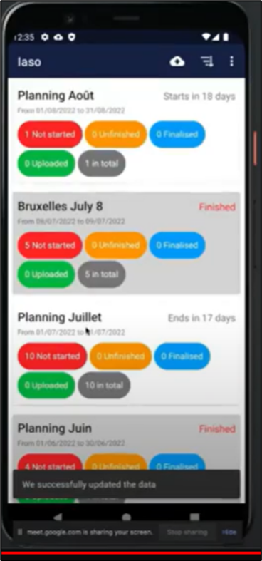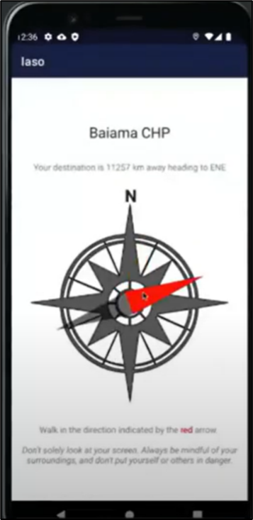

-   Gives the field agent information about where he needs to go and the
    > form he needs to fill out.

There are 2 types of support to help him during the navigation

-   The compass, which is especially useful when you are close to your
    > destination, has no internet access and no off-line map (in the
    > village for example).

-   The Google maps browser

> Once on the spot (household for example) the agent will fill in the
> form (content decided in advance by the customer).
>
> It is possible to add a photo or a geo point for example.

-   Gives the manager an overview on the the status of the schedules he
    > is responsible for / the advancements of the campaign

Number of finalised, unfinished, sent forms according to the colours.

> Once finalised, the agent will be able to upload the data on the
> server (need to have internet at this stage).

### Edit and view

#### View Sent Forms

From the main menu, go to « Uploaded »

You can see the name of the forms, day and time they were sent

#### Edit a saved form

-   Tap on “Unfinished” on the homepage

-   Select the Form

-   Tap on “Go to Start”

-   Start re-entering data until you reach the end of the Form

-   At the end of the form, if you want to be able to review and correct
    > the form, DONT mark it as finalised

-   You can give a name to the form to make it easier to find it later

-   The form will be saved and available from the main menu under
    > « Unfinished»

#### Edit a finalised form

-   Tap on “Finalised” on the homepage

-   Select the Form

-   Tap on « Go to Start »

-   Start re-entering data until you reach the end of the form

-   At the end of the form, if you want to be able to review and correct
    > the form, DONT mark it as finalised.

-   You can give a name to the form to make it easier to find it later

-   The form will be saved and available from the main menu under
    > « Unfinished»

#### Review a Form

-   Tap on “Finalised” on the homepage

-   Select the Form

-   Scroll down to review data you have entered

-   If you need to modify data, tap on « Go To Start » and swap screens
    > until you reach the data you want to modify

-   At the end of the form, if you want to be able to review and correct
    > the form, DONT mark it as finalised.

-   You can give a name to the form to make it easier to find it later

-   The form will be saved and available from the main menu under
    > « Unfinished»

#### New Version 1.28

Better sending of forms in case of a very weak and / or intermittent
network.

For devices that have unsent forms, we've added a "forced download"
feature. To access it, you must activate "developer mode" by tapping 10
times on the application icon under the "about '' menu (under the three
dots) and then "Force resend all forms" will appear in the menu . This
option is not available by default to avoid re-sending data already
correctly sent, which will overwrite those already sent (and which could
therefore have been modified by an administrator in the meantime).
