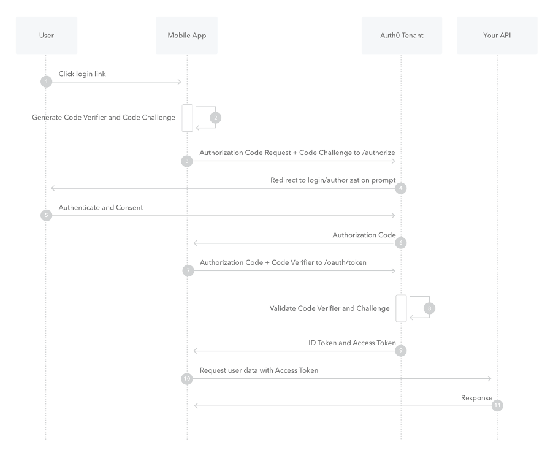

This django app implement Authentication via the WFP CIAM server. It is implemented as an django-allauth provider [0] .

The protocol used is OAUTH2, the login flow used is _Authorization Code Flow with Proof Key for Code Exchange (PKCE)_

[0] https://django-allauth.readthedocs.io/en/latest/advanced.html#customizing-providers

Reconciliation with existing user is done via their email address (not yet implemented)

## User Flow
1. User click login via WFP button in IASO (POST to `/accounts/wfp/login/`)
2. The user authenticate through CIAM
3. Callback to IASO ( GET `/accounts/wfp/login/callback/` with params)
4. Attempt reconciliation to an account via the email address
   1. If the user exist, login (if user is already created manually or via a bulk import)
   2. If the user doesn't exist, create it with no group or permissions. These will be added later per an admin (add a message to tell the user that he needs an admin to give the permissions).
5. Authenticate the user in the platform

## Settings
The following environment variables are used for configuration (see corporate password vault for dev access):
* WFP_AUTH_CLIENT_ID
* WFP_AUTH_SECRET_KEY

These are provided by the CIAM team.

## Documentations
* CIAM documentation https://docs.ciam.auth.wfp.org/login-methods/
* More example of PKCE workflow https://auth0.com/docs/get-started/authentication-and-authorization-flow/authorization-code-flow-with-proof-key-for-code-exchange-pkce
* Django-allauth https://django-allauth.readthedocs.io/en/latest/index.html
