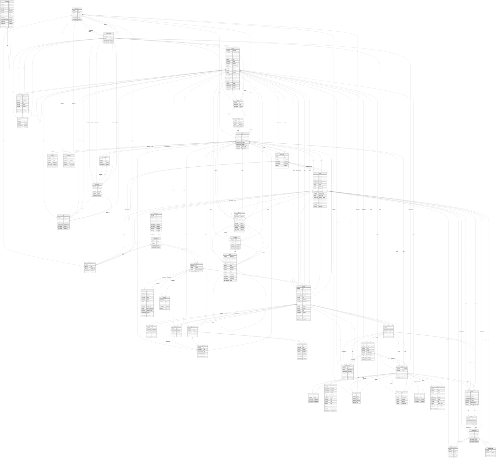

## hat's ER Diagram

```mermaid
%%{init: {'theme': 'neutral' } }%%
erDiagram
DataSource{
AutoField id
CharField name
BooleanField read_only
TextField description
DateTimeField created_at
DateTimeField updated_at
}
SourceVersion{
AutoField id
IntegerField number
TextField description
DateTimeField created_at
DateTimeField updated_at
}
Project{
AutoField id
TextField name
TextField app_id
BooleanField needs_authentication
DateTimeField created_at
DateTimeField updated_at
UUIDField external_token
IntegerField min_version
}
OrgUnitType{
AutoField id
CharField name
CharField short_name
DateTimeField created_at
DateTimeField updated_at
CharField category
PositiveSmallIntegerField depth
}
OrgUnit{
ForeignKey campaigns
ForeignKey campaigns_country
OneToOneField countryusersgroup
AutoField id
CharField name
TextField uuid
BooleanField custom
BooleanField validated
CharField validation_status
TextField path
ArrayField aliases
TextField sub_source
TextField source_ref
MultiPolygonField geom
MultiPolygonField simplified_geom
MultiPolygonField catchment
IntegerField geom_ref
TextField gps_source
PointField location
DateTimeField created_at
DateTimeField updated_at
ForeignKey creator
}
Device{
AutoField id
CharField imei
BooleanField test_device
DateTimeField created_at
DateTimeField updated_at
}
DeviceOwnership{
AutoField id
ForeignKey user
DateTimeField start
DateTimeField end
DateTimeField created_at
DateTimeField updated_at
}
DevicePosition{
AutoField id
UUIDField uuid
PointField location
CharField transport
DecimalField accuracy
DateTimeField captured_at
DateTimeField created_at
DateTimeField updated_at
}
Form{
AutoField id
DateTimeField deleted_at
TextField form_id
DateTimeField created_at
DateTimeField updated_at
TextField name
TextField device_field
TextField location_field
TextField correlation_field
BooleanField correlatable
JSONField possible_fields
TextField period_type
BooleanField single_per_period
IntegerField periods_before_allowed
IntegerField periods_after_allowed
BooleanField derived
UUIDField uuid
ArrayField label_keys
}
FormVersion{
AutoField id
FileField file
FileField xls_file
JSONField form_descriptor
TextField version_id
DateTimeField created_at
DateTimeField updated_at
TextField start_period
TextField end_period
}
AccountFeatureFlag{
CharField name
CharField code
DateTimeField created_at
DateTimeField updated_at
}
Account{
ForeignKey campaigns
AutoField id
TextField name
DateTimeField created_at
DateTimeField updated_at
ManyToManyField users
}
RecordType{
AutoField id
TextField name
TextField description
DateTimeField created_at
}
Record{
AutoField id
DecimalField value
DateTimeField created_at
}
MatchingAlgorithm{
AutoField id
TextField name
TextField description
DateTimeField created_at
}
AlgorithmRun{
AutoField id
DateTimeField created_at
DateTimeField ended_at
ForeignKey launcher
JSONField result
BooleanField finished
}
Task{
AutoField id
DateTimeField created_at
DateTimeField started_at
DateTimeField ended_at
IntegerField progress_value
IntegerField end_value
ForeignKey launcher
JSONField result
CharField status
TextField name
JSONField params
JSONField queue_answer
TextField progress_message
BooleanField should_be_killed
}
Link{
AutoField id
BooleanField validated
ForeignKey validator
DateTimeField validation_date
SmallIntegerField similarity_score
DateTimeField created_at
DateTimeField updated_at
}
Group{
OneToOneField roundScope
OneToOneField campaignScope
ForeignKey campaigns
AutoField id
TextField name
TextField source_ref
CharField domain
DateTimeField created_at
DateTimeField updated_at
}
GroupSet{
AutoField id
TextField name
TextField source_ref
DateTimeField created_at
DateTimeField updated_at
}
Mapping{
AutoField id
TextField name
TextField mapping_type
DateTimeField created_at
DateTimeField updated_at
}
MappingVersion{
AutoField id
TextField name
JSONField json
DateTimeField created_at
DateTimeField updated_at
}
ExternalCredentials{
AutoField id
TextField name
TextField login
TextField password
TextField url
}
Instance{
AutoField id
DateTimeField created_at
ForeignKey created_by
ForeignKey last_modified_by
DateTimeField updated_at
TextField uuid
TextField export_id
BigIntegerField correlation_id
TextField name
FileField file
TextField file_name
PointField location
JSONField json
DecimalField accuracy
TextField period
DateTimeField last_export_success_at
BooleanField deleted
BooleanField to_export
}
InstanceFile{
AutoField id
DateTimeField created_at
DateTimeField updated_at
TextField name
FileField file
BooleanField deleted
}
Profile{
AutoField id
OneToOneField user
CharField external_user_id
CharField language
CharField dhis2_id
CharField home_page
}
ExportRequest{
BigAutoField id
JSONField params
ForeignKey launcher
JSONField result
BooleanField finished
TextField status
IntegerField instance_count
IntegerField exported_count
IntegerField errored_count
TextField last_error_message
BooleanField continue_on_error
DateTimeField queued_at
DateTimeField started_at
DateTimeField ended_at
}
ExportLog{
BigAutoField id
JSONField sent
JSONField received
DateTimeField created_at
IntegerField http_status
TextField url
}
ExportStatus{
BigAutoField id
TextField status
TextField last_error_message
DateTimeField created_at
}
FeatureFlag{
AutoField id
CharField code
CharField name
TextField description
DateTimeField created_at
DateTimeField updated_at
}
BulkCreateUserCsvFile{
AutoField id
FileField file
DateTimeField created_at
ForeignKey created_by
}
InstanceLock{
AutoField id
DateTimeField locked_at
ForeignKey locked_by
DateTimeField unlocked_at
ForeignKey unlocked_by
}
Page{
AutoField id
TextField name
TextField content
BooleanField needs_authentication
SlugField slug
DateTimeField created_at
DateTimeField updated_at
CharField type
TextField powerbi_group_id
TextField powerbi_report_id
JSONField powerbi_filters
ManyToManyField users
}
CommentIaso{
AutoField id
CharField object_pk
ForeignKey site
ForeignKey user
CharField user_name
CharField user_email
CharField user_url
TextField comment
DateTimeField submit_date
GenericIPAddressField ip_address
BooleanField is_public
BooleanField is_removed
ForeignKey content_type
GenericForeignKey content_object
}
ImportGPKG{
AutoField id
DateTimeField created_at
DateTimeField updated_at
FileField file
IntegerField version_number
CharField description
}
EntityType{
AutoField id
CharField name
DateTimeField created_at
DateTimeField updated_at
BooleanField is_active
ArrayField fields_list_view
ArrayField fields_detail_info_view
}
Entity{
AutoField id
DateTimeField deleted_at
CharField name
UUIDField uuid
DateTimeField created_at
DateTimeField updated_at
}
StorageDevice{
AutoField id
CharField customer_chosen_id
CharField type
CharField status
CharField status_reason
TextField status_comment
DateTimeField status_updated_at
DateTimeField created_at
DateTimeField updated_at
}
StorageLogEntry{
UUIDField id
CharField operation_type
DateTimeField performed_at
ForeignKey performed_by
CharField status
CharField status_reason
TextField status_comment
}
Workflow{
AutoField id
DateTimeField deleted_at
DateTimeField created_at
DateTimeField updated_at
}
WorkflowVersion{
AutoField id
DateTimeField deleted_at
CharField name
CharField status
DateTimeField created_at
DateTimeField updated_at
}
WorkflowFollowup{
AutoField id
IntegerField order
JSONField condition
DateTimeField created_at
DateTimeField updated_at
}
WorkflowChange{
AutoField id
JSONField mapping
DateTimeField created_at
DateTimeField updated_at
}
Team{
ForeignKey budgetstep
ManyToManyField countryusersgroup
ManyToManyField budgetevent
AutoField id
DateTimeField deleted_at
CharField name
TextField description
ForeignKey manager
TextField path
CharField type
ForeignKey created_by
DateTimeField created_at
DateTimeField updated_at
ManyToManyField users
}
Planning{
AutoField id
DateTimeField deleted_at
CharField name
TextField description
DateField started_at
DateField ended_at
DateTimeField published_at
ForeignKey created_by
DateTimeField created_at
DateTimeField updated_at
}
Assignment{
AutoField id
DateTimeField deleted_at
ForeignKey user
ForeignKey created_by
DateTimeField created_at
DateTimeField updated_at
}
DataSource||--|{SourceVersion : versions
DataSource||--|{Mapping : mappings
DataSource||--|{ImportGPKG : importgpkg
DataSource||--|{ExternalCredentials : credentials
DataSource||--|{SourceVersion : default_version
DataSource}|--|{Project : projects
SourceVersion||--|{DataSource : datasource
SourceVersion||--|{OrgUnit : orgunit
SourceVersion||--|{Account : account
SourceVersion||--|{Record : record
SourceVersion||--|{AlgorithmRun : runs_where_destination
SourceVersion||--|{AlgorithmRun : runs_where_source
SourceVersion||--|{Group : group
SourceVersion||--|{GroupSet : groupset
SourceVersion||--|{DataSource : data_source
Project}|--|{DataSource : data_sources
Project}|--|{OrgUnitType : unit_types
Project}|--|{Device : devices
Project||--|{DeviceOwnership : deviceownership
Project}|--|{RecordType : record_types
Project}|--|{MatchingAlgorithm : match_algos
Project||--|{Instance : instance
Project||--|{ImportGPKG : importgpkg
Project||--|{Team : team
Project||--|{Planning : planning
Project||--|{Account : account
Project}|--|{Form : forms
Project}|--|{FeatureFlag : feature_flags
OrgUnitType}|--|{OrgUnitType : super_types
OrgUnitType||--|{OrgUnit : orgunit
OrgUnitType}|--|{Form : form
OrgUnitType||--|{Form : reference_form
OrgUnitType}|--|{OrgUnitType : sub_unit_types
OrgUnitType}|--|{Project : projects
OrgUnit||--|{OrgUnit : orgunit
OrgUnit||--|{Record : record
OrgUnit||--|{Link : source_set
OrgUnit||--|{Link : destination_set
OrgUnit}|--|{Group : groups
OrgUnit||--|{Instance : instance
OrgUnit}|--|{Profile : iaso_profile
OrgUnit||--|{InstanceLock : instance_lock
OrgUnit||--|{StorageDevice : storagedevice
OrgUnit||--|{StorageLogEntry : storagelogentry
OrgUnit||--|{Planning : planning
OrgUnit||--|{Assignment : assignment
OrgUnit||--|{SourceVersion : version
OrgUnit||--|{OrgUnit : parent
OrgUnit||--|{OrgUnitType : org_unit_type
OrgUnit||--|{Instance : reference_instance
Device||--|{DeviceOwnership : deviceownership
Device||--|{DevicePosition : deviceposition
Device||--|{Instance : instance
Device}|--|{Project : projects
DeviceOwnership||--|{Device : device
DeviceOwnership||--|{Project : project
DevicePosition||--|{Device : device
Form}|--|{Project : projects
Form||--|{OrgUnitType : orgunittype
Form||--|{FormVersion : form_versions
Form||--|{Mapping : mapping
Form||--|{Instance : instances
Form||--|{EntityType : entitytype
Form||--|{WorkflowVersion : workflowversion
Form}|--|{WorkflowFollowup : workflowfollowup
Form||--|{WorkflowChange : workflowchange
Form}|--|{Planning : teams
Form}|--|{OrgUnitType : org_unit_types
FormVersion||--|{MappingVersion : mapping_versions
FormVersion||--|{Form : form
AccountFeatureFlag}|--|{Account : account
Account||--|{Project : project
Account||--|{Task : task
Account||--|{ExternalCredentials : credentials
Account||--|{Profile : profile
Account||--|{BulkCreateUserCsvFile : bulkcreateusercsvfile
Account||--|{Page : page
Account||--|{EntityType : entitytype
Account||--|{Entity : entity
Account||--|{StorageDevice : storagedevice
Account||--|{SourceVersion : default_version
Account}|--|{AccountFeatureFlag : feature_flags
RecordType||--|{Record : record
RecordType}|--|{Project : projects
Record||--|{SourceVersion : version
Record||--|{OrgUnit : org_unit
Record||--|{RecordType : record_type
MatchingAlgorithm||--|{AlgorithmRun : algorithmrun
MatchingAlgorithm}|--|{Project : projects
AlgorithmRun||--|{Link : link
AlgorithmRun||--|{MatchingAlgorithm : algorithm
AlgorithmRun||--|{SourceVersion : version_1
AlgorithmRun||--|{SourceVersion : version_2
Task||--|{Account : account
Link||--|{OrgUnit : destination
Link||--|{OrgUnit : source
Link||--|{AlgorithmRun : algorithm_run
Group}|--|{GroupSet : group_sets
Group||--|{SourceVersion : source_version
Group}|--|{OrgUnit : org_units
GroupSet||--|{SourceVersion : source_version
GroupSet}|--|{Group : groups
Mapping||--|{MappingVersion : versions
Mapping||--|{DataSource : data_source
Mapping||--|{Form : form
MappingVersion||--|{ExportStatus : exportstatus
MappingVersion||--|{FormVersion : form_version
MappingVersion||--|{Mapping : mapping
ExternalCredentials||--|{DataSource : data_sources
ExternalCredentials||--|{Account : account
Instance||--|{OrgUnit : orgunit
Instance||--|{InstanceFile : instancefile
Instance||--|{ExportStatus : exportstatus
Instance||--|{InstanceLock : instancelock
Instance||--||Entity : attributes
Instance}|--|{StorageLogEntry : storage_log_entries
Instance||--|{OrgUnit : org_unit
Instance||--|{Form : form
Instance||--|{Project : project
Instance||--|{Device : device
Instance||--|{Entity : entity
InstanceFile||--|{Instance : instance
Profile||--|{Account : account
Profile}|--|{OrgUnit : org_units
ExportRequest||--|{ExportStatus : exportstatus
ExportLog}|--|{ExportStatus : exportstatus
ExportStatus||--|{ExportRequest : export_request
ExportStatus||--|{Instance : instance
ExportStatus||--|{MappingVersion : mapping_version
ExportStatus}|--|{ExportLog : export_logs
BulkCreateUserCsvFile||--|{Account : account
InstanceLock||--|{Instance : instance
InstanceLock||--|{OrgUnit : top_org_unit
Page||--|{Account : account
CommentIaso||--|{CommentIaso : children
CommentIaso||--|{CommentIaso : parent
ImportGPKG||--|{Project : project
ImportGPKG||--|{DataSource : data_source
EntityType||--|{Entity : entity
EntityType||--||Workflow : workflow
EntityType||--|{Form : reference_form
EntityType||--|{Account : account
Entity||--|{Instance : instances
Entity||--|{StorageDevice : storagedevice
Entity||--|{StorageLogEntry : storagelogentry
Entity||--|{EntityType : entity_type
Entity||--||Instance : attributes
Entity||--|{Account : account
StorageDevice||--|{StorageLogEntry : log_entries
StorageDevice||--|{Account : account
StorageDevice||--|{OrgUnit : org_unit
StorageDevice||--|{Entity : entity
StorageLogEntry||--|{StorageDevice : device
StorageLogEntry||--|{OrgUnit : org_unit
StorageLogEntry||--|{Entity : entity
StorageLogEntry}|--|{Instance : instances
Workflow||--|{WorkflowVersion : workflow_versions
Workflow||--||EntityType : entity_type
WorkflowVersion||--|{WorkflowFollowup : follow_ups
WorkflowVersion||--|{WorkflowChange : changes
WorkflowVersion||--|{Workflow : workflow
WorkflowVersion||--|{Form : reference_form
WorkflowFollowup||--|{WorkflowVersion : workflow_version
WorkflowFollowup}|--|{Form : forms
WorkflowChange||--|{Form : form
WorkflowChange||--|{WorkflowVersion : workflow_version
Team||--|{Team : sub_teams
Team||--|{Planning : planning
Team||--|{Assignment : assignment
Team||--|{Project : project
Team||--|{Team : parent
Planning||--|{Assignment : assignment
Planning||--|{Project : project
Planning||--|{Team : team
Planning||--|{OrgUnit : org_unit
Planning}|--|{Form : forms
Assignment||--|{Planning : planning
Assignment||--|{OrgUnit : org_unit
Assignment||--|{Team : team
```
