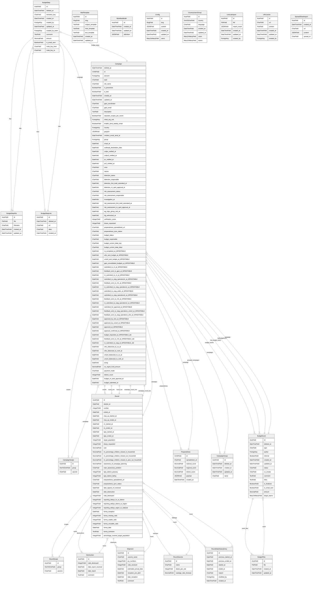

## hat's ER Diagram

```mermaid
%%{init: {'theme': 'neutral' } }%%
erDiagram
BudgetStep{
AutoField id
DateTimeField deleted_at
CharField transition_key
DateTimeField created_at
ForeignKey created_by
DateTimeField updated_at
ForeignKey created_by_team
TextField comment
DecimalField amount
BooleanField is_email_sent
CharField node_key_from
CharField node_key_to
}
BudgetStepFile{
AutoField id
FileField file
CharField filename
DateTimeField created_at
DateTimeField updated_at
}
BudgetStepLink{
AutoField id
DateTimeField deleted_at
CharField url
CharField alias
DateTimeField created_at
}
MailTemplate{
AutoField id
SlugField slug
TextField subject_template
TextField html_template
TextField text_template
DateTimeField created_at
DateTimeField updated_at
}
WorkflowModel{
AutoField id
DateTimeField created_at
DateTimeField updated_at
JSONField definition
}
RoundScope{
AutoField id
OneToOneField group
CharField vaccine
}
CampaignScope{
AutoField id
OneToOneField group
CharField vaccine
}
Destruction{
AutoField id
IntegerField vials_destroyed
DateField date_report_received
DateField date_report
TextField comment
}
Shipment{
AutoField id
CharField vaccine_name
IntegerField po_numbers
IntegerField vials_received
DateField estimated_arrival_date
DateField reception_pre_alert
DateField date_reception
TextField comment
}
RoundVaccine{
AutoField id
CharField name
IntegerField doses_per_vial
DecimalField wastage_ratio_forecast
}
RoundDateHistoryEntry{
AutoField id
DateField previous_started_at
DateField previous_ended_at
DateField started_at
DateField ended_at
CharField reason
ForeignKey modified_by
DateTimeField created_at
}
Round{
AutoField id
DateField started_at
IntegerField number
DateField ended_at
DateField mop_up_started_at
DateField mop_up_ended_at
DateField im_started_at
DateField im_ended_at
DateField lqas_started_at
DateField lqas_ended_at
IntegerField target_population
IntegerField doses_requested
DecimalField cost
DecimalField im_percentage_children_missed_in_household
DecimalField im_percentage_children_missed_out_household
DecimalField im_percentage_children_missed_in_plus_out_household
DecimalField awareness_of_campaign_planning
CharField main_awareness_problem
IntegerField lqas_district_passing
IntegerField lqas_district_failing
CharField preparedness_spreadsheet_url
CharField preparedness_sync_status
DateField date_signed_vrf_received
DateField date_destruction
IntegerField vials_destroyed
IntegerField reporting_delays_hc_to_district
IntegerField reporting_delays_district_to_region
IntegerField reporting_delays_region_to_national
DateField forma_reception
IntegerField forma_missing_vials
IntegerField forma_usable_vials
IntegerField forma_unusable_vials
DateField forma_date
TextField forma_comment
IntegerField percentage_covered_target_population
}
Campaign{
DateTimeField deleted_at
UUIDField id
ForeignKey account
CharField epid
CharField obr_name
BooleanField is_preventive
BooleanField is_test
DateTimeField created_at
DateTimeField updated_at
CharField gpei_coordinator
CharField gpei_email
TextField description
BooleanField separate_scopes_per_round
ForeignKey initial_org_unit
BooleanField enable_send_weekly_email
ForeignKey country
JSONField geojson
DateTimeField creation_email_send_at
ForeignKey group
DateField onset_at
DateField outbreak_declaration_date
DateField cvdpv_notified_at
DateField cvdpv2_notified_at
DateField pv_notified_at
DateField pv2_notified_at
CharField virus
CharField vacine
CharField detection_status
CharField detection_responsible
DateField detection_first_draft_submitted_at
DateField detection_rrt_oprtt_approval_at
CharField risk_assessment_status
CharField risk_assessment_responsible
DateField investigation_at
DateField risk_assessment_first_draft_submitted_at
DateField risk_assessment_rrt_oprtt_approval_at
DateField ag_nopv_group_met_at
DateField dg_authorized_at
IntegerField verification_score
IntegerField doses_requested
CharField preperadness_spreadsheet_url
CharField preperadness_sync_status
CharField budget_status
CharField budget_responsible
CharField budget_current_state_key
CharField budget_current_state_label
DateField ra_completed_at_WFEDITABLE
DateField who_sent_budget_at_WFEDITABLE
DateField unicef_sent_budget_at_WFEDITABLE
DateField gpei_consolidated_budgets_at_WFEDITABLE
DateField submitted_to_rrt_at_WFEDITABLE
DateField feedback_sent_to_gpei_at_WFEDITABLE
DateField re_submitted_to_rrt_at_WFEDITABLE
DateField submitted_to_orpg_operations1_at_WFEDITABLE
DateField feedback_sent_to_rrt1_at_WFEDITABLE
DateField re_submitted_to_orpg_operations1_at_WFEDITABLE
DateField submitted_to_orpg_wider_at_WFEDITABLE
DateField submitted_to_orpg_operations2_at_WFEDITABLE
DateField feedback_sent_to_rrt2_at_WFEDITABLE
DateField re_submitted_to_orpg_operations2_at_WFEDITABLE
DateField submitted_for_approval_at_WFEDITABLE
DateField feedback_sent_to_orpg_operations_unicef_at_WFEDITABLE
DateField feedback_sent_to_orpg_operations_who_at_WFEDITABLE
DateField approved_by_who_at_WFEDITABLE
DateField approved_by_unicef_at_WFEDITABLE
DateField approved_at_WFEDITABLE
DateField approval_confirmed_at_WFEDITABLE
DateField budget_requested_at_WFEDITABLE_old
DateField feedback_sent_to_rrt3_at_WFEDITABLE_old
DateField re_submitted_to_orpg_at_WFEDITABLE_old
DateField who_disbursed_to_co_at
DateField who_disbursed_to_moh_at
DateField unicef_disbursed_to_co_at
DateField unicef_disbursed_to_moh_at
DateField eomg
DecimalField no_regret_fund_amount
CharField payment_mode
IntegerField district_count
DateField budget_rrt_oprtt_approval_at
DateField budget_submitted_at
}
Preparedness{
UUIDField id
CharField spreadsheet_url
DecimalField national_score
DecimalField regional_score
DecimalField district_score
JSONField payload
DateTimeField created_at
}
Config{
AutoField id
SlugField slug
JSONField content
DateTimeField created_at
DateTimeField updated_at
ManyToManyField users
}
CountryUsersGroup{
AutoField id
OneToOneField country
CharField language
DateTimeField created_at
DateTimeField updated_at
ManyToManyField users
ManyToManyField teams
}
LineListImport{
AutoField id
FileField file
JSONField import_result
DateTimeField created_at
DateTimeField updated_at
ForeignKey created_by
}
URLCache{
AutoField id
CharField url
TextField content
DateTimeField created_at
DateTimeField updated_at
ForeignKey created_by
}
SpreadSheetImport{
AutoField id
DateTimeField created_at
CharField url
JSONField content
CharField spread_id
}
CampaignGroup{
AutoField id
DateTimeField deleted_at
DateTimeField created_at
DateTimeField updated_at
CharField name
}
BudgetEvent{
AutoField id
DateTimeField deleted_at
CharField type
ForeignKey author
BooleanField internal
DateTimeField created_at
DateTimeField updated_at
CharField status
CharField cc_emails
TextField comment
TextField links
BooleanField is_finalized
BooleanField is_email_sent
DecimalField amount
ManyToManyField target_teams
}
BudgetFiles{
AutoField id
FileField file
DateTimeField created_at
DateTimeField updated_at
}
BudgetStep||--|{BudgetStepFile : files
BudgetStep||--|{BudgetStepLink : links
BudgetStep||--|{Campaign : campaign
BudgetStepFile||--|{BudgetStep : step
BudgetStepLink||--|{BudgetStep : step
RoundScope||--|{Round : round
CampaignScope||--|{Campaign : campaign
Destruction||--|{Round : round
Shipment||--|{Round : round
RoundVaccine||--|{Round : round
RoundDateHistoryEntry||--|{Round : round
Round||--|{RoundScope : scopes
Round||--|{Destruction : destructions
Round||--|{Shipment : shipments
Round||--|{RoundVaccine : vaccines
Round||--|{RoundDateHistoryEntry : datelogs
Round||--||Campaign : campaign_round_one
Round||--||Campaign : campaign_round_two
Round||--|{Campaign : campaign
Campaign||--|{BudgetStep : budget_steps
Campaign||--|{CampaignScope : scopes
Campaign||--|{Round : rounds
Campaign||--|{Preparedness : preparedness
Campaign}|--|{CampaignGroup : grouped_campaigns
Campaign||--|{BudgetEvent : budget_events
Campaign||--|{BudgetEvent : last_budget_event
Campaign||--||Round : round_one
Campaign||--||Round : round_two
Preparedness||--|{Campaign : campaign
CampaignGroup}|--|{Campaign : campaigns
BudgetEvent||--|{Campaign : lastbudgetevent
BudgetEvent||--|{BudgetFiles : event_files
BudgetEvent||--|{Campaign : campaign
BudgetFiles||--|{BudgetEvent : event
```
